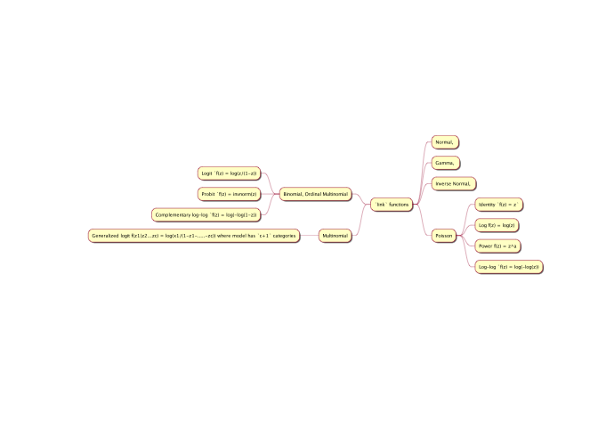

Generalized Linear Models
================

# Introduction

Following:  
1\.<https://www.kdnuggets.com/2017/10/learn-generalized-linear-models-glm-r.html>  
and
thereafter:

2\.<https://www.r-bloggers.com/how-to-perform-ordinal-logistic-regression-in-r/>

A Generalized Linear Model (GLM/GLZ) helps represent the dependent
variable as a linear combination of independent variables. In its
simplest form, a linear model specifies the (linear) relationship
between a dependent (or response) variable Y, and a set of predictor
variables, the X’s, so that

\[
Y = b_0 + b_1X_1 + b_2X_2 + ... + b_kX_k  + e
\]

In the GLZs, the model is assumed to be: \[
Y = g (b_0 + b_1X_1 + b_2X_2 + ... + b_kX_k )+ e
\] The `inverse` of the funtion `g(...)`, say f(…)`is called the`link
function\`, so that:

\[
f(\mu_Y)= b_0 + b_1X_1 + b_2X_2 + ... + b_kX_k
\]

GLZs work when :

1)  the dependent variable has a discrete/multinomial distribution. The
    distribution of the dependent or response variable can be
    (explicitly) non-normal, and does not have to be continuous, i.e.,
    it can be binomial, multinomial, or ordinal multinomial (i.e.,
    contain information on ranks only);

2)  the relationship between dependent and independent variable
    (i.e. the `link function`) is inherently nonlinear, or a power
    relationship, for
example.

## Types of `link functions` and distributions of `y` dependent variables

Various link functions can be chosen based on the assumbned
distributions of the y dependent variable:

<!-- -->

``` r
###
x <- plantuml("
@startmindmap
+ `link` functions
++ Normal, 
++ Gamma, 
++ Inverse Normal, 
++ Poisson
+++ Identity `f(z) = z`
+++ Log f(z) = log(z)
+++ Power f(z) = z^a
-- Binomial, Ordinal Multinomial
--- Logit `f(z) = log(z/(1-z))
--- Probit `f(z) = invnorm(z)
--- Complementary log-log `f(z) = log(-log(1-z))
+++ Log-log `f(z) = log(-log(z))
-- Multinomial
--- Generalized logit f(z1|z2...zc) = log(x1/(1-z1-.....-zc)) where model has `c+1` categories
@endmindmap")

plot(x)
```

<!-- -->
