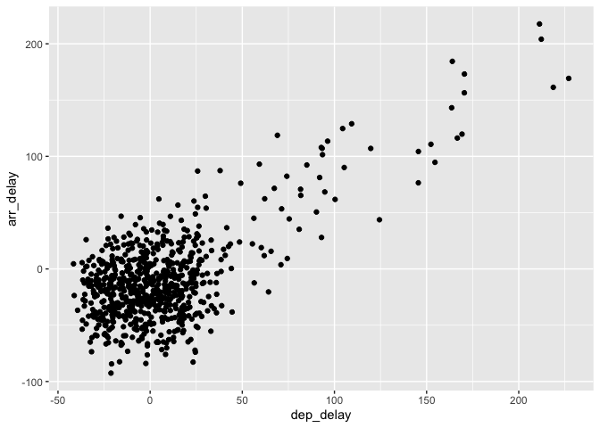
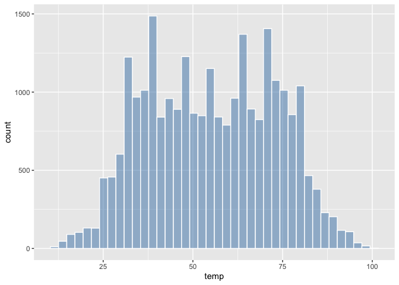
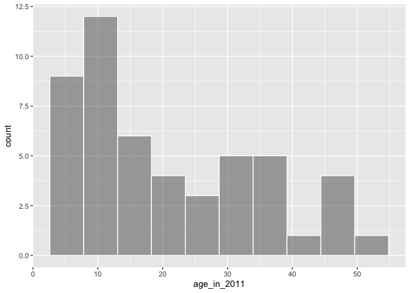
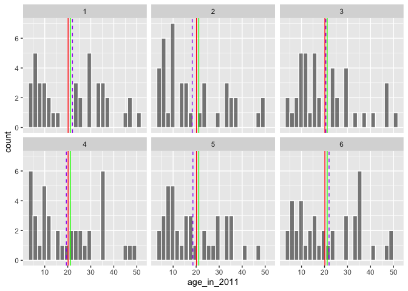

ModernDive
================
Arvind Venkatadri
31/05/2019

# Introduction

Following in the footsteps of Chester Ismay’s *ModernDive*. I will use
`ggformula`, however, to create the graphs where needed.

# Exploring Data

## The `nycflights13` Package

`flights`: Information on all 336,776 flights  
`airlines`: A table matching airline names and their two letter IATA
airline codes (also known as carrier codes) for 16 airline companies  
`planes`: Information about each of 3,322 physical aircraft used.  
`weather`: Hourly meteorological data for each of the three NYC
airports. This data frame has 26,115 rows, roughly corresponding to the
365 × 24 × 3 = 26,280 possible hourly measurements one can observe at
three locations over the course of a year.  
`airports`: Airport names, codes, and locations for 1,458 destination
airports.

## Exploring `flights`

``` r
flights
```

    ## # A tibble: 336,776 x 19
    ##     year month   day dep_time sched_dep_time dep_delay arr_time
    ##    <int> <int> <int>    <int>          <int>     <dbl>    <int>
    ##  1  2013     1     1      517            515         2      830
    ##  2  2013     1     1      533            529         4      850
    ##  3  2013     1     1      542            540         2      923
    ##  4  2013     1     1      544            545        -1     1004
    ##  5  2013     1     1      554            600        -6      812
    ##  6  2013     1     1      554            558        -4      740
    ##  7  2013     1     1      555            600        -5      913
    ##  8  2013     1     1      557            600        -3      709
    ##  9  2013     1     1      557            600        -3      838
    ## 10  2013     1     1      558            600        -2      753
    ## # … with 336,766 more rows, and 12 more variables: sched_arr_time <int>,
    ## #   arr_delay <dbl>, carrier <chr>, flight <int>, tailnum <chr>,
    ## #   origin <chr>, dest <chr>, air_time <dbl>, distance <dbl>, hour <dbl>,
    ## #   minute <dbl>, time_hour <dttm>

``` r
head(flights)
```

    ## # A tibble: 6 x 19
    ##    year month   day dep_time sched_dep_time dep_delay arr_time
    ##   <int> <int> <int>    <int>          <int>     <dbl>    <int>
    ## 1  2013     1     1      517            515         2      830
    ## 2  2013     1     1      533            529         4      850
    ## 3  2013     1     1      542            540         2      923
    ## 4  2013     1     1      544            545        -1     1004
    ## 5  2013     1     1      554            600        -6      812
    ## 6  2013     1     1      554            558        -4      740
    ## # … with 12 more variables: sched_arr_time <int>, arr_delay <dbl>,
    ## #   carrier <chr>, flight <int>, tailnum <chr>, origin <chr>, dest <chr>,
    ## #   air_time <dbl>, distance <dbl>, hour <dbl>, minute <dbl>,
    ## #   time_hour <dttm>

``` r
glimpse(flights)
```

    ## Observations: 336,776
    ## Variables: 19
    ## $ year           <int> 2013, 2013, 2013, 2013, 2013, 2013, 2013, 2013, 2…
    ## $ month          <int> 1, 1, 1, 1, 1, 1, 1, 1, 1, 1, 1, 1, 1, 1, 1, 1, 1…
    ## $ day            <int> 1, 1, 1, 1, 1, 1, 1, 1, 1, 1, 1, 1, 1, 1, 1, 1, 1…
    ## $ dep_time       <int> 517, 533, 542, 544, 554, 554, 555, 557, 557, 558,…
    ## $ sched_dep_time <int> 515, 529, 540, 545, 600, 558, 600, 600, 600, 600,…
    ## $ dep_delay      <dbl> 2, 4, 2, -1, -6, -4, -5, -3, -3, -2, -2, -2, -2, …
    ## $ arr_time       <int> 830, 850, 923, 1004, 812, 740, 913, 709, 838, 753…
    ## $ sched_arr_time <int> 819, 830, 850, 1022, 837, 728, 854, 723, 846, 745…
    ## $ arr_delay      <dbl> 11, 20, 33, -18, -25, 12, 19, -14, -8, 8, -2, -3,…
    ## $ carrier        <chr> "UA", "UA", "AA", "B6", "DL", "UA", "B6", "EV", "…
    ## $ flight         <int> 1545, 1714, 1141, 725, 461, 1696, 507, 5708, 79, …
    ## $ tailnum        <chr> "N14228", "N24211", "N619AA", "N804JB", "N668DN",…
    ## $ origin         <chr> "EWR", "LGA", "JFK", "JFK", "LGA", "EWR", "EWR", …
    ## $ dest           <chr> "IAH", "IAH", "MIA", "BQN", "ATL", "ORD", "FLL", …
    ## $ air_time       <dbl> 227, 227, 160, 183, 116, 150, 158, 53, 140, 138, …
    ## $ distance       <dbl> 1400, 1416, 1089, 1576, 762, 719, 1065, 229, 944,…
    ## $ hour           <dbl> 5, 5, 5, 5, 6, 5, 6, 6, 6, 6, 6, 6, 6, 6, 6, 5, 6…
    ## $ minute         <dbl> 15, 29, 40, 45, 0, 58, 0, 0, 0, 0, 0, 0, 0, 0, 0,…
    ## $ time_hour      <dttm> 2013-01-01 05:00:00, 2013-01-01 05:00:00, 2013-0…

## Exploring `airports`

``` r
glimpse(airports)
```

    ## Observations: 1,458
    ## Variables: 8
    ## $ faa   <chr> "04G", "06A", "06C", "06N", "09J", "0A9", "0G6", "0G7", "0…
    ## $ name  <chr> "Lansdowne Airport", "Moton Field Municipal Airport", "Sch…
    ## $ lat   <dbl> 41.13, 32.46, 41.99, 41.43, 31.07, 36.37, 41.47, 42.88, 39…
    ## $ lon   <dbl> -80.62, -85.68, -88.10, -74.39, -81.43, -82.17, -84.51, -7…
    ## $ alt   <int> 1044, 264, 801, 523, 11, 1593, 730, 492, 1000, 108, 409, 8…
    ## $ tz    <dbl> -5, -6, -6, -5, -5, -5, -5, -5, -5, -8, -5, -6, -5, -5, -5…
    ## $ dst   <chr> "A", "A", "A", "A", "A", "A", "A", "A", "U", "A", "A", "U"…
    ## $ tzone <chr> "America/New_York", "America/Chicago", "America/Chicago", …

## The 5NG - Five Named Graphs

ModernDive uses mainly these graphs 1. Scatter Plots 2. Line Graphs 3.
Histograms 4. Box Plots 5. Bar Plots

Some of these are appropriate for *quantitative* and some for
*categorical* variables.

### Scatter Plots

1.  `dep_delay` vs `arr_delay`

We can plot this as

``` r
flights %>% 
  filter(carrier == "AS") %>% 
  gf_point(arr_delay~dep_delay, data = .,alpha = 0.2)
```

    ## Warning: Removed 5 rows containing missing values (geom_point).

<!-- -->

``` r
flights %>% 
  filter(carrier == "AS") %>% 
  gf_jitter(arr_delay~dep_delay, data = .,width = 30,height = 30)
```

    ## Warning: Removed 5 rows containing missing values (geom_point).

<!-- -->

### Line Graphs

Line graphs are commonly used for `time series` plots We will try to get
a sense of the `weather` dataset.

Use a `gf_line` graph when the `x` variable has an **inherent
ordering**.

``` r
glimpse(weather)
```

    ## Observations: 26,115
    ## Variables: 15
    ## $ origin     <chr> "EWR", "EWR", "EWR", "EWR", "EWR", "EWR", "EWR", "EWR…
    ## $ year       <dbl> 2013, 2013, 2013, 2013, 2013, 2013, 2013, 2013, 2013,…
    ## $ month      <dbl> 1, 1, 1, 1, 1, 1, 1, 1, 1, 1, 1, 1, 1, 1, 1, 1, 1, 1,…
    ## $ day        <int> 1, 1, 1, 1, 1, 1, 1, 1, 1, 1, 1, 1, 1, 1, 1, 1, 1, 1,…
    ## $ hour       <int> 1, 2, 3, 4, 5, 6, 7, 8, 9, 10, 11, 13, 14, 15, 16, 17…
    ## $ temp       <dbl> 39.02, 39.02, 39.02, 39.92, 39.02, 37.94, 39.02, 39.9…
    ## $ dewp       <dbl> 26.06, 26.96, 28.04, 28.04, 28.04, 28.04, 28.04, 28.0…
    ## $ humid      <dbl> 59.37, 61.63, 64.43, 62.21, 64.43, 67.21, 64.43, 62.2…
    ## $ wind_dir   <dbl> 270, 250, 240, 250, 260, 240, 240, 250, 260, 260, 260…
    ## $ wind_speed <dbl> 10.357, 8.055, 11.508, 12.659, 12.659, 11.508, 14.960…
    ## $ wind_gust  <dbl> NA, NA, NA, NA, NA, NA, NA, NA, NA, NA, NA, NA, NA, N…
    ## $ precip     <dbl> 0, 0, 0, 0, 0, 0, 0, 0, 0, 0, 0, 0, 0, 0, 0, 0, 0, 0,…
    ## $ pressure   <dbl> 1012, 1012, 1012, 1012, 1012, 1012, 1012, 1012, 1013,…
    ## $ visib      <dbl> 10, 10, 10, 10, 10, 10, 10, 10, 10, 10, 10, 10, 10, 1…
    ## $ time_hour  <dttm> 2013-01-01 01:00:00, 2013-01-01 02:00:00, 2013-01-01…

We will look at the `temp` variable at *EWR* airport, between Jan 1 to
Jan 15.

``` r
weather %>% 
  filter(origin == "EWR", month == 1,day<=15) %>% 
  gf_line(data = ., temp ~ time_hour)
```

<!-- -->

``` r
# If `time_hour` had not been available
weather %>% 
  filter(origin == "EWR", month == 1,day<=15) %>% 
  gf_line(data = ., temp ~ (hour + 24*day))
```

<!-- -->

``` r
#LC3.13: Plot a time series of a variable other than temp for Newark Airport in the first 15 days of January 2013.
weather %>% 
  filter(origin == "EWR", month == 1,day<=15) %>% 
  gf_line(data = ., humid ~ time_hour)
```

<!-- -->

### Histograms

``` r
weather %>% 
  gf_histogram(~temp,bins = 40, color = "white",fill = "steelblue")
```

    ## Warning: Removed 1 rows containing non-finite values (stat_bin).

<!-- -->

``` r
weather %>% 
  gf_histogram(~temp|month,bins = 40)
```

    ## Warning: Removed 1 rows containing non-finite values (stat_bin).

<!-- --> \#\#\#
Boxplots

``` r
weather %>% 
  gf_boxplot(temp~factor(month),data = .,outlier.color = "red")
```

    ## Warning: Removed 1 rows containing non-finite values (stat_boxplot).


Boxplots look like a bunch of Buddhist prayer wheels.

The trick with understanding boxplots is that the shape of the boxplots
is based on **counts** of data and the thing itself is plotted on scales
that show **amplitudes** of data. If a boxplot was plotted on a scale
showing *counts* every boxplot would be symmetric.

### Bar Plots

This helps to visualize the distribution of a *categorical* variable.
(No book had really stated this. Good on you, Chester Ismay\!). This is
a simpler task, as we are simply *counting* different categories, also
known as *levels*, of a categorical variable. Depending upon whether the
categorical variable is **pre-counted** or not, we choose a different
type of bar plot.When the categorical variable whose distribution you
want to visualize is:

  - Is **not pre-counted** in your data frame: use `geom_bar()`.
  - Is **pre-counted** in your data frame, use `geom_col()` with the
    y-position aesthetic mapped to the variable that has the
counts.

#### One Categorical Variable

``` r
gf_bar(data = flights, ~carrier) # uncounted
```

<!-- -->

``` r
flights_counted <- as_tibble(xtabs(data = flights, ~carrier)) # pre-counted table
gf_col(n~carrier, data = flights_counted)
```

<!-- -->

#### Two Categorical Variables

We can use *stacked barplots* or a *dodged barplot* to view more than on
categorical
variable.

``` r
gf_bar(data = flights, ~carrier, fill = ~origin) # stacked barplot
```

<!-- -->

``` r
gf_bar(data = flights, ~carrier, fill = ~origin, position = "dodge") # dodged barplot
```

<!-- -->

``` r
# Facetted Barplot
gf_bar(data = flights, ~carrier|origin~., fill = ~origin)
```

<!-- -->

*Dodged barplots* are more easy to understand and to compare
numbers/counts.

Barplots are the preferred way of displaying the distribution of a
categorical variable, or in other words the frequency with which the
different categories called levels occur. They are easy to understand
and make it easy to make comparisons across levels. When trying to
visualize two categorical variables, you have many options: stacked
barplots, side-by-side barplots, and faceted barplots. Depending on what
aspect of the joint distribution you are trying to emphasize, you will
need to make a choice between these three types of barplots.

# Data Wrangling

`dplyr` functions:  
\- `filter()`  
\- `summarize()`  
\- `group_by()`  
\- `mutate()`  
\- `arrange()`  
\- `join()`

## `filter`

``` r
# Departed from JFK
# Heading to Burlington VT or to Seattle, WA
# Departed in October, November, December
flights %>% 
  filter(origin == "JFK" & (dest == "BTV" | dest == "SEA") & month >=10)
```

    ## # A tibble: 815 x 19
    ##     year month   day dep_time sched_dep_time dep_delay arr_time
    ##    <int> <int> <int>    <int>          <int>     <dbl>    <int>
    ##  1  2013    10     1      729            735        -6     1049
    ##  2  2013    10     1      853            900        -7     1217
    ##  3  2013    10     1      916            925        -9     1016
    ##  4  2013    10     1     1216           1221        -5     1326
    ##  5  2013    10     1     1452           1459        -7     1602
    ##  6  2013    10     1     1459           1500        -1     1817
    ##  7  2013    10     1     1754           1800        -6     2102
    ##  8  2013    10     1     1825           1830        -5     2159
    ##  9  2013    10     1     1925           1930        -5     2227
    ## 10  2013    10     1     2238           2245        -7     2348
    ## # … with 805 more rows, and 12 more variables: sched_arr_time <int>,
    ## #   arr_delay <dbl>, carrier <chr>, flight <int>, tailnum <chr>,
    ## #   origin <chr>, dest <chr>, air_time <dbl>, distance <dbl>, hour <dbl>,
    ## #   minute <dbl>, time_hour <dttm>

``` r
# not BTV and not SEA
flights %>% 
  filter(origin == "JFK" & !(dest == "BTV" | dest == "SEA") & month >=10)
```

    ## # A tibble: 26,184 x 19
    ##     year month   day dep_time sched_dep_time dep_delay arr_time
    ##    <int> <int> <int>    <int>          <int>     <dbl>    <int>
    ##  1  2013    10     1      536            545        -9      809
    ##  2  2013    10     1      539            545        -6      917
    ##  3  2013    10     1      544            550        -6      912
    ##  4  2013    10     1      549            600       -11      653
    ##  5  2013    10     1      553            600        -7      829
    ##  6  2013    10     1      557            600        -3      851
    ##  7  2013    10     1      606            615        -9      744
    ##  8  2013    10     1      621            630        -9      822
    ##  9  2013    10     1      627            630        -3      917
    ## 10  2013    10     1      627            630        -3      809
    ## # … with 26,174 more rows, and 12 more variables: sched_arr_time <int>,
    ## #   arr_delay <dbl>, carrier <chr>, flight <int>, tailnum <chr>,
    ## #   origin <chr>, dest <chr>, air_time <dbl>, distance <dbl>, hour <dbl>,
    ## #   minute <dbl>, time_hour <dttm>

``` r
#or
flights %>% filter(origin == "JFK" & dest !="BTV" & dest !="SEA" & month >=10)
```

    ## # A tibble: 26,184 x 19
    ##     year month   day dep_time sched_dep_time dep_delay arr_time
    ##    <int> <int> <int>    <int>          <int>     <dbl>    <int>
    ##  1  2013    10     1      536            545        -9      809
    ##  2  2013    10     1      539            545        -6      917
    ##  3  2013    10     1      544            550        -6      912
    ##  4  2013    10     1      549            600       -11      653
    ##  5  2013    10     1      553            600        -7      829
    ##  6  2013    10     1      557            600        -3      851
    ##  7  2013    10     1      606            615        -9      744
    ##  8  2013    10     1      621            630        -9      822
    ##  9  2013    10     1      627            630        -3      917
    ## 10  2013    10     1      627            630        -3      809
    ## # … with 26,174 more rows, and 12 more variables: sched_arr_time <int>,
    ## #   arr_delay <dbl>, carrier <chr>, flight <int>, tailnum <chr>,
    ## #   origin <chr>, dest <chr>, air_time <dbl>, distance <dbl>, hour <dbl>,
    ## #   minute <dbl>, time_hour <dttm>

``` r
# SEA, BTV, PDX, SFO, LAX
flights %>% 
  filter(origin == "JFK" & dest %in% c("BTV", "SFO", "LAX", "PDX", "SEA") & month >=10)
```

    ## # A tibble: 5,930 x 19
    ##     year month   day dep_time sched_dep_time dep_delay arr_time
    ##    <int> <int> <int>    <int>          <int>     <dbl>    <int>
    ##  1  2013    10     1      557            600        -3      851
    ##  2  2013    10     1      627            630        -3      917
    ##  3  2013    10     1      650            700       -10      929
    ##  4  2013    10     1      657            700        -3      946
    ##  5  2013    10     1      658            700        -2      941
    ##  6  2013    10     1      658            700        -2      947
    ##  7  2013    10     1      714            715        -1      949
    ##  8  2013    10     1      729            735        -6     1049
    ##  9  2013    10     1      739            740        -1     1028
    ## 10  2013    10     1      739            745        -6     1032
    ## # … with 5,920 more rows, and 12 more variables: sched_arr_time <int>,
    ## #   arr_delay <dbl>, carrier <chr>, flight <int>, tailnum <chr>,
    ## #   origin <chr>, dest <chr>, air_time <dbl>, distance <dbl>, hour <dbl>,
    ## #   minute <dbl>, time_hour <dttm>

`filter` is the first of the verbs we should use in data wrangling, in
order to clean the dataset and narrow the focus to the observations of
interest.

I need to work on the `scoped` versions of the `dplyr` verbs.

## `summarise`

``` r
summary_temp<- 
  weather %>% 
  summarise(mean = mean(temp, na.rm = TRUE), sd = sd(temp, na.rm = TRUE), count = n())
summary_temp
```

    ## # A tibble: 1 x 3
    ##    mean    sd count
    ##   <dbl> <dbl> <int>
    ## 1  55.3  17.8 26115

## `group_by`

``` r
weather %>% group_by(month) %>%
  summarise(
    mean_temp = mean(temp, na.rm = TRUE),
    sd_temp = sd(temp, na.rm = TRUE),
    count = n()
  )
```

    ## # A tibble: 12 x 4
    ##    month mean_temp sd_temp count
    ##    <dbl>     <dbl>   <dbl> <int>
    ##  1     1      35.6   10.2   2226
    ##  2     2      34.3    6.98  2010
    ##  3     3      39.9    6.25  2227
    ##  4     4      51.7    8.79  2159
    ##  5     5      61.8    9.68  2232
    ##  6     6      72.2    7.55  2160
    ##  7     7      80.1    7.12  2228
    ##  8     8      74.5    5.19  2217
    ##  9     9      67.4    8.47  2159
    ## 10    10      60.1    8.85  2212
    ## 11    11      45.0   10.4   2141
    ## 12    12      38.4    9.98  2144

``` r
flights %>% 
  group_by(origin) %>% 
  summarise(count = n())
```

    ## # A tibble: 3 x 2
    ##   origin  count
    ##   <chr>   <int>
    ## 1 EWR    120835
    ## 2 JFK    111279
    ## 3 LGA    104662

### Grouping by more than one variable

``` r
by_origin_monthly <- 
  weather %>% 
  group_by(origin, month) %>% 
  summarise(count = n())
by_origin_monthly
```

    ## # A tibble: 36 x 3
    ## # Groups:   origin [3]
    ##    origin month count
    ##    <chr>  <dbl> <int>
    ##  1 EWR        1   742
    ##  2 EWR        2   669
    ##  3 EWR        3   743
    ##  4 EWR        4   720
    ##  5 EWR        5   744
    ##  6 EWR        6   720
    ##  7 EWR        7   741
    ##  8 EWR        8   740
    ##  9 EWR        9   719
    ## 10 EWR       10   736
    ## # … with 26 more rows

``` r
gf_col(by_origin_monthly,count~month, fill = ~origin, position = "dodge")
```

<!-- -->

``` r
#LC4.6: Mean and SD of temp for each day
weather %>% 
  group_by(month,day) %>% 
  summarise(count = n(), mean_temp = mean(temp, na.rm = TRUE), sd_temp= sd(temp, na.rm = TRUE))
```

    ## # A tibble: 364 x 5
    ## # Groups:   month [12]
    ##    month   day count mean_temp sd_temp
    ##    <dbl> <int> <int>     <dbl>   <dbl>
    ##  1     1     1    67      37.0    4.00
    ##  2     1     2    72      28.7    3.45
    ##  3     1     3    72      30.0    2.58
    ##  4     1     4    72      34.9    2.45
    ##  5     1     5    72      37.2    4.01
    ##  6     1     6    71      40.1    4.40
    ##  7     1     7    72      40.6    3.68
    ##  8     1     8    72      40.1    5.77
    ##  9     1     9    72      43.2    5.40
    ## 10     1    10    72      43.8    2.95
    ## # … with 354 more rows

``` r
#LC4.7 `group_by(month, origin)` vs `group_by(origin,month)`

by_origin_monthly <- 
  flights %>% 
  group_by(origin, month) %>% 
  summarise(count = n())
by_origin_monthly
```

    ## # A tibble: 36 x 3
    ## # Groups:   origin [3]
    ##    origin month count
    ##    <chr>  <int> <int>
    ##  1 EWR        1  9893
    ##  2 EWR        2  9107
    ##  3 EWR        3 10420
    ##  4 EWR        4 10531
    ##  5 EWR        5 10592
    ##  6 EWR        6 10175
    ##  7 EWR        7 10475
    ##  8 EWR        8 10359
    ##  9 EWR        9  9550
    ## 10 EWR       10 10104
    ## # … with 26 more rows

``` r
by_month_origin <- 
  flights %>% 
  group_by(month,origin) %>% 
  summarise(count = n())
by_month_origin
```

    ## # A tibble: 36 x 3
    ## # Groups:   month [12]
    ##    month origin count
    ##    <int> <chr>  <int>
    ##  1     1 EWR     9893
    ##  2     1 JFK     9161
    ##  3     1 LGA     7950
    ##  4     2 EWR     9107
    ##  5     2 JFK     8421
    ##  6     2 LGA     7423
    ##  7     3 EWR    10420
    ##  8     3 JFK     9697
    ##  9     3 LGA     8717
    ## 10     4 EWR    10531
    ## # … with 26 more rows

``` r
#LC4.8 n(flights) from each airport for each carrier
flights %>% 
  group_by(origin,carrier) %>% 
  summarise(count = n())
```

    ## # A tibble: 35 x 3
    ## # Groups:   origin [3]
    ##    origin carrier count
    ##    <chr>  <chr>   <int>
    ##  1 EWR    9E       1268
    ##  2 EWR    AA       3487
    ##  3 EWR    AS        714
    ##  4 EWR    B6       6557
    ##  5 EWR    DL       4342
    ##  6 EWR    EV      43939
    ##  7 EWR    MQ       2276
    ##  8 EWR    OO          6
    ##  9 EWR    UA      46087
    ## 10 EWR    US       4405
    ## # … with 25 more rows

## `mutate`

As a rough rule of thumb, as long as you are not losing original
information that you might need later, it’s acceptable practice to
overwrite existing data frames. So when creating new variables (columns)
with `mutate`, we may safely overwrite the original data\_frame.

``` r
weather <- 
  weather %>% 
  mutate(temp_in_c = (temp-32)/1.8)
weather
```

    ## # A tibble: 26,115 x 16
    ##    origin  year month   day  hour  temp  dewp humid wind_dir wind_speed
    ##    <chr>  <dbl> <dbl> <int> <int> <dbl> <dbl> <dbl>    <dbl>      <dbl>
    ##  1 EWR     2013     1     1     1  39.0  26.1  59.4      270      10.4 
    ##  2 EWR     2013     1     1     2  39.0  27.0  61.6      250       8.06
    ##  3 EWR     2013     1     1     3  39.0  28.0  64.4      240      11.5 
    ##  4 EWR     2013     1     1     4  39.9  28.0  62.2      250      12.7 
    ##  5 EWR     2013     1     1     5  39.0  28.0  64.4      260      12.7 
    ##  6 EWR     2013     1     1     6  37.9  28.0  67.2      240      11.5 
    ##  7 EWR     2013     1     1     7  39.0  28.0  64.4      240      15.0 
    ##  8 EWR     2013     1     1     8  39.9  28.0  62.2      250      10.4 
    ##  9 EWR     2013     1     1     9  39.9  28.0  62.2      260      15.0 
    ## 10 EWR     2013     1     1    10  41    28.0  59.6      260      13.8 
    ## # … with 26,105 more rows, and 6 more variables: wind_gust <dbl>,
    ## #   precip <dbl>, pressure <dbl>, visib <dbl>, time_hour <dttm>,
    ## #   temp_in_c <dbl>

``` r
#Let’s compute average monthly temperatures in both °F and °C using the similar group_by() and summarize() code as in the previous section.

weather %>% 
  group_by(month) %>% 
  summarise(mean_F = mean(temp, na.rm = TRUE), mean_C = mean(temp_in_c, na.rm = TRUE))
```

    ## # A tibble: 12 x 3
    ##    month mean_F mean_C
    ##    <dbl>  <dbl>  <dbl>
    ##  1     1   35.6   2.02
    ##  2     2   34.3   1.26
    ##  3     3   39.9   4.38
    ##  4     4   51.7  11.0 
    ##  5     5   61.8  16.6 
    ##  6     6   72.2  22.3 
    ##  7     7   80.1  26.7 
    ##  8     8   74.5  23.6 
    ##  9     9   67.4  19.7 
    ## 10    10   60.1  15.6 
    ## 11    11   45.0   7.22
    ## 12    12   38.4   3.58

``` r
#Let's see how many flights "gain" time.
flights <- 
  flights %>% 
  mutate(gain = dep_delay - arr_delay)
flights
```

    ## # A tibble: 336,776 x 20
    ##     year month   day dep_time sched_dep_time dep_delay arr_time
    ##    <int> <int> <int>    <int>          <int>     <dbl>    <int>
    ##  1  2013     1     1      517            515         2      830
    ##  2  2013     1     1      533            529         4      850
    ##  3  2013     1     1      542            540         2      923
    ##  4  2013     1     1      544            545        -1     1004
    ##  5  2013     1     1      554            600        -6      812
    ##  6  2013     1     1      554            558        -4      740
    ##  7  2013     1     1      555            600        -5      913
    ##  8  2013     1     1      557            600        -3      709
    ##  9  2013     1     1      557            600        -3      838
    ## 10  2013     1     1      558            600        -2      753
    ## # … with 336,766 more rows, and 13 more variables: sched_arr_time <int>,
    ## #   arr_delay <dbl>, carrier <chr>, flight <int>, tailnum <chr>,
    ## #   origin <chr>, dest <chr>, air_time <dbl>, distance <dbl>, hour <dbl>,
    ## #   minute <dbl>, time_hour <dttm>, gain <dbl>

``` r
flights %>% 
  summarise(
  min = min(gain,na.rm = TRUE),
  median = median(gain,na.rm = TRUE),
  q3 = quantile(gain, 0.75, na.rm = TRUE),
  max = max(gain,na.rm = TRUE),
    mean = mean(gain,na.rm = TRUE),
  sd = sd(gain,na.rm = TRUE)
)
```

    ## # A tibble: 1 x 6
    ##     min median    q3   max  mean    sd
    ##   <dbl>  <dbl> <dbl> <dbl> <dbl> <dbl>
    ## 1  -196      7    17   109  5.66  18.0

``` r
gf_histogram(flights, ~gain,color = "white",bins = 20)
```

    ## Warning: Removed 9430 rows containing non-finite values (stat_bin).

<!-- -->

## `arrange`

Sorting of rows in a `data_frame` based on *alphanumeric* values of some
variable/column. In other words, `arrange()` sorts in ascending order by
default unless you override this default behavior by using `desc()`.

``` r
freq_dest <- 
  flights %>% 
  group_by(dest) %>% 
  summarise(count = n())
freq_dest
```

    ## # A tibble: 105 x 2
    ##    dest  count
    ##    <chr> <int>
    ##  1 ABQ     254
    ##  2 ACK     265
    ##  3 ALB     439
    ##  4 ANC       8
    ##  5 ATL   17215
    ##  6 AUS    2439
    ##  7 AVL     275
    ##  8 BDL     443
    ##  9 BGR     375
    ## 10 BHM     297
    ## # … with 95 more rows

``` r
freq_dest <- 
  flights %>% 
  group_by(dest) %>% 
  summarise(count = n()) %>% 
  arrange(desc(count))
freq_dest
```

    ## # A tibble: 105 x 2
    ##    dest  count
    ##    <chr> <int>
    ##  1 ORD   17283
    ##  2 ATL   17215
    ##  3 LAX   16174
    ##  4 BOS   15508
    ##  5 MCO   14082
    ##  6 CLT   14064
    ##  7 SFO   13331
    ##  8 FLL   12055
    ##  9 MIA   11728
    ## 10 DCA    9705
    ## # … with 95 more rows

## `join`ing data\_frames

We can join datasets using various kinds of `join` operations. This is
done using `key variables` to match values across data\_frames.

``` r
glimpse(airlines)
```

    ## Observations: 16
    ## Variables: 2
    ## $ carrier <chr> "9E", "AA", "AS", "B6", "DL", "EV", "F9", "FL", "HA", "M…
    ## $ name    <chr> "Endeavor Air Inc.", "American Airlines Inc.", "Alaska A…

``` r
#Getting `carrier` info into `flights`

flights_joined <- 
  flights %>% 
  inner_join(airlines, by = "carrier")
glimpse(flights)
```

    ## Observations: 336,776
    ## Variables: 20
    ## $ year           <int> 2013, 2013, 2013, 2013, 2013, 2013, 2013, 2013, 2…
    ## $ month          <int> 1, 1, 1, 1, 1, 1, 1, 1, 1, 1, 1, 1, 1, 1, 1, 1, 1…
    ## $ day            <int> 1, 1, 1, 1, 1, 1, 1, 1, 1, 1, 1, 1, 1, 1, 1, 1, 1…
    ## $ dep_time       <int> 517, 533, 542, 544, 554, 554, 555, 557, 557, 558,…
    ## $ sched_dep_time <int> 515, 529, 540, 545, 600, 558, 600, 600, 600, 600,…
    ## $ dep_delay      <dbl> 2, 4, 2, -1, -6, -4, -5, -3, -3, -2, -2, -2, -2, …
    ## $ arr_time       <int> 830, 850, 923, 1004, 812, 740, 913, 709, 838, 753…
    ## $ sched_arr_time <int> 819, 830, 850, 1022, 837, 728, 854, 723, 846, 745…
    ## $ arr_delay      <dbl> 11, 20, 33, -18, -25, 12, 19, -14, -8, 8, -2, -3,…
    ## $ carrier        <chr> "UA", "UA", "AA", "B6", "DL", "UA", "B6", "EV", "…
    ## $ flight         <int> 1545, 1714, 1141, 725, 461, 1696, 507, 5708, 79, …
    ## $ tailnum        <chr> "N14228", "N24211", "N619AA", "N804JB", "N668DN",…
    ## $ origin         <chr> "EWR", "LGA", "JFK", "JFK", "LGA", "EWR", "EWR", …
    ## $ dest           <chr> "IAH", "IAH", "MIA", "BQN", "ATL", "ORD", "FLL", …
    ## $ air_time       <dbl> 227, 227, 160, 183, 116, 150, 158, 53, 140, 138, …
    ## $ distance       <dbl> 1400, 1416, 1089, 1576, 762, 719, 1065, 229, 944,…
    ## $ hour           <dbl> 5, 5, 5, 5, 6, 5, 6, 6, 6, 6, 6, 6, 6, 6, 6, 5, 6…
    ## $ minute         <dbl> 15, 29, 40, 45, 0, 58, 0, 0, 0, 0, 0, 0, 0, 0, 0,…
    ## $ time_hour      <dttm> 2013-01-01 05:00:00, 2013-01-01 05:00:00, 2013-0…
    ## $ gain           <dbl> -9, -16, -31, 17, 19, -16, -24, 11, 5, -10, 0, 1,…

``` r
glimpse(flights_joined)
```

    ## Observations: 336,776
    ## Variables: 21
    ## $ year           <int> 2013, 2013, 2013, 2013, 2013, 2013, 2013, 2013, 2…
    ## $ month          <int> 1, 1, 1, 1, 1, 1, 1, 1, 1, 1, 1, 1, 1, 1, 1, 1, 1…
    ## $ day            <int> 1, 1, 1, 1, 1, 1, 1, 1, 1, 1, 1, 1, 1, 1, 1, 1, 1…
    ## $ dep_time       <int> 517, 533, 542, 544, 554, 554, 555, 557, 557, 558,…
    ## $ sched_dep_time <int> 515, 529, 540, 545, 600, 558, 600, 600, 600, 600,…
    ## $ dep_delay      <dbl> 2, 4, 2, -1, -6, -4, -5, -3, -3, -2, -2, -2, -2, …
    ## $ arr_time       <int> 830, 850, 923, 1004, 812, 740, 913, 709, 838, 753…
    ## $ sched_arr_time <int> 819, 830, 850, 1022, 837, 728, 854, 723, 846, 745…
    ## $ arr_delay      <dbl> 11, 20, 33, -18, -25, 12, 19, -14, -8, 8, -2, -3,…
    ## $ carrier        <chr> "UA", "UA", "AA", "B6", "DL", "UA", "B6", "EV", "…
    ## $ flight         <int> 1545, 1714, 1141, 725, 461, 1696, 507, 5708, 79, …
    ## $ tailnum        <chr> "N14228", "N24211", "N619AA", "N804JB", "N668DN",…
    ## $ origin         <chr> "EWR", "LGA", "JFK", "JFK", "LGA", "EWR", "EWR", …
    ## $ dest           <chr> "IAH", "IAH", "MIA", "BQN", "ATL", "ORD", "FLL", …
    ## $ air_time       <dbl> 227, 227, 160, 183, 116, 150, 158, 53, 140, 138, …
    ## $ distance       <dbl> 1400, 1416, 1089, 1576, 762, 719, 1065, 229, 944,…
    ## $ hour           <dbl> 5, 5, 5, 5, 6, 5, 6, 6, 6, 6, 6, 6, 6, 6, 6, 5, 6…
    ## $ minute         <dbl> 15, 29, 40, 45, 0, 58, 0, 0, 0, 0, 0, 0, 0, 0, 0,…
    ## $ time_hour      <dttm> 2013-01-01 05:00:00, 2013-01-01 05:00:00, 2013-0…
    ## $ gain           <dbl> -9, -16, -31, 17, 19, -16, -24, 11, 5, -10, 0, 1,…
    ## $ name           <chr> "United Air Lines Inc.", "United Air Lines Inc.",…

Say instead we are interested in the destinations of all domestic
flights departing NYC in 2013 and ask yourself:

  - “What cities are these airports in?”  
  - Is “ORD” Orlando?”  
  - “Where is”FLL"?

<!-- end list -->

``` r
glimpse(airports)
```

    ## Observations: 1,458
    ## Variables: 8
    ## $ faa   <chr> "04G", "06A", "06C", "06N", "09J", "0A9", "0G6", "0G7", "0…
    ## $ name  <chr> "Lansdowne Airport", "Moton Field Municipal Airport", "Sch…
    ## $ lat   <dbl> 41.13, 32.46, 41.99, 41.43, 31.07, 36.37, 41.47, 42.88, 39…
    ## $ lon   <dbl> -80.62, -85.68, -88.10, -74.39, -81.43, -82.17, -84.51, -7…
    ## $ alt   <int> 1044, 264, 801, 523, 11, 1593, 730, 492, 1000, 108, 409, 8…
    ## $ tz    <dbl> -5, -6, -6, -5, -5, -5, -5, -5, -5, -8, -5, -6, -5, -5, -5…
    ## $ dst   <chr> "A", "A", "A", "A", "A", "A", "A", "A", "U", "A", "A", "U"…
    ## $ tzone <chr> "America/New_York", "America/Chicago", "America/Chicago", …

``` r
flights_with_airport_names <- 
  flights %>% inner_join(airports, by = c("dest" = "faa"))
glimpse(flights_with_airport_names)
```

    ## Observations: 329,174
    ## Variables: 27
    ## $ year           <int> 2013, 2013, 2013, 2013, 2013, 2013, 2013, 2013, 2…
    ## $ month          <int> 1, 1, 1, 1, 1, 1, 1, 1, 1, 1, 1, 1, 1, 1, 1, 1, 1…
    ## $ day            <int> 1, 1, 1, 1, 1, 1, 1, 1, 1, 1, 1, 1, 1, 1, 1, 1, 1…
    ## $ dep_time       <int> 517, 533, 542, 554, 554, 555, 557, 557, 558, 558,…
    ## $ sched_dep_time <int> 515, 529, 540, 600, 558, 600, 600, 600, 600, 600,…
    ## $ dep_delay      <dbl> 2, 4, 2, -6, -4, -5, -3, -3, -2, -2, -2, -2, -2, …
    ## $ arr_time       <int> 830, 850, 923, 812, 740, 913, 709, 838, 753, 849,…
    ## $ sched_arr_time <int> 819, 830, 850, 837, 728, 854, 723, 846, 745, 851,…
    ## $ arr_delay      <dbl> 11, 20, 33, -25, 12, 19, -14, -8, 8, -2, -3, 7, -…
    ## $ carrier        <chr> "UA", "UA", "AA", "DL", "UA", "B6", "EV", "B6", "…
    ## $ flight         <int> 1545, 1714, 1141, 461, 1696, 507, 5708, 79, 301, …
    ## $ tailnum        <chr> "N14228", "N24211", "N619AA", "N668DN", "N39463",…
    ## $ origin         <chr> "EWR", "LGA", "JFK", "LGA", "EWR", "EWR", "LGA", …
    ## $ dest           <chr> "IAH", "IAH", "MIA", "ATL", "ORD", "FLL", "IAD", …
    ## $ air_time       <dbl> 227, 227, 160, 116, 150, 158, 53, 140, 138, 149, …
    ## $ distance       <dbl> 1400, 1416, 1089, 762, 719, 1065, 229, 944, 733, …
    ## $ hour           <dbl> 5, 5, 5, 6, 5, 6, 6, 6, 6, 6, 6, 6, 6, 6, 5, 6, 6…
    ## $ minute         <dbl> 15, 29, 40, 0, 58, 0, 0, 0, 0, 0, 0, 0, 0, 0, 59,…
    ## $ time_hour      <dttm> 2013-01-01 05:00:00, 2013-01-01 05:00:00, 2013-0…
    ## $ gain           <dbl> -9, -16, -31, 19, -16, -24, 11, 5, -10, 0, 1, -9,…
    ## $ name           <chr> "George Bush Intercontinental", "George Bush Inte…
    ## $ lat            <dbl> 29.98, 29.98, 25.79, 33.64, 41.98, 26.07, 38.94, …
    ## $ lon            <dbl> -95.34, -95.34, -80.29, -84.43, -87.90, -80.15, -…
    ## $ alt            <int> 97, 97, 8, 1026, 668, 9, 313, 96, 668, 19, 26, 12…
    ## $ tz             <dbl> -6, -6, -5, -5, -6, -5, -5, -5, -6, -5, -5, -8, -…
    ## $ dst            <chr> "A", "A", "A", "A", "A", "A", "A", "A", "A", "A",…
    ## $ tzone          <chr> "America/Chicago", "America/Chicago", "America/Ne…

``` r
named_dests <- 
  flights_with_airport_names %>%
  group_by(dest) %>% 
  summarise(num_flights = n()) %>% 
  arrange(desc(num_flights)) %>% 
  inner_join(airports, by = c("dest"= "faa")) %>% 
  rename(airport_name = "name")
named_dests
```

    ## # A tibble: 101 x 9
    ##    dest  num_flights airport_name       lat    lon   alt    tz dst   tzone 
    ##    <chr>       <int> <chr>            <dbl>  <dbl> <int> <dbl> <chr> <chr> 
    ##  1 ORD         17283 Chicago Ohare I…  42.0  -87.9   668    -6 A     Ameri…
    ##  2 ATL         17215 Hartsfield Jack…  33.6  -84.4  1026    -5 A     Ameri…
    ##  3 LAX         16174 Los Angeles Intl  33.9 -118.    126    -8 A     Ameri…
    ##  4 BOS         15508 General Edward …  42.4  -71.0    19    -5 A     Ameri…
    ##  5 MCO         14082 Orlando Intl      28.4  -81.3    96    -5 A     Ameri…
    ##  6 CLT         14064 Charlotte Dougl…  35.2  -80.9   748    -5 A     Ameri…
    ##  7 SFO         13331 San Francisco I…  37.6 -122.     13    -8 A     Ameri…
    ##  8 FLL         12055 Fort Lauderdale…  26.1  -80.2     9    -5 A     Ameri…
    ##  9 MIA         11728 Miami Intl        25.8  -80.3     8    -5 A     Ameri…
    ## 10 DCA          9705 Ronald Reagan W…  38.9  -77.0    15    -5 A     Ameri…
    ## # … with 91 more rows

### Using multiple `key` variables to `join`

``` r
flights_weather_joined <- flights %>% 
  inner_join(weather, by = c("year", "month", "day", "hour","origin"))
flights_weather_joined
```

    ## # A tibble: 335,220 x 31
    ##     year month   day dep_time sched_dep_time dep_delay arr_time
    ##    <dbl> <dbl> <int>    <int>          <int>     <dbl>    <int>
    ##  1  2013     1     1      517            515         2      830
    ##  2  2013     1     1      533            529         4      850
    ##  3  2013     1     1      542            540         2      923
    ##  4  2013     1     1      544            545        -1     1004
    ##  5  2013     1     1      554            600        -6      812
    ##  6  2013     1     1      554            558        -4      740
    ##  7  2013     1     1      555            600        -5      913
    ##  8  2013     1     1      557            600        -3      709
    ##  9  2013     1     1      557            600        -3      838
    ## 10  2013     1     1      558            600        -2      753
    ## # … with 335,210 more rows, and 24 more variables: sched_arr_time <int>,
    ## #   arr_delay <dbl>, carrier <chr>, flight <int>, tailnum <chr>,
    ## #   origin <chr>, dest <chr>, air_time <dbl>, distance <dbl>, hour <dbl>,
    ## #   minute <dbl>, time_hour.x <dttm>, gain <dbl>, temp <dbl>, dewp <dbl>,
    ## #   humid <dbl>, wind_dir <dbl>, wind_speed <dbl>, wind_gust <dbl>,
    ## #   precip <dbl>, pressure <dbl>, visib <dbl>, time_hour.y <dttm>,
    ## #   temp_in_c <dbl>

### LC4.20 Neat Problem

Compute the available seat miles for each airline sorted in descending
order.

``` r
# compute the available seat miles for each airline sorted in descending order. 
seatmiles <- flights %>% 
  inner_join(airlines,by = "carrier") %>% 
  inner_join(planes, by = "tailnum") %>% 
# flights with NO tailnum did not operate !
# check the following:
# flights %>% filter(is.na(tailnum) & !is.na(dep_time))
  select(carrier, name, distance, seats) %>% 
  mutate(seatmiles = seats*distance) %>% 
  group_by(carrier, name) %>% 
  summarise(total_seat_miles_million = sum(seatmiles)/1000000) %>% 
  arrange(desc(total_seat_miles_million))
seatmiles
```

    ## # A tibble: 16 x 3
    ## # Groups:   carrier [16]
    ##    carrier name                        total_seat_miles_million
    ##    <chr>   <chr>                                          <dbl>
    ##  1 UA      United Air Lines Inc.                       15516.  
    ##  2 DL      Delta Air Lines Inc.                        10533.  
    ##  3 B6      JetBlue Airways                              9618.  
    ##  4 AA      American Airlines Inc.                       3677.  
    ##  5 US      US Airways Inc.                              2534.  
    ##  6 VX      Virgin America                               2297.  
    ##  7 EV      ExpressJet Airlines Inc.                     1817.  
    ##  8 WN      Southwest Airlines Co.                       1718.  
    ##  9 9E      Endeavor Air Inc.                             777.  
    ## 10 HA      Hawaiian Airlines Inc.                        642.  
    ## 11 AS      Alaska Airlines Inc.                          314.  
    ## 12 FL      AirTran Airways Corporation                   220.  
    ## 13 F9      Frontier Airlines Inc.                        185.  
    ## 14 YV      Mesa Airlines Inc.                             20.2 
    ## 15 MQ      Envoy Air                                       7.16
    ## 16 OO      SkyWest Airlines Inc.                           1.30

# Data Importing and **tidy** data

``` r
# "Levels" of democracy
dem_score <- read_csv("https://moderndive.com/data/dem_score.csv")
```

    ## Parsed with column specification:
    ## cols(
    ##   country = col_character(),
    ##   `1952` = col_double(),
    ##   `1957` = col_double(),
    ##   `1962` = col_double(),
    ##   `1967` = col_double(),
    ##   `1972` = col_double(),
    ##   `1977` = col_double(),
    ##   `1982` = col_double(),
    ##   `1987` = col_double(),
    ##   `1992` = col_double()
    ## )

``` r
dem_score
```

    ## # A tibble: 96 x 10
    ##    country   `1952` `1957` `1962` `1967` `1972` `1977` `1982` `1987` `1992`
    ##    <chr>      <dbl>  <dbl>  <dbl>  <dbl>  <dbl>  <dbl>  <dbl>  <dbl>  <dbl>
    ##  1 Albania       -9     -9     -9     -9     -9     -9     -9     -9      5
    ##  2 Argentina     -9     -1     -1     -9     -9     -9     -8      8      7
    ##  3 Armenia       -9     -7     -7     -7     -7     -7     -7     -7      7
    ##  4 Australia     10     10     10     10     10     10     10     10     10
    ##  5 Austria       10     10     10     10     10     10     10     10     10
    ##  6 Azerbaij…     -9     -7     -7     -7     -7     -7     -7     -7      1
    ##  7 Belarus       -9     -7     -7     -7     -7     -7     -7     -7      7
    ##  8 Belgium       10     10     10     10     10     10     10     10     10
    ##  9 Bhutan       -10    -10    -10    -10    -10    -10    -10    -10    -10
    ## 10 Bolivia       -4     -3     -3     -4     -7     -7      8      9      9
    ## # … with 86 more rows

In this `dem_score` data frame, the minimum value of `-10` corresponds
to a highly autocratic nation whereas a value of `10` corresponds to a
highly democratic nation.

## Analysing `drinks` data from `fivethirtyeight`

``` r
drinks
```

    ## # A tibble: 193 x 5
    ##    country   beer_servings spirit_servings wine_servings total_litres_of_p…
    ##    <chr>             <int>           <int>         <int>              <dbl>
    ##  1 Afghanis…             0               0             0                0  
    ##  2 Albania              89             132            54                4.9
    ##  3 Algeria              25               0            14                0.7
    ##  4 Andorra             245             138           312               12.4
    ##  5 Angola              217              57            45                5.9
    ##  6 Antigua …           102             128            45                4.9
    ##  7 Argentina           193              25           221                8.3
    ##  8 Armenia              21             179            11                3.8
    ##  9 Australia           261              72           212               10.4
    ## 10 Austria             279              75           191                9.7
    ## # … with 183 more rows

``` r
drinks_smaller <- drinks %>% 
  filter(country %in% c("USA","China","Italy","Saudi Arabia")) %>% 
  select(-total_litres_of_pure_alcohol) %>% 
  rename(beer = beer_servings,
         spirit = spirit_servings,
         wine = wine_servings)
drinks_smaller
```

    ## # A tibble: 4 x 4
    ##   country       beer spirit  wine
    ##   <chr>        <int>  <int> <int>
    ## 1 China           79    192     8
    ## 2 Italy           85     42   237
    ## 3 Saudi Arabia     0      5     0
    ## 4 USA            249    158    84

This code below does not work…so we need to tidy the
data

``` r
# gf_bar(drinks_smaller,~beer, fill = ~country,width = 7,position = "dodge") %>% 
# gf_bar(drinks_smaller,~spirit, fill = ~country,width = 7,position = "dodge") %>% 
# gf_bar(drinks_smaller,~wine, fill = ~country,width = 7,position = "dodge")

# Can do this ordinary thing
gf_point(beer~reorder(country,beer), data = drinks_smaller,xlab = "Country") %>% gf_refine(coord_flip())
```

<!-- -->

So we need to `gather` this data into narrow form

``` r
drinks_smaller_tidy <- 
  drinks_smaller %>% 
  gather(key = type_of_drink,
# key contains column names of the original data frame that you want to tidy. 
value = servings,
# take columns names and values from these columns
... = c(beer,spirit,wine)
)
drinks_smaller_tidy
```

    ## # A tibble: 12 x 3
    ##    country      type_of_drink servings
    ##    <chr>        <chr>            <int>
    ##  1 China        beer                79
    ##  2 Italy        beer                85
    ##  3 Saudi Arabia beer                 0
    ##  4 USA          beer               249
    ##  5 China        spirit             192
    ##  6 Italy        spirit              42
    ##  7 Saudi Arabia spirit               5
    ##  8 USA          spirit             158
    ##  9 China        wine                 8
    ## 10 Italy        wine               237
    ## 11 Saudi Arabia wine                 0
    ## 12 USA          wine                84

``` r
gf_col(drinks_smaller_tidy,servings ~ country, 
       fill = ~ type_of_drink,color = "black",
       position = "dodge")
```

<!-- -->

So wide data is good for looking at and eyeballing; Narrow data is
essential for plotting and not really good for looking at, with its
repeated names in the key coloumn.

### Problem LC5.3

``` r
airline_safety_smaller <- 
  airline_safety %>% 
  select(-c(incl_reg_subsidiaries,avail_seat_km_per_week))
airline_safety_smaller
```

    ## # A tibble: 56 x 7
    ##    airline incidents_85_99 fatal_accidents… fatalities_85_99
    ##    <chr>             <int>            <int>            <int>
    ##  1 Aer Li…               2                0                0
    ##  2 Aerofl…              76               14              128
    ##  3 Aeroli…               6                0                0
    ##  4 Aerome…               3                1               64
    ##  5 Air Ca…               2                0                0
    ##  6 Air Fr…              14                4               79
    ##  7 Air In…               2                1              329
    ##  8 Air Ne…               3                0                0
    ##  9 Alaska…               5                0                0
    ## 10 Alital…               7                2               50
    ## # … with 46 more rows, and 3 more variables: incidents_00_14 <int>,
    ## #   fatal_accidents_00_14 <int>, fatalities_00_14 <int>

``` r
# How to tidy up this dataset?

airline_safety_smaller_tidy <- 
  airline_safety_smaller %>% 
  gather(key = "incident_type_years", # What to call the stacked up column headers
         value = "count", # What to call the stacked up the readings
         ... = -airline) # Where to (not) stack from !!

airline_safety_smaller_tidy
```

    ## # A tibble: 336 x 3
    ##    airline               incident_type_years count
    ##    <chr>                 <chr>               <int>
    ##  1 Aer Lingus            incidents_85_99         2
    ##  2 Aeroflot              incidents_85_99        76
    ##  3 Aerolineas Argentinas incidents_85_99         6
    ##  4 Aeromexico            incidents_85_99         3
    ##  5 Air Canada            incidents_85_99         2
    ##  6 Air France            incidents_85_99        14
    ##  7 Air India             incidents_85_99         2
    ##  8 Air New Zealand       incidents_85_99         3
    ##  9 Alaska Airlines       incidents_85_99         5
    ## 10 Alitalia              incidents_85_99         7
    ## # … with 326 more rows

``` r
gf_col(airline_safety_smaller_tidy,
      count~airline,fill = ~incident_type_years,size = 8) %>% 
  gf_refine(coord_flip()) %>% 
  gf_theme(theme_minimal()) %>% 
  gf_theme(axis.text.y = 
             element_text(hjust = 1.0, color = "navy", size = 5),
           legend.text = element_text(size = 8),
           legend.title = element_text(size = 10),
           legend.background = element_rect(fill = "grey"))
```

<!-- -->

``` r
# Can use `reorder` to plot these and get the Dustin Hoffman `Rain Man` plot. (Quantas has had no accidents)

gf_col(airline_safety_smaller_tidy,
      count ~ reorder(airline,count),fill = ~incident_type_years,size = 8, title = "Dustin Hoffman Rain Man plot", subtitle = "Quantas has had no accidents") %>% 
  gf_refine(coord_flip()) %>% 
  gf_theme(theme_minimal()) %>% 
  gf_theme(axis.text.y = 
             element_text(hjust = 1.0, color = "navy", size = 5),
           legend.text = element_text(size = 8),
           legend.title = element_text(size = 10),
           legend.background = element_rect(fill = "grey"))
```

<!-- -->

# Basic Regression

The fundamental premise of data modeling is to make explicit the
relationship between:  
\- an outcome variable y, also called a dependent variable and  
\- an explanatory/predictor variable x, also called an independent
variable or *covariate*.

*Linear Regression* is when y is numerical or quantitative; and x is
either numerical or categorical. `x` is called the `independent`
variable or also the `covariate`.

## One numerical explanatory variable

``` r
library(moderndive)
library(skimr)
library(gapminder)

# We use `evals`, the teacher evaluation score dataset
moderndive::evals
```

    ## # A tibble: 463 x 13
    ##       ID score   age bty_avg gender ethnicity language rank  pic_outfit
    ##    <int> <dbl> <int>   <dbl> <fct>  <fct>     <fct>    <fct> <fct>     
    ##  1     1   4.7    36    5    female minority  english  tenu… not formal
    ##  2     2   4.1    36    5    female minority  english  tenu… not formal
    ##  3     3   3.9    36    5    female minority  english  tenu… not formal
    ##  4     4   4.8    36    5    female minority  english  tenu… not formal
    ##  5     5   4.6    59    3    male   not mino… english  tenu… not formal
    ##  6     6   4.3    59    3    male   not mino… english  tenu… not formal
    ##  7     7   2.8    59    3    male   not mino… english  tenu… not formal
    ##  8     8   4.1    51    3.33 male   not mino… english  tenu… not formal
    ##  9     9   3.4    51    3.33 male   not mino… english  tenu… not formal
    ## 10    10   4.5    40    3.17 female not mino… english  tenu… not formal
    ## # … with 453 more rows, and 4 more variables: pic_color <fct>,
    ## #   cls_did_eval <int>, cls_students <int>, cls_level <fct>

``` r
evals_ch6 <- evals %>% 
  select(score,bty_avg,age)
glimpse(evals_ch6)
```

    ## Observations: 463
    ## Variables: 3
    ## $ score   <dbl> 4.7, 4.1, 3.9, 4.8, 4.6, 4.3, 2.8, 4.1, 3.4, 4.5, 3.8, 4…
    ## $ bty_avg <dbl> 5.000, 5.000, 5.000, 5.000, 3.000, 3.000, 3.000, 3.333, …
    ## $ age     <int> 36, 36, 36, 36, 59, 59, 59, 51, 51, 40, 40, 40, 40, 40, …

``` r
evals_ch6 %>% select(score, bty_avg) %>% 
  skim()
```

    ## Skim summary statistics
    ##  n obs: 463 
    ##  n variables: 2 
    ## 
    ## ── Variable type:numeric ─────────────────────────────────────────────────────────────────
    ##  variable missing complete   n mean   sd   p0  p25  p50 p75 p100     hist
    ##   bty_avg       0      463 463 4.42 1.53 1.67 3.17 4.33 5.5 8.17 ▂▅▅▇▃▃▂▁
    ##     score       0      463 463 4.17 0.54 2.3  3.8  4.3  4.6 5    ▁▁▂▃▅▇▇▆

### Calculating correlations using `moderndive`

``` r
evals_ch6 %>% 
  get_correlation(score~bty_avg)
```

    ## # A tibble: 1 x 1
    ##   correlation
    ##         <dbl>
    ## 1       0.187

``` r
gf_point(evals_ch6,score~bty_avg) %>% 
  # Note that gf_jitter would reveal the overplotted points
  gf_smooth(method = "lm")
```

<!-- -->

Seems like a low-value positive correlation between the beauty score and
the teaching score.

### Linear Model

``` r
score_model <- lm(score ~ bty_avg, data = evals_ch6)

# Regression Table from `moderndive`
moderndive::get_regression_table(score_model)
```

    ## # A tibble: 2 x 7
    ##   term      estimate std_error statistic p_value lower_ci upper_ci
    ##   <chr>        <dbl>     <dbl>     <dbl>   <dbl>    <dbl>    <dbl>
    ## 1 intercept    3.88      0.076     51.0        0    3.73     4.03 
    ## 2 bty_avg      0.067     0.016      4.09       0    0.035    0.099

The model seems to make the correlation value even more tepid. (0.067
compared with 0.187)

### LC6.1,LC6.2 Teaching Score vs Age

``` r
#LC6.1 - Exploration
gf_point(evals_ch6,score~age) %>% 
  gf_smooth(method = "lm")
```

<!-- -->

``` r
evals_ch6 %>% get_correlation(score ~age)
```

    ## # A tibble: 1 x 1
    ##   correlation
    ##         <dbl>
    ## 1      -0.107

``` r
#LC6.2 Model
model_age <- lm(score~age, evals_ch6)
get_regression_table(model_age)
```

    ## # A tibble: 2 x 7
    ##   term      estimate std_error statistic p_value lower_ci upper_ci
    ##   <chr>        <dbl>     <dbl>     <dbl>   <dbl>    <dbl>    <dbl>
    ## 1 intercept    4.46      0.127     35.2    0        4.21     4.71 
    ## 2 age         -0.006     0.003     -2.31   0.021   -0.011   -0.001

``` r
gf_point(evals_ch6,score ~ age) %>% 
  gf_smooth(method = "lm",se = TRUE)
```

<!-- -->

The `teaching score` is also slightly negatively correlated with`age`.

### Observed and Fitted values, Residuals

``` r
score_model
```

    ## 
    ## Call:
    ## lm(formula = score ~ bty_avg, data = evals_ch6)
    ## 
    ## Coefficients:
    ## (Intercept)      bty_avg  
    ##      3.8803       0.0666

``` r
reg_points <- get_regression_points(score_model)
reg_points
```

    ## # A tibble: 463 x 5
    ##       ID score bty_avg score_hat residual
    ##    <int> <dbl>   <dbl>     <dbl>    <dbl>
    ##  1     1   4.7    5         4.21    0.486
    ##  2     2   4.1    5         4.21   -0.114
    ##  3     3   3.9    5         4.21   -0.314
    ##  4     4   4.8    5         4.21    0.586
    ##  5     5   4.6    3         4.08    0.52 
    ##  6     6   4.3    3         4.08    0.22 
    ##  7     7   2.8    3         4.08   -1.28 
    ##  8     8   4.1    3.33      4.10   -0.002
    ##  9     9   3.4    3.33      4.10   -0.702
    ## 10    10   4.5    3.17      4.09    0.409
    ## # … with 453 more rows

``` r
# Trying to plot residuals: ggformula strangely does not work here
# It will work if we use the `fomrula` interface for all parameters, even numerically declared ones such as intercepts and slopes

gf_jitter(data = evals_ch6,score ~ bty_avg,height = 0) %>%
gf_abline(intercept = ~ 4.462, slope = ~ -0.006, color = "blue") %>%
  gf_segment(score_hat + score ~ bty_avg + bty_avg, data = reg_points,color = "red")
```

<!-- -->

``` r
# Ha! Don't do the `tilde` thing for `ggplot`!!
ggplot(evals_ch6, aes(x = bty_avg, y = score))+
  geom_jitter(height = 0)+
  geom_abline(intercept = 4.462, slope = -0.006, color = "blue")+
  geom_segment(aes(y = score_hat,yend = score, x = bty_avg, xend = bty_avg), data = reg_points,color = "red")
```

<!-- -->

## One *Categorical* Explanatory variable

In this section, we’ll use the `gapminder` dataset to explore
differences in life expectancy in two
    ways:

    1. Differences between continents: Are there significant differences in life expectancy, on average, between the five continents of the world: Africa, the Americas, Asia, Europe, and Oceania?
    
    2. Differences within continents: How does life expectancy vary within the world’s five continents? For example, is the spread of life expectancy among the countries of Africa larger than the spread of life expectancy among the countries of Asia? ( This is called verbatim text in RMarkdown, achieved with indentation of 4 spaces)

### Gapminder

``` r
# Exploratory Data Analysis
library(gapminder)
gapminder2007 <- gapminder %>%  filter(year == "2007") %>% select(country, continent, lifeExp, gdpPercap)
glimpse(gapminder2007)
```

    ## Observations: 142
    ## Variables: 4
    ## $ country   <fct> Afghanistan, Albania, Algeria, Angola, Argentina, Aust…
    ## $ continent <fct> Asia, Europe, Africa, Africa, Americas, Oceania, Europ…
    ## $ lifeExp   <dbl> 43.83, 76.42, 72.30, 42.73, 75.32, 81.23, 79.83, 75.64…
    ## $ gdpPercap <dbl> 974.6, 5937.0, 6223.4, 4797.2, 12779.4, 34435.4, 36126…

``` r
#Further Explorations 1
gapminder2007 %>% skim()
```

    ## Skim summary statistics
    ##  n obs: 142 
    ##  n variables: 4 
    ## 
    ## ── Variable type:factor ──────────────────────────────────────────────────────────────────
    ##   variable missing complete   n n_unique
    ##  continent       0      142 142        5
    ##    country       0      142 142      142
    ##                          top_counts ordered
    ##  Afr: 52, Asi: 33, Eur: 30, Ame: 25   FALSE
    ##      Afg: 1, Alb: 1, Alg: 1, Ang: 1   FALSE
    ## 
    ## ── Variable type:numeric ─────────────────────────────────────────────────────────────────
    ##   variable missing complete   n     mean       sd     p0     p25     p50
    ##  gdpPercap       0      142 142 11680.07 12859.94 277.55 1624.84 6124.37
    ##    lifeExp       0      142 142    67.01    12.07  39.61   57.16   71.94
    ##       p75     p100     hist
    ##  18008.84 49357.19 ▇▃▁▁▁▁▁▁
    ##     76.41    82.6  ▂▂▂▂▂▃▇▇

``` r
gf_histogram(data = gapminder2007,~lifeExp)
```

<!-- -->

`lifeExp` is negatively skewed: there are many countries who have
lower-than-mean Life Expectancy.

``` r
median(gapminder2007$lifeExp)
```

    ## [1] 71.94

``` r
gapminder2007 %>% group_by(continent) %>% 
  summarise(mean = mean(lifeExp), median = median(lifeExp), sd = sd(lifeExp), n = n())
```

    ## # A tibble: 5 x 5
    ##   continent  mean median    sd     n
    ##   <fct>     <dbl>  <dbl> <dbl> <int>
    ## 1 Africa     54.8   52.9 9.63     52
    ## 2 Americas   73.6   72.9 4.44     25
    ## 3 Asia       70.7   72.4 7.96     33
    ## 4 Europe     77.6   78.6 2.98     30
    ## 5 Oceania    80.7   80.7 0.729     2

``` r
#Visualise this
gapminder2007 %>% gf_histogram(~lifeExp|continent, ylab = "Number of Countries",xlab = "Life Expectancy in years")
```

<!-- -->

``` r
gf_boxplot(data = gapminder2007, lifeExp~continent, title = " Life Expectancy per Continent compared to Worldwide") %>% 
  gf_hline(yintercept = ~ median(gapminder2007$lifeExp),color = "blue")
```

<!-- -->

``` r
gapminder2007 %>% filter(lifeExp<=50) # Hard life, guys!
```

    ## # A tibble: 19 x 4
    ##    country                  continent lifeExp gdpPercap
    ##    <fct>                    <fct>       <dbl>     <dbl>
    ##  1 Afghanistan              Asia         43.8      975.
    ##  2 Angola                   Africa       42.7     4797.
    ##  3 Burundi                  Africa       49.6      430.
    ##  4 Central African Republic Africa       44.7      706.
    ##  5 Congo, Dem. Rep.         Africa       46.5      278.
    ##  6 Cote d'Ivoire            Africa       48.3     1545.
    ##  7 Guinea-Bissau            Africa       46.4      579.
    ##  8 Lesotho                  Africa       42.6     1569.
    ##  9 Liberia                  Africa       45.7      415.
    ## 10 Malawi                   Africa       48.3      759.
    ## 11 Mozambique               Africa       42.1      824.
    ## 12 Nigeria                  Africa       46.9     2014.
    ## 13 Rwanda                   Africa       46.2      863.
    ## 14 Sierra Leone             Africa       42.6      863.
    ## 15 Somalia                  Africa       48.2      926.
    ## 16 South Africa             Africa       49.3     9270.
    ## 17 Swaziland                Africa       39.6     4513.
    ## 18 Zambia                   Africa       42.4     1271.
    ## 19 Zimbabwe                 Africa       43.5      470.

### LC6.3 Gapminder `gdpPercap` vs `continent`

``` r
#Histogram
gf_histogram(~gdpPercap, data = gapminder2007)
```

<!-- -->

``` r
#Boxplot
gf_boxplot(data = gapminder2007,gdpPercap~continent)
```

<!-- -->

``` r
# fivenumbers for gdpPercap
gapminder2007 %>% group_by(continent) %>% 
  summarise(mean = mean(gdpPercap), median = median(gdpPercap),n = n())
```

    ## # A tibble: 5 x 4
    ##   continent   mean median     n
    ##   <fct>      <dbl>  <dbl> <int>
    ## 1 Africa     3089.  1452.    52
    ## 2 Americas  11003.  8948.    25
    ## 3 Asia      12473.  4471.    33
    ## 4 Europe    25054. 28054.    30
    ## 5 Oceania   29810. 29810.     2

``` r
gapminder2007 %>% filter(gdpPercap>=45000) # Rich guys!
```

    ## # A tibble: 3 x 4
    ##   country   continent lifeExp gdpPercap
    ##   <fct>     <fct>       <dbl>     <dbl>
    ## 1 Kuwait    Asia         77.6    47307.
    ## 2 Norway    Europe       80.2    49357.
    ## 3 Singapore Asia         80.0    47143.

### Linear Regression with one `categorical` explanatory variable

``` r
lifeExp_model <- lm(lifeExp ~ continent, data = gapminder2007)
get_regression_table(lifeExp_model)
```

    ## # A tibble: 5 x 7
    ##   term              estimate std_error statistic p_value lower_ci upper_ci
    ##   <chr>                <dbl>     <dbl>     <dbl>   <dbl>    <dbl>    <dbl>
    ## 1 intercept             54.8      1.02     53.4        0     52.8     56.8
    ## 2 continentAmericas     18.8      1.8      10.4        0     15.2     22.4
    ## 3 continentAsia         15.9      1.65      9.68       0     12.7     19.2
    ## 4 continentEurope       22.8      1.70     13.5        0     19.5     26.2
    ## 5 continentOceania      25.9      5.33      4.86       0     15.4     36.4

The model equation becomes

\[
\widehat{lifeExp} =
b_0 +b_{Amer}* 1_{Amer}(x) + b_{Asia} * 1_{Asia}(y)\\
+b_{Europe} * 1_{Europe}(z) + b_{Oceania} * 1_{Oceania}(p)
\] \[
where\\
\pmb{b_0} = intercept\\
\pmb{b_{Amer}} = Modelling \ Coefficient \ for \ American \ countries \ etc.\\
\pmb{1_{Amer}}(x) = Binary\ Categorical\ Variable\ to\\ indicate\ if\ a\ country\ is\ in\ the\ Americas\ etc.\  
\]

Since `Africa` was alphabetically the first of the continents, it
becomes the baseline and hence the intercept is `mean(lifeExp)@Africa)`.
We can change this using the `forcats` package, for example. The
`$1_{Asia}$` coefficients are binary, and take values `1` or `0`
depending on whether the selected country is in that continent.

### LC6.4 Gapminder2007 gdpPercap vs continent

``` r
# From LC6.3 above
#Histogram
gf_histogram(~gdpPercap, data = gapminder2007)
```

<!-- -->

``` r
#Boxplot
gf_boxplot(data = gapminder2007,gdpPercap~continent)
```

<!-- -->

``` r
# Model
gdp_model <- lm(gdpPercap ~ continent, data = gapminder2007)
get_regression_table(gdp_model)
```

    ## # A tibble: 5 x 7
    ##   term              estimate std_error statistic p_value lower_ci upper_ci
    ##   <chr>                <dbl>     <dbl>     <dbl>   <dbl>    <dbl>    <dbl>
    ## 1 intercept            3089.     1373.      2.25   0.026     375.    5804.
    ## 2 continentAmericas    7914.     2409.      3.28   0.001    3150.   12678.
    ## 3 continentAsia        9384.     2203.      4.26   0        5027.   13741.
    ## 4 continentEurope     21965.     2270.      9.68   0       17478.   26453.
    ## 5 continentOceania    26721.     7133.      3.75   0       12616.   40826.

# Multiple Regression

``` r
library(ISLR)
```

We will use the `Credit` dataset from the book `ISLR` to demonstrate
multiple regression with:

    A numerical outcome variable y, in this case credit card `Balance`.
    Two explanatory variables:
    - A first numerical explanatory variable x1, in this case, their credit `Limit`.
    - A second numerical explanatory variable x2, in this case, their `Income` (in thousands of dollars).

## Exploratory Data Analysis

``` r
# Look at the data
ISLR::Credit %>% glimpse()
```

    ## Observations: 400
    ## Variables: 12
    ## $ ID        <int> 1, 2, 3, 4, 5, 6, 7, 8, 9, 10, 11, 12, 13, 14, 15, 16,…
    ## $ Income    <dbl> 14.89, 106.03, 104.59, 148.92, 55.88, 80.18, 21.00, 71…
    ## $ Limit     <int> 3606, 6645, 7075, 9504, 4897, 8047, 3388, 7114, 3300, …
    ## $ Rating    <int> 283, 483, 514, 681, 357, 569, 259, 512, 266, 491, 589,…
    ## $ Cards     <int> 2, 3, 4, 3, 2, 4, 2, 2, 5, 3, 4, 3, 1, 1, 2, 3, 3, 3, …
    ## $ Age       <int> 34, 82, 71, 36, 68, 77, 37, 87, 66, 41, 30, 64, 57, 49…
    ## $ Education <int> 11, 15, 11, 11, 16, 10, 12, 9, 13, 19, 14, 16, 7, 9, 1…
    ## $ Gender    <fct>  Male, Female,  Male, Female,  Male,  Male, Female,  M…
    ## $ Student   <fct> No, Yes, No, No, No, No, No, No, No, Yes, No, No, No, …
    ## $ Married   <fct> Yes, Yes, No, No, Yes, No, No, No, No, Yes, Yes, No, Y…
    ## $ Ethnicity <fct> Caucasian, Asian, Asian, Asian, Caucasian, Caucasian, …
    ## $ Balance   <int> 333, 903, 580, 964, 331, 1151, 203, 872, 279, 1350, 14…

``` r
Credit %>% 
  select(Balance, Limit, Rating, Age, Income) %>% 
  skim()
```

    ## Skim summary statistics
    ##  n obs: 400 
    ##  n variables: 5 
    ## 
    ## ── Variable type:integer ─────────────────────────────────────────────────────────────────
    ##  variable missing complete   n    mean      sd  p0     p25    p50     p75
    ##       Age       0      400 400   55.67   17.25  23   41.75   56     70   
    ##   Balance       0      400 400  520.01  459.76   0   68.75  459.5  863   
    ##     Limit       0      400 400 4735.6  2308.2  855 3088    4622.5 5872.75
    ##    Rating       0      400 400  354.94  154.72  93  247.25  344    437.25
    ##   p100     hist
    ##     98 ▅▆▇▆▆▆▃▁
    ##   1999 ▇▃▃▃▂▁▁▁
    ##  13913 ▅▇▇▃▂▁▁▁
    ##    982 ▅▇▇▅▂▁▁▁
    ## 
    ## ── Variable type:numeric ─────────────────────────────────────────────────────────────────
    ##  variable missing complete   n  mean    sd    p0   p25   p50   p75   p100
    ##    Income       0      400 400 45.22 35.24 10.35 21.01 33.12 57.47 186.63
    ##      hist
    ##  ▇▃▂▁▁▁▁▁

``` r
# Can do this simultaneously too
# `cor` takes two numerical vectors or takes a dataframe of numerical vectors for pairwise correlation
Credit %>% 
  select(Balance,Limit, Income) %>% 
  cor()
```

    ##         Balance  Limit Income
    ## Balance  1.0000 0.8617 0.4637
    ## Limit    0.8617 1.0000 0.7921
    ## Income   0.4637 0.7921 1.0000

``` r
# Correlation Coefficients
get_correlation(Balance ~ Limit, data = Credit)
```

    ## # A tibble: 1 x 1
    ##   correlation
    ##         <dbl>
    ## 1       0.862

``` r
get_correlation(Balance ~ Income, data = Credit)
```

    ## # A tibble: 1 x 1
    ##   correlation
    ##         <dbl>
    ## 1       0.464

``` r
# Balance vs Income
gf_point(Balance ~ Income, data = Credit,title = "Balance is strongly correlated with Income") %>% 
  gf_smooth(method = "lm")
```

<!-- -->

``` r
#Balance vs Limit
gf_point(Balance ~ Limit, data = Credit,title = "Balance is also strongly correlated with limit") %>% 
  gf_smooth(method = "lm")
```

<!-- -->

The best fitting regression line with two explanatory variables will be
a `plane`. We need to use `plotly` to plot the regression plane.

Note that `Income` and `Limit`, our explanatory variables, are also
correlated, leading to the problem of `multicollinearity`.

### Problem LC7.1 Balance vs Rating and Age

``` r
#EDA
# Look at the data
Credit %>% 
  select(Balance, Age, Rating) %>% 
  glimpse()
```

    ## Observations: 400
    ## Variables: 3
    ## $ Balance <int> 333, 903, 580, 964, 331, 1151, 203, 872, 279, 1350, 1407…
    ## $ Age     <int> 34, 82, 71, 36, 68, 77, 37, 87, 66, 41, 30, 64, 57, 49, …
    ## $ Rating  <int> 283, 483, 514, 681, 357, 569, 259, 512, 266, 491, 589, 1…

``` r
# Summary Statistics
Credit %>% 
  select(Balance, Age, Rating) %>% 
  skim()
```

    ## Skim summary statistics
    ##  n obs: 400 
    ##  n variables: 3 
    ## 
    ## ── Variable type:integer ─────────────────────────────────────────────────────────────────
    ##  variable missing complete   n   mean     sd p0    p25   p50    p75 p100
    ##       Age       0      400 400  55.67  17.25 23  41.75  56    70      98
    ##   Balance       0      400 400 520.01 459.76  0  68.75 459.5 863    1999
    ##    Rating       0      400 400 354.94 154.72 93 247.25 344   437.25  982
    ##      hist
    ##  ▅▆▇▆▆▆▃▁
    ##  ▇▃▃▃▂▁▁▁
    ##  ▅▇▇▅▂▁▁▁

``` r
Credit %>% 
  select(Balance, Age, Rating) %>% 
  cor()
```

    ##          Balance      Age Rating
    ## Balance 1.000000 0.001835 0.8636
    ## Age     0.001835 1.000000 0.1032
    ## Rating  0.863625 0.103165 1.0000

``` r
#Visualisations
Credit %>% 
  gf_point(Balance~Rating, data = Credit)
```

<!-- -->

``` r
Credit %>% 
  gf_point(Balance~Age, data = Credit)
```

<!-- -->

We find that `Balance` is not correlated with `Age` (0.1032) but has a
very strong correlation with \`Rating’ (0.8636). So in this case a
simple (linear) regression would suffice to model.

## Modelling

``` r
Credit %>% 
  select(Balance, Limit, Income) %>% 
  cor()
```

    ##         Balance  Limit Income
    ## Balance  1.0000 0.8617 0.4637
    ## Limit    0.8617 1.0000 0.7921
    ## Income   0.4637 0.7921 1.0000

``` r
#
Balance_model <- lm(Balance~Limit+Income, data = Credit)
get_regression_table(Balance_model)
```

    ## # A tibble: 3 x 7
    ##   term      estimate std_error statistic p_value lower_ci upper_ci
    ##   <chr>        <dbl>     <dbl>     <dbl>   <dbl>    <dbl>    <dbl>
    ## 1 intercept -385.       19.5       -19.8       0 -423.    -347.   
    ## 2 Limit        0.264     0.006      45.0       0    0.253    0.276
    ## 3 Income      -7.66      0.385     -19.9       0   -8.42    -6.91

> However, recall that when considered separately, both `Limit` and
> `Income` had **positive** relationships with the outcome variable
> `Balance`. As card holders’ credit limits increased their credit card
> balances tended to increase as well, and a similar relationship held
> for incomes and balances. In the above multiple regression, however,
> the `slope` for `Income` is now `-7.66`, suggesting a **negative**
> relationship between income and credit card balance. What explains
> these contradictory results?

> This is known as **Simpson’s Paradox**, a phenomenon in which a trend
> appears in several different groups of data but disappears or reverses
> when these groups are combined. We expand on this in Subsection 7.3.2
> where we’ll look at the relationship between credit Limit and credit
> card balance but split by different income bracket groups.

### Problem LC7.2 Balance vs Rating and Age - Model

``` r
# Recall that:
Credit %>% 
  select(Balance, Age, Rating) %>% 
  cor()
```

    ##          Balance      Age Rating
    ## Balance 1.000000 0.001835 0.8636
    ## Age     0.001835 1.000000 0.1032
    ## Rating  0.863625 0.103165 1.0000

``` r
#Modelling:
Balance_model2 <- lm(Balance ~ Rating + Age, data = Credit)
get_regression_table(Balance_model2)
```

    ## # A tibble: 3 x 7
    ##   term      estimate std_error statistic p_value lower_ci upper_ci
    ##   <chr>        <dbl>     <dbl>     <dbl>   <dbl>    <dbl>    <dbl>
    ## 1 intercept  -270.      44.8       -6.02       0  -358.    -181.  
    ## 2 Rating        2.59     0.074     34.8        0     2.45     2.74
    ## 3 Age          -2.35     0.668     -3.52       0    -3.66    -1.04

We had noted that `Age` was poorly correlated ( `0.1032`) with
`Balance`. Here we see that in the model, `Age` is actually
**negatively** correlated (`-2.351`) with `Balance`, while `Rating` is
very strongly correlated with `Balance`. This is another example of \*\*
Simpson’s Paradox\*\* in action.

### Observed and Fitted Values

``` r
# We performed:
# Balance_model <- lm(Balance ~ Limit + Income, data = Credit)

regression_points <- get_regression_points(Balance_model)
regression_points
```

    ## # A tibble: 400 x 6
    ##       ID Balance Limit Income Balance_hat residual
    ##    <int>   <dbl> <dbl>  <dbl>       <dbl>    <dbl>
    ##  1     1     333  3606   14.9        454.   -121. 
    ##  2     2     903  6645  106.         559.    344. 
    ##  3     3     580  7075  105.         683.   -103. 
    ##  4     4     964  9504  149.         986.    -21.7
    ##  5     5     331  4897   55.9        481.   -150. 
    ##  6     6    1151  8047   80.2       1127.     23.6
    ##  7     7     203  3388   21.0        349.   -146. 
    ##  8     8     872  7114   71.4        948.    -76.0
    ##  9     9     279  3300   15.1        371.    -92.2
    ## 10    10    1350  6819   71.1        873.    477. 
    ## # … with 390 more rows

## One `Numeric` and one `Categorical` Explanatory variable

We use the Instructor eval data again.

\[
y = instructor\ score, numerical\ response\ variable \\
x_1 = Age, numerical\ explanatory\ variable\\
x_2 = Gender, categorical\ explanatory\ variable
\]

``` r
evals_ch7 <- evals %>% select(score, gender, age)
evals_ch7 %>% skim()
```

    ## Skim summary statistics
    ##  n obs: 463 
    ##  n variables: 3 
    ## 
    ## ── Variable type:factor ──────────────────────────────────────────────────────────────────
    ##  variable missing complete   n n_unique                top_counts ordered
    ##    gender       0      463 463        2 mal: 268, fem: 195, NA: 0   FALSE
    ## 
    ## ── Variable type:integer ─────────────────────────────────────────────────────────────────
    ##  variable missing complete   n  mean  sd p0 p25 p50 p75 p100     hist
    ##       age       0      463 463 48.37 9.8 29  42  48  57   73 ▅▅▅▇▅▇▂▁
    ## 
    ## ── Variable type:numeric ─────────────────────────────────────────────────────────────────
    ##  variable missing complete   n mean   sd  p0 p25 p50 p75 p100     hist
    ##     score       0      463 463 4.17 0.54 2.3 3.8 4.3 4.6    5 ▁▁▂▃▅▇▇▆

``` r
evals_ch7 %>% glimpse()
```

    ## Observations: 463
    ## Variables: 3
    ## $ score  <dbl> 4.7, 4.1, 3.9, 4.8, 4.6, 4.3, 2.8, 4.1, 3.4, 4.5, 3.8, 4.…
    ## $ gender <fct> female, female, female, female, male, male, male, male, m…
    ## $ age    <int> 36, 36, 36, 36, 59, 59, 59, 51, 51, 40, 40, 40, 40, 40, 4…

``` r
evals_ch7 %>% get_correlation(score ~ age)
```

    ## # A tibble: 1 x 1
    ##   correlation
    ##         <dbl>
    ## 1      -0.107

``` r
# evals_ch7 %>% get_correlation(score ~ gender) # does not work.

gf_jitter(score ~ age, data = evals_ch7,color = ~ gender) %>% 
  gf_smooth(method = "lm",title = "Graphs before Modelling")
```

<!-- -->

### Multiple Regression - Parallel Slopes Model

Putting a **`+`** between explanatory variables creates model with a
single intercept, i.e. a parallel slopes model.

``` r
score_model2 <- lm(score ~ age + gender, data = evals_ch7)
get_regression_table(score_model2)
```

    ## # A tibble: 3 x 7
    ##   term       estimate std_error statistic p_value lower_ci upper_ci
    ##   <chr>         <dbl>     <dbl>     <dbl>   <dbl>    <dbl>    <dbl>
    ## 1 intercept     4.48      0.125     35.8    0        4.24     4.73 
    ## 2 age          -0.009     0.003     -3.28   0.001   -0.014   -0.003
    ## 3 gendermale    0.191     0.052      3.63   0        0.087    0.294

The model can be expressed as: \[
\widehat{score} = b_0+b_{age}*age+b_{is-male}*1_{is-male}\\
where\\
1_{is-male}= \left\{\begin{matrix}
=1\ person\ is\ male\\ 
=0\ person\ is\ female
\end{matrix}\right.
\]

$b\_{is-male} = $
0.1906.

### Visualising the Model

``` r
gf_jitter(score ~ age, data = evals_ch7,color = ~gender,title = "Fitting a Parallel Slopes Model") %>% 
  gf_abline(intercept = ~ 4.484, slope = ~ -0.009,color = ~ gender,data = filter(evals_ch7,gender == "male")) %>% 
  gf_abline(intercept = ~ 4.484 + 0.191,slope = ~ -0.009,color = ~ gender,data = filter(evals_ch7,gender == "female"))
```

<!-- -->

As before,  
\- `females` are treated as baseline, since thus category appears before
`males` alphabetically. - the intercepts (which in this case make no
sense since no instructor can have an age of 0) are :

– for women: \(b_0 = 4.484\)  
– for men: \(b_0 +b_{male} = 4.484 + 0.191 = 4.675\)

Both men and women models have the same slope. In other words, in this
model the associated `effect size` of `age` is the same for men and
women. So for every increase of one year in `age`, there is on average
an associated change of \(b_{age} = -0.009\) (a decrease) in teaching
`score`.

The two plots (before and after model) show that there may be an
*interaction effect* between the two explanatory variables. So we next
model that.

## Multiple Regression - Interaction Effects

We model `interaction` between independent variables using the **`*`**
symbol between them in the `lm` formula.

``` r
score_model3 <- lm(score ~ age * gender, data = evals_ch7)
get_regression_table(score_model3)
```

    ## # A tibble: 4 x 7
    ##   term           estimate std_error statistic p_value lower_ci upper_ci
    ##   <chr>             <dbl>     <dbl>     <dbl>   <dbl>    <dbl>    <dbl>
    ## 1 intercept         4.88      0.205     23.8    0        4.48     5.29 
    ## 2 age              -0.018     0.004     -3.92   0       -0.026   -0.009
    ## 3 gendermale       -0.446     0.265     -1.68   0.094   -0.968    0.076
    ## 4 age:gendermale    0.014     0.006      2.45   0.015    0.003    0.024

This gives us a model as: $$  = b\_0 + b\_{age} \* age + b\_{male} \*
1\_{is-male}(x) +\\ b\_{age,male} \* age \* 1\_{is-male}(x)\\

\= 4.883 -0.018 \* age -0.446 \* 1\_{is-male}(x)\\ + 0.014 \* age \*
1\_{is-male}(x) $$ Hence the two models for the two genders become

\[
\widehat{score_{male}}\\
= 4.883 -0.018*age - 0.446 +0.014 * age
\\= 4.437 - 0.004 *  age
\]

\[
\widehat{score_{female}} = 4.883 - 0.018*age
\]

So if we visualize this we get:

``` r
gf_point(score ~ age,data = evals_ch7,color = ~gender) %>%   
  gf_abline(intercept = ~ 4.437, slope = ~ -0.004, color = ~ gender,data = filter(evals_ch7,gender == "male")) %>% 
  gf_abline(intercept = ~ 4.883,slope = ~ -0.018, color = ~ gender, data = filter(evals_ch7,gender == "female"))
```

<!-- -->

It can be seen that the `effect` of `age` on the teaching `scores` of
female teachers is more harsh, compared to that of male teachers. Who
said it was a fair world?

We can also obtain the observed and fitted values and residuals:

``` r
regression_points <- get_regression_points(score_model3)
regression_points
```

    ## # A tibble: 463 x 6
    ##       ID score   age gender score_hat residual
    ##    <int> <dbl> <dbl> <fct>      <dbl>    <dbl>
    ##  1     1   4.7    36 female      4.25    0.448
    ##  2     2   4.1    36 female      4.25   -0.152
    ##  3     3   3.9    36 female      4.25   -0.352
    ##  4     4   4.8    36 female      4.25    0.548
    ##  5     5   4.6    59 male        4.20    0.399
    ##  6     6   4.3    59 male        4.20    0.099
    ##  7     7   2.8    59 male        4.20   -1.40 
    ##  8     8   4.1    51 male        4.23   -0.133
    ##  9     9   3.4    51 male        4.23   -0.833
    ## 10    10   4.5    40 female      4.18    0.318
    ## # … with 453 more rows

We can plot the residuals too:

``` r
gf_jitter(score ~ age, data = regression_points, color = ~ gender) %>%
  gf_point(score_hat ~ age, data = regression_points, color = ~ gender) %>%
  gf_segment(score_hat + score ~ age + age, data = regression_points %>% filter(gender == "female")) %>%
  gf_segment(score_hat + score ~ age + age, data = regression_points %>% filter(gender == "male")) %>%
  gf_abline(
    intercept = ~ 4.437,
    slope = ~ -0.004,
    color = "blue",
    data = regression_points
  ) %>%
  gf_abline(
    intercept = ~ 4.883,
    slope = ~ -0.018,
    color = "magenta",
    data = regression_points
  )
```

<!-- -->

## Simpson’s Paradox

> We saw the two following seemingly contradictory results when studying
> the relationship between credit card balance, credit limit, and
> income. On the one hand, the right hand plot of Figure 7.1 suggested
> that credit card balance and income were positively related:

``` r
gf_point(Balance ~ Limit, data = Credit) %>% 
  gf_smooth(method = "lm")
gf_point(Balance~ Income, data = Credit)%>% 
  gf_smooth(method = "lm")

# However
lm(Balance ~ Limit + Income, data = Credit) %>% 
  get_regression_table()
```

    ## # A tibble: 3 x 7
    ##   term      estimate std_error statistic p_value lower_ci upper_ci
    ##   <chr>        <dbl>     <dbl>     <dbl>   <dbl>    <dbl>    <dbl>
    ## 1 intercept -385.       19.5       -19.8       0 -423.    -347.   
    ## 2 Limit        0.264     0.006      45.0       0    0.253    0.276
    ## 3 Income      -7.66      0.385     -19.9       0   -8.42    -6.91


\> On the other hand, the multiple regression in Table 7.3, suggested
that when modeling credit card `Balance` as:
\(Balance = f(Limit,Income)\) credit limit has a negative relationship
with balance, as evidenced by the slope of -7.66. How can this be?

If we create the histogram of \`Limit’:

``` r
gf_histogram(~ Limit,binwidth = 200,data = Credit,color = "white") %>% 
  gf_vline(xintercept = ~ quantile(x = Credit$Limit,probs = 0.25), color = "red", linetype = "dashed") %>% 
  gf_vline(xintercept = ~ quantile(x = Credit$Limit,probs = 0.5), color = "red", linetype = "dashed") %>% 
  gf_vline(xintercept = ~ quantile(x = Credit$Limit,probs = 0.75), color = "red", linetype = "dashed")
```

<!-- -->
then we can split the income range into `low`, `medium-low`,
`medium-high` and `high` brackets.

We can then split the individuals into groups as per the above and then
see if they, in their groups, have a positive correlation with Credit
Card
`Balance`.

``` r
Limit_quantiles <-  with(Credit, quantile(Limit, probs = c(0, 0.25, 0.5, 0.75,1)))
Limit_quantiles
```

    ##    0%   25%   50%   75%  100% 
    ##   855  3088  4622  5873 13913

``` r
Credit <-
  Credit %>% mutate(Type = cut(
    Limit,
    breaks = Limit_quantiles,
    labels = c("Low", "Medium_low", "Medium-high", "High"),
    right = FALSE,
    ordered_result = TRUE
  ))
Credit
```

    ##      ID Income Limit Rating Cards Age Education Gender Student Married
    ## 1     1  14.89  3606    283     2  34        11   Male      No     Yes
    ## 2     2 106.03  6645    483     3  82        15 Female     Yes     Yes
    ## 3     3 104.59  7075    514     4  71        11   Male      No      No
    ## 4     4 148.92  9504    681     3  36        11 Female      No      No
    ## 5     5  55.88  4897    357     2  68        16   Male      No     Yes
    ## 6     6  80.18  8047    569     4  77        10   Male      No      No
    ## 7     7  21.00  3388    259     2  37        12 Female      No      No
    ## 8     8  71.41  7114    512     2  87         9   Male      No      No
    ## 9     9  15.12  3300    266     5  66        13 Female      No      No
    ## 10   10  71.06  6819    491     3  41        19 Female     Yes     Yes
    ## 11   11  63.09  8117    589     4  30        14   Male      No     Yes
    ## 12   12  15.04  1311    138     3  64        16   Male      No      No
    ## 13   13  80.62  5308    394     1  57         7 Female      No     Yes
    ## 14   14  43.68  6922    511     1  49         9   Male      No     Yes
    ## 15   15  19.14  3291    269     2  75        13 Female      No      No
    ## 16   16  20.09  2525    200     3  57        15 Female      No     Yes
    ## 17   17  53.60  3714    286     3  73        17 Female      No     Yes
    ## 18   18  36.50  4378    339     3  69        15 Female      No     Yes
    ## 19   19  49.57  6384    448     1  28         9 Female      No     Yes
    ## 20   20  42.08  6626    479     2  44         9   Male      No      No
    ## 21   21  17.70  2860    235     4  63        16 Female      No      No
    ## 22   22  37.35  6378    458     1  72        17 Female      No      No
    ## 23   23  20.10  2631    213     3  61        10   Male      No     Yes
    ## 24   24  64.03  5179    398     5  48         8   Male      No     Yes
    ## 25   25  10.74  1757    156     3  57        15 Female      No      No
    ## 26   26  14.09  4323    326     5  25        16 Female      No     Yes
    ## 27   27  42.47  3625    289     6  44        12 Female     Yes      No
    ## 28   28  32.79  4534    333     2  44        16   Male      No      No
    ## 29   29 186.63 13414    949     2  41        14 Female      No     Yes
    ## 30   30  26.81  5611    411     4  55        16 Female      No      No
    ## 31   31  34.14  5666    413     4  47         5 Female      No     Yes
    ## 32   32  28.94  2733    210     5  43        16   Male      No     Yes
    ## 33   33 134.18  7838    563     2  48        13 Female      No      No
    ## 34   34  31.37  1829    162     4  30        10   Male      No     Yes
    ## 35   35  20.15  2646    199     2  25        14 Female      No     Yes
    ## 36   36  23.35  2558    220     3  49        12 Female     Yes      No
    ## 37   37  62.41  6457    455     2  71        11 Female      No     Yes
    ## 38   38  30.01  6481    462     2  69         9 Female      No     Yes
    ## 39   39  11.79  3899    300     4  25        10 Female      No      No
    ## 40   40  13.65  3461    264     4  47        14   Male      No     Yes
    ## 41   41  34.95  3327    253     3  54        14 Female      No      No
    ## 42   42 113.66  7659    538     2  66        15   Male     Yes     Yes
    ## 43   43  44.16  4763    351     2  66        13 Female      No     Yes
    ## 44   44  36.93  6257    445     1  24        14 Female      No     Yes
    ## 45   45  31.86  6375    469     3  25        16 Female      No     Yes
    ## 46   46  77.38  7569    564     3  50        12 Female      No     Yes
    ## 47   47  19.53  5043    376     2  64        16 Female     Yes     Yes
    ## 48   48  44.65  4431    320     2  49        15   Male     Yes     Yes
    ## 49   49  44.52  2252    205     6  72        15   Male      No     Yes
    ## 50   50  43.48  4569    354     4  49        13   Male     Yes     Yes
    ## 51   51  36.36  5183    376     3  49        15   Male      No     Yes
    ## 52   52  39.70  3969    301     2  27        20   Male      No     Yes
    ## 53   53  44.20  5441    394     1  32        12   Male      No     Yes
    ## 54   54  16.30  5466    413     4  66        10   Male      No     Yes
    ## 55   55  15.33  1499    138     2  47         9 Female      No     Yes
    ## 56   56  32.92  1786    154     2  60         8 Female      No     Yes
    ## 57   57  57.10  4742    372     7  79        18 Female      No     Yes
    ## 58   58  76.27  4779    367     4  65        14 Female      No     Yes
    ## 59   59  10.35  3480    281     2  70        17   Male      No     Yes
    ## 60   60  51.87  5294    390     4  81        17 Female      No      No
    ## 61   61  35.51  5198    364     2  35        20 Female      No      No
    ## 62   62  21.24  3089    254     3  59        10 Female      No      No
    ## 63   63  30.68  1671    160     2  77         7 Female      No      No
    ## 64   64  14.13  2998    251     4  75        17   Male      No      No
    ## 65   65  32.16  2937    223     2  79        15 Female      No     Yes
    ## 66   66  12.00  4160    320     4  28        14 Female      No     Yes
    ## 67   67 113.83  9704    694     4  38        13 Female      No     Yes
    ## 68   68  11.19  5099    380     4  69        16 Female      No      No
    ## 69   69  27.85  5619    418     2  78        15 Female      No     Yes
    ## 70   70  49.50  6819    505     4  55        14   Male      No     Yes
    ## 71   71  24.89  3954    318     4  75        12   Male      No     Yes
    ## 72   72  58.78  7402    538     2  81        12 Female      No     Yes
    ## 73   73  22.94  4923    355     1  47        18 Female      No     Yes
    ## 74   74  23.99  4523    338     4  31        15   Male      No      No
    ## 75   75  16.10  5390    418     4  45        10 Female      No     Yes
    ## 76   76  33.02  3180    224     2  28        16   Male      No     Yes
    ## 77   77  30.62  3293    251     1  68        16   Male     Yes      No
    ## 78   78  20.94  3254    253     1  30        15 Female      No      No
    ## 79   79 110.97  6662    468     3  45        11 Female      No     Yes
    ## 80   80  15.35  2101    171     2  65        14   Male      No      No
    ## 81   81  27.37  3449    288     3  40         9 Female      No     Yes
    ## 82   82  53.48  4263    317     1  83        15   Male      No      No
    ## 83   83  23.67  4433    344     3  63        11   Male      No      No
    ## 84   84  19.23  1433    122     3  38        14 Female      No      No
    ## 85   85  43.54  2906    232     4  69        11   Male      No      No
    ## 86   86 152.30 12066    828     4  41        12 Female      No     Yes
    ## 87   87  55.37  6340    448     1  33        15   Male      No     Yes
    ## 88   88  11.74  2271    182     4  59        12 Female      No      No
    ## 89   89  15.56  4307    352     4  57         8   Male      No     Yes
    ## 90   90  59.53  7518    543     3  52         9 Female      No      No
    ## 91   91  20.19  5767    431     4  42        16   Male      No     Yes
    ## 92   92  48.50  6040    456     3  47        16   Male      No     Yes
    ## 93   93  30.73  2832    249     4  51        13   Male      No      No
    ## 94   94  16.48  5435    388     2  26        16   Male      No      No
    ## 95   95  38.01  3075    245     3  45        15 Female      No      No
    ## 96   96  14.08   855    120     5  46        17 Female      No     Yes
    ## 97   97  14.31  5382    367     1  59        17   Male     Yes      No
    ## 98   98  26.07  3388    266     4  74        17 Female      No     Yes
    ## 99   99  36.30  2963    241     2  68        14 Female     Yes      No
    ## 100 100  83.85  8494    607     5  47        18   Male      No      No
    ## 101 101  21.15  3736    256     1  41        11   Male      No      No
    ## 102 102  17.98  2433    190     3  70        16 Female     Yes      No
    ## 103 103  68.71  7582    531     2  56        16   Male     Yes      No
    ## 104 104 146.18  9540    682     6  66        15   Male      No      No
    ## 105 105  15.85  4768    365     4  53        12 Female      No      No
    ## 106 106  12.03  3182    259     2  58        18 Female      No     Yes
    ## 107 107  16.82  1337    115     2  74        15   Male      No     Yes
    ## 108 108  39.11  3189    263     3  72        12   Male      No      No
    ## 109 109 107.99  6033    449     4  64        14   Male      No     Yes
    ## 110 110  13.56  3261    279     5  37        19   Male      No     Yes
    ## 111 111  34.54  3271    250     3  57        17 Female      No     Yes
    ## 112 112  28.57  2959    231     2  60        11 Female      No      No
    ## 113 113  46.01  6637    491     4  42        14   Male      No     Yes
    ## 114 114  69.25  6386    474     4  30        12 Female      No     Yes
    ## 115 115  16.48  3326    268     4  41        15   Male      No      No
    ## 116 116  40.44  4828    369     5  81         8 Female      No      No
    ## 117 117  35.18  2117    186     3  62        16 Female      No      No
    ## 118 118  91.36  9113    626     1  47        17   Male      No     Yes
    ## 119 119  27.04  2161    173     3  40        17 Female      No      No
    ## 120 120  23.01  1410    137     3  81        16   Male      No      No
    ## 121 121  27.24  1402    128     2  67        15 Female      No     Yes
    ## 122 122 148.08  8157    599     2  83        13   Male      No     Yes
    ## 123 123  62.60  7056    481     1  84        11 Female      No      No
    ## 124 124  11.81  1300    117     3  77        14 Female      No      No
    ## 125 125  29.56  2529    192     1  30        12 Female      No     Yes
    ## 126 126  27.58  2531    195     1  34        15 Female      No     Yes
    ## 127 127  26.43  5533    433     5  50        15 Female     Yes     Yes
    ## 128 128  57.20  3411    259     3  72        11 Female      No      No
    ## 129 129 123.30  8376    610     2  89        17   Male     Yes      No
    ## 130 130  18.14  3461    279     3  56        15   Male      No     Yes
    ## 131 131  23.79  3821    281     4  56        12 Female     Yes     Yes
    ## 132 132  10.73  1568    162     5  46        19   Male      No     Yes
    ## 133 133  23.28  5443    407     4  49        13   Male      No     Yes
    ## 134 134  21.45  5829    427     4  80        12 Female      No     Yes
    ## 135 135  34.66  5835    452     3  77        15 Female      No     Yes
    ## 136 136  44.47  3500    257     3  81        16 Female      No      No
    ## 137 137  54.66  4116    314     2  70         8 Female      No      No
    ## 138 138  36.35  3613    278     4  35         9   Male      No     Yes
    ## 139 139  21.37  2073    175     2  74        11 Female      No     Yes
    ## 140 140 107.84 10384    728     3  87         7   Male      No      No
    ## 141 141  39.83  6045    459     3  32        12 Female     Yes     Yes
    ## 142 142  91.88  6754    483     2  33        10   Male      No     Yes
    ## 143 143 103.89  7416    549     3  84        17   Male      No      No
    ## 144 144  19.64  4896    387     3  64        10 Female      No      No
    ## 145 145  17.39  2748    228     3  32        14   Male      No     Yes
    ## 146 146  19.53  4673    341     2  51        14   Male      No      No
    ## 147 147  17.05  5110    371     3  55        15 Female      No     Yes
    ## 148 148  23.86  1501    150     3  56        16   Male      No     Yes
    ## 149 149  15.18  2420    192     2  69        11 Female      No     Yes
    ## 150 150  13.44   886    121     5  44        10   Male      No     Yes
    ## 151 151  63.93  5728    435     3  28        14 Female      No     Yes
    ## 152 152  35.86  4831    353     3  66        13 Female      No     Yes
    ## 153 153  41.42  2120    184     4  24        11 Female     Yes      No
    ## 154 154  92.11  4612    344     3  32        17   Male      No      No
    ## 155 155  55.06  3155    235     2  31        16   Male      No     Yes
    ## 156 156  19.54  1362    143     4  34         9 Female      No     Yes
    ## 157 157  31.81  4284    338     5  75        13 Female      No     Yes
    ## 158 158  56.26  5521    406     2  72        16 Female     Yes     Yes
    ## 159 159  42.36  5550    406     2  83        12 Female      No     Yes
    ## 160 160  53.32  3000    235     3  53        13   Male      No      No
    ## 161 161  12.24  4865    381     5  67        11 Female      No      No
    ## 162 162  31.35  1705    160     3  81        14   Male      No     Yes
    ## 163 163  63.81  7530    515     1  56        12   Male      No     Yes
    ## 164 164  13.68  2330    203     5  80        16 Female      No      No
    ## 165 165  76.78  5977    429     4  44        12   Male      No     Yes
    ## 166 166  25.38  4527    367     4  46        11   Male      No     Yes
    ## 167 167  35.69  2880    214     2  35        15   Male      No      No
    ## 168 168  29.40  2327    178     1  37        14 Female      No     Yes
    ## 169 169  27.47  2820    219     1  32        11 Female      No     Yes
    ## 170 170  27.33  6179    459     4  36        12 Female      No     Yes
    ## 171 171  34.77  2021    167     3  57         9   Male      No      No
    ## 172 172  36.93  4270    299     1  63         9 Female      No     Yes
    ## 173 173  76.35  4697    344     4  60        18   Male      No      No
    ## 174 174  14.89  4745    339     3  58        12   Male      No     Yes
    ## 175 175 121.83 10673    750     3  54        16   Male      No      No
    ## 176 176  30.13  2168    206     3  52        17   Male      No      No
    ## 177 177  24.05  2607    221     4  32        18   Male      No     Yes
    ## 178 178  22.38  3965    292     2  34        14 Female      No     Yes
    ## 179 179  28.32  4391    316     2  29        10 Female      No      No
    ## 180 180  58.03  7499    560     5  67        11 Female      No      No
    ## 181 181  10.63  3584    294     5  69        16   Male      No     Yes
    ## 182 182  46.10  5180    382     3  81        12   Male      No     Yes
    ## 183 183  58.93  6420    459     2  66         9 Female      No     Yes
    ## 184 184  80.86  4090    335     3  29        15 Female      No     Yes
    ## 185 185 158.89 11589    805     1  62        17 Female      No     Yes
    ## 186 186  30.42  4442    316     1  30        14 Female      No      No
    ## 187 187  36.47  3806    309     2  52        13   Male      No      No
    ## 188 188  23.36  2179    167     2  75        15   Male      No      No
    ## 189 189  83.87  7667    554     2  83        11   Male      No      No
    ## 190 190  58.35  4411    326     2  85        16 Female      No     Yes
    ## 191 191  55.19  5352    385     4  50        17 Female      No     Yes
    ## 192 192 124.29  9560    701     3  52        17 Female     Yes      No
    ## 193 193  28.51  3933    287     4  56        14   Male      No     Yes
    ## 194 194 130.21 10088    730     7  39        19 Female      No     Yes
    ## 195 195  30.41  2120    181     2  79        14   Male      No     Yes
    ## 196 196  23.88  5384    398     2  73        16 Female      No     Yes
    ## 197 197  93.04  7398    517     1  67        12   Male      No     Yes
    ## 198 198  50.70  3977    304     2  84        17 Female      No      No
    ## 199 199  27.35  2000    169     4  51        16 Female      No     Yes
    ## 200 200  10.40  4159    310     3  43         7   Male      No     Yes
    ## 201 201  23.95  5343    383     2  40        18   Male      No     Yes
    ## 202 202  73.91  7333    529     6  67        15 Female      No     Yes
    ## 203 203  21.04  1448    145     2  58        13 Female      No     Yes
    ## 204 204  68.21  6784    499     5  40        16 Female     Yes      No
    ## 205 205  57.34  5310    392     2  45         7 Female      No      No
    ## 206 206  10.79  3878    321     8  29        13   Male      No      No
    ## 207 207  23.45  2450    180     2  78        13   Male      No      No
    ## 208 208  10.84  4391    358     5  37        10 Female     Yes     Yes
    ## 209 209  51.34  4327    320     3  46        15   Male      No      No
    ## 210 210 151.95  9156    642     2  91        11 Female      No     Yes
    ## 211 211  24.54  3206    243     2  62        12 Female      No     Yes
    ## 212 212  29.57  5309    397     3  25        15   Male      No      No
    ## 213 213  39.15  4351    323     2  66        13   Male      No     Yes
    ## 214 214  39.42  5245    383     2  44        19   Male      No      No
    ## 215 215  34.91  5289    410     2  62        16 Female      No     Yes
    ## 216 216  41.02  4229    337     3  79        19 Female      No     Yes
    ## 217 217  15.48  2762    215     3  60        18   Male      No      No
    ## 218 218  12.46  5395    392     3  65        14   Male      No     Yes
    ## 219 219  10.63  1647    149     2  71        10 Female     Yes     Yes
    ## 220 220  38.95  5222    370     4  76        13 Female      No      No
    ## 221 221  44.85  5765    437     3  53        13 Female     Yes      No
    ## 222 222  98.52  8760    633     5  78        11 Female      No      No
    ## 223 223  33.44  6207    451     4  44         9   Male     Yes      No
    ## 224 224  27.51  4613    344     5  72        17   Male      No     Yes
    ## 225 225 121.71  7818    584     4  50         6   Male      No     Yes
    ## 226 226  15.08  5673    411     4  28        15 Female      No     Yes
    ## 227 227  59.88  6906    527     6  78        15 Female      No      No
    ## 228 228  66.99  5614    430     3  47        14 Female      No     Yes
    ## 229 229  69.17  4668    341     2  34        11 Female      No      No
    ## 230 230  69.94  7555    547     3  76         9   Male      No     Yes
    ## 231 231  33.21  5137    387     3  59         9   Male      No      No
    ## 232 232  25.12  4776    378     4  29        12   Male      No     Yes
    ## 233 233  15.74  4788    360     1  39        14   Male      No     Yes
    ## 234 234  11.60  2278    187     3  71        11   Male      No     Yes
    ## 235 235  69.66  8244    579     3  41        14   Male      No     Yes
    ## 236 236  10.50  2923    232     3  25        18 Female      No     Yes
    ## 237 237  42.53  4986    369     2  37        11   Male      No     Yes
    ## 238 238  60.58  5149    388     5  38        15   Male      No     Yes
    ## 239 239  26.53  2910    236     6  58        19 Female      No     Yes
    ## 240 240  27.95  3557    263     1  35        13 Female      No     Yes
    ## 241 241  29.70  3351    262     5  71        14 Female      No     Yes
    ## 242 242  15.60   906    103     2  36        11   Male      No     Yes
    ## 243 243  20.92  1233    128     3  47        18 Female     Yes     Yes
    ## 244 244  58.16  6617    460     1  56        12 Female      No     Yes
    ## 245 245  22.56  1787    147     4  66        15 Female      No      No
    ## 246 246  34.51  2001    189     5  80        18 Female      No     Yes
    ## 247 247  19.59  3211    265     4  59        14 Female      No      No
    ## 248 248  36.36  2220    188     3  50        19   Male      No      No
    ## 249 249  15.72   905     93     1  38        16   Male     Yes     Yes
    ## 250 250  22.57  1551    134     3  43        13 Female     Yes     Yes
    ## 251 251  10.36  2430    191     2  47        18 Female      No     Yes
    ## 252 252  28.47  3202    267     5  66        12   Male      No     Yes
    ## 253 253  72.94  8603    621     3  64         8 Female      No      No
    ## 254 254  85.42  5182    402     6  60        12   Male      No     Yes
    ## 255 255  36.51  6386    469     4  79         6 Female      No     Yes
    ## 256 256  58.06  4221    304     3  50         8   Male      No      No
    ## 257 257  25.94  1774    135     2  71        14 Female      No      No
    ## 258 258  15.63  2493    186     1  60        14   Male      No     Yes
    ## 259 259  41.40  2561    215     2  36        14   Male      No     Yes
    ## 260 260  33.66  6196    450     6  55         9 Female      No      No
    ## 261 261  67.94  5184    383     4  63        12   Male      No     Yes
    ## 262 262 180.38  9310    665     3  67         8 Female     Yes     Yes
    ## 263 263  10.59  4049    296     1  66        13 Female      No     Yes
    ## 264 264  29.73  3536    270     2  52        15 Female      No      No
    ## 265 265  28.00  5107    380     1  55        10   Male      No     Yes
    ## 266 266  40.88  5013    379     3  46        13 Female      No     Yes
    ## 267 267  88.83  4952    360     4  86        16 Female      No     Yes
    ## 268 268  29.64  5833    433     3  29        15 Female      No     Yes
    ## 269 269  25.99  1349    142     4  82        12   Male      No      No
    ## 270 270  39.05  5565    410     4  48        18 Female      No     Yes
    ## 271 271  15.87  3085    217     1  39        13   Male      No      No
    ## 272 272  44.98  4866    347     1  30        10 Female      No      No
    ## 273 273  30.41  3690    299     2  25        15 Female     Yes      No
    ## 274 274  16.75  4706    353     6  48        14   Male     Yes      No
    ## 275 275  30.55  5869    439     5  81         9 Female      No      No
    ## 276 276 163.33  8732    636     3  50        14   Male      No     Yes
    ## 277 277  23.11  3476    257     2  50        15 Female      No      No
    ## 278 278  41.53  5000    353     2  50        12   Male      No     Yes
    ## 279 279 128.04  6982    518     2  78        11 Female      No     Yes
    ## 280 280  54.32  3063    248     3  59         8 Female     Yes      No
    ## 281 281  53.40  5319    377     3  35        12 Female      No      No
    ## 282 282  36.14  1852    183     3  33        13 Female      No      No
    ## 283 283  63.53  8100    581     2  50        17 Female      No     Yes
    ## 284 284  49.93  6396    485     3  75        17 Female      No     Yes
    ## 285 285  14.71  2047    167     2  67         6   Male      No     Yes
    ## 286 286  18.97  1626    156     2  41        11 Female      No     Yes
    ## 287 287  18.04  1552    142     2  48        15 Female      No      No
    ## 288 288  60.45  3098    272     4  69         8   Male      No     Yes
    ## 289 289  16.71  5274    387     3  42        16 Female      No     Yes
    ## 290 290  10.85  3907    296     2  30         9   Male      No      No
    ## 291 291  26.37  3235    268     5  78        11   Male      No     Yes
    ## 292 292  24.09  3665    287     4  56        13 Female      No     Yes
    ## 293 293  51.53  5096    380     2  31        15   Male      No     Yes
    ## 294 294 140.67 11200    817     7  46         9   Male      No     Yes
    ## 295 295  42.91  2532    205     4  42        13   Male      No     Yes
    ## 296 296  27.27  1389    149     5  67        10 Female      No     Yes
    ## 297 297  65.90  5140    370     1  49        17 Female      No     Yes
    ## 298 298  55.05  4381    321     3  74        17   Male      No     Yes
    ## 299 299  20.79  2672    204     1  70        18 Female      No      No
    ## 300 300  24.92  5051    372     3  76        11 Female      No     Yes
    ## 301 301  21.79  4632    355     1  50        17   Male      No     Yes
    ## 302 302  31.34  3526    289     3  38         7 Female      No      No
    ## 303 303  59.85  4964    365     1  46        13 Female      No     Yes
    ## 304 304  44.06  4970    352     1  79        11   Male      No     Yes
    ## 305 305  82.71  7506    536     2  64        13 Female      No     Yes
    ## 306 306  24.46  1924    165     2  50        14 Female      No     Yes
    ## 307 307  45.12  3762    287     3  80         8   Male      No     Yes
    ## 308 308  75.41  3874    298     3  41        14 Female      No     Yes
    ## 309 309  14.96  4640    332     2  33         6   Male      No      No
    ## 310 310  75.26  7010    494     3  34        18 Female      No     Yes
    ## 311 311  33.69  4891    369     1  52        16   Male     Yes      No
    ## 312 312  23.38  5429    396     3  57        15 Female      No     Yes
    ## 313 313  27.82  5227    386     6  63        11   Male      No     Yes
    ## 314 314  92.39  7685    534     2  75        18 Female      No     Yes
    ## 315 315 115.52  9272    656     2  69        14   Male      No      No
    ## 316 316  14.48  3907    296     3  43        16   Male      No     Yes
    ## 317 317  52.18  7306    522     2  57        14   Male      No      No
    ## 318 318  68.46  4712    340     2  71        16   Male      No     Yes
    ## 319 319  18.95  1485    129     3  82        13 Female      No      No
    ## 320 320  27.59  2586    229     5  54        16   Male      No     Yes
    ## 321 321  16.28  1160    126     3  78        13   Male     Yes     Yes
    ## 322 322  25.08  3096    236     2  27        15 Female      No     Yes
    ## 323 323  27.23  3484    282     6  51        11   Male      No      No
    ## 324 324 182.73 13913    982     4  98        17   Male      No     Yes
    ## 325 325  31.03  2863    223     2  66        17   Male     Yes     Yes
    ## 326 326  17.77  5072    364     1  66        12 Female      No     Yes
    ## 327 327 125.48 10230    721     3  82        16   Male      No     Yes
    ## 328 328  49.17  6662    508     3  68        14 Female      No      No
    ## 329 329  41.19  3673    297     3  54        16 Female      No     Yes
    ## 330 330  94.19  7576    527     2  44        16 Female      No     Yes
    ## 331 331  20.41  4543    329     2  72        17   Male     Yes      No
    ## 332 332  12.58  3976    291     2  48        16   Male      No     Yes
    ## 333 333  62.33  5228    377     3  83        15   Male      No      No
    ## 334 334  21.01  3402    261     2  68        17   Male      No     Yes
    ## 335 335  24.23  4756    351     2  64        15 Female      No     Yes
    ## 336 336  24.31  3409    270     2  23         7 Female      No     Yes
    ## 337 337  32.86  5884    438     4  68        13   Male      No      No
    ## 338 338  12.41   855    119     3  32        12   Male      No     Yes
    ## 339 339  41.37  5303    377     1  45        14   Male      No      No
    ## 340 340 149.32 10278    707     1  80        16   Male      No      No
    ## 341 341  27.79  3807    301     4  35         8 Female      No     Yes
    ## 342 342  13.23  3922    299     2  77        17 Female      No     Yes
    ## 343 343  14.60  2955    260     5  37         9   Male      No     Yes
    ## 344 344  10.73  3746    280     2  44        17 Female      No     Yes
    ## 345 345  48.22  5199    401     7  39        10   Male      No     Yes
    ## 346 346  30.01  1511    137     2  33        17   Male      No     Yes
    ## 347 347  21.55  5380    420     5  51        18   Male      No     Yes
    ## 348 348 160.23 10748    754     2  69        17   Male      No      No
    ## 349 349  13.43  1134    112     3  70        14   Male      No     Yes
    ## 350 350  48.58  5145    389     3  71        13 Female      No     Yes
    ## 351 351  30.00  1561    155     4  70        13 Female      No     Yes
    ## 352 352  61.62  5140    374     1  71         9   Male      No     Yes
    ## 353 353 104.48  7140    507     2  41        14   Male      No     Yes
    ## 354 354  41.87  4716    342     2  47        18   Male      No      No
    ## 355 355  12.07  3873    292     1  44        18 Female      No     Yes
    ## 356 356 180.68 11966    832     2  58         8 Female      No     Yes
    ## 357 357  34.48  6090    442     3  36        14   Male      No      No
    ## 358 358  39.61  2539    188     1  40        14   Male      No     Yes
    ## 359 359  30.11  4336    339     1  81        18   Male      No     Yes
    ## 360 360  12.34  4471    344     3  79        12   Male      No     Yes
    ## 361 361  53.57  5891    434     4  82        10 Female      No      No
    ## 362 362  53.22  4943    362     2  46        16 Female      No     Yes
    ## 363 363  26.16  5101    382     3  62        19 Female      No      No
    ## 364 364  64.17  6127    433     1  80        10   Male      No     Yes
    ## 365 365 128.67  9824    685     3  67        16   Male      No     Yes
    ## 366 366 113.77  6442    489     4  69        15   Male     Yes     Yes
    ## 367 367  61.07  7871    564     3  56        14   Male      No     Yes
    ## 368 368  23.79  3615    263     2  70        14   Male      No      No
    ## 369 369  89.00  5759    440     3  37         6 Female      No      No
    ## 370 370  71.68  8028    599     3  57        16   Male      No     Yes
    ## 371 371  35.61  6135    466     4  40        12   Male      No      No
    ## 372 372  39.12  2150    173     4  75        15   Male      No      No
    ## 373 373  19.78  3782    293     2  46        16 Female     Yes      No
    ## 374 374  55.41  5354    383     2  37        16 Female     Yes     Yes
    ## 375 375  29.40  4840    368     3  76        18 Female      No     Yes
    ## 376 376  20.97  5673    413     5  44        16 Female      No     Yes
    ## 377 377  87.62  7167    515     2  46        10 Female      No      No
    ## 378 378  28.14  1567    142     3  51        10   Male      No     Yes
    ## 379 379  19.35  4941    366     1  33        19   Male      No     Yes
    ## 380 380  53.31  2860    214     1  84        10   Male      No     Yes
    ## 381 381 115.12  7760    538     3  83        14 Female      No      No
    ## 382 382 101.79  8029    574     2  84        11   Male      No     Yes
    ## 383 383  24.82  5495    409     1  33         9   Male     Yes      No
    ## 384 384  14.29  3274    282     9  64         9   Male      No     Yes
    ## 385 385  20.09  1870    180     3  76        16   Male      No      No
    ## 386 386  26.40  5640    398     3  58        15 Female      No      No
    ## 387 387  19.25  3683    287     4  57        10   Male      No      No
    ## 388 388  16.53  1357    126     3  62         9   Male      No      No
    ## 389 389  37.88  6827    482     2  80        13 Female      No      No
    ## 390 390  83.95  7100    503     2  44        18   Male      No      No
    ## 391 391 135.12 10578    747     3  81        15 Female      No     Yes
    ## 392 392  73.33  6555    472     2  43        15 Female      No      No
    ## 393 393  25.97  2308    196     2  24        10   Male      No      No
    ## 394 394  17.32  1335    138     2  65        13   Male      No      No
    ## 395 395  49.79  5758    410     4  40         8   Male      No      No
    ## 396 396  12.10  4100    307     3  32        13   Male      No     Yes
    ## 397 397  13.36  3838    296     5  65        17   Male      No      No
    ## 398 398  57.87  4171    321     5  67        12 Female      No     Yes
    ## 399 399  37.73  2525    192     1  44        13   Male      No     Yes
    ## 400 400  18.70  5524    415     5  64         7 Female      No      No
    ##            Ethnicity Balance        Type
    ## 1          Caucasian     333  Medium_low
    ## 2              Asian     903        High
    ## 3              Asian     580        High
    ## 4              Asian     964        High
    ## 5          Caucasian     331 Medium-high
    ## 6          Caucasian    1151        High
    ## 7   African American     203  Medium_low
    ## 8              Asian     872        High
    ## 9          Caucasian     279  Medium_low
    ## 10  African American    1350        High
    ## 11         Caucasian    1407        High
    ## 12         Caucasian       0         Low
    ## 13             Asian     204 Medium-high
    ## 14         Caucasian    1081        High
    ## 15  African American     148  Medium_low
    ## 16  African American       0         Low
    ## 17  African American       0  Medium_low
    ## 18             Asian     368  Medium_low
    ## 19             Asian     891        High
    ## 20             Asian    1048        High
    ## 21             Asian      89         Low
    ## 22         Caucasian     968        High
    ## 23  African American       0         Low
    ## 24  African American     411 Medium-high
    ## 25         Caucasian       0         Low
    ## 26  African American     671  Medium_low
    ## 27         Caucasian     654  Medium_low
    ## 28  African American     467  Medium_low
    ## 29  African American    1809        High
    ## 30         Caucasian     915 Medium-high
    ## 31         Caucasian     863 Medium-high
    ## 32             Asian       0         Low
    ## 33         Caucasian     526        High
    ## 34         Caucasian       0         Low
    ## 35             Asian       0         Low
    ## 36         Caucasian     419         Low
    ## 37         Caucasian     762        High
    ## 38         Caucasian    1093        High
    ## 39         Caucasian     531  Medium_low
    ## 40         Caucasian     344  Medium_low
    ## 41  African American      50  Medium_low
    ## 42  African American    1155        High
    ## 43             Asian     385 Medium-high
    ## 44             Asian     976        High
    ## 45         Caucasian    1120        High
    ## 46         Caucasian     997        High
    ## 47             Asian    1241 Medium-high
    ## 48         Caucasian     797  Medium_low
    ## 49             Asian       0         Low
    ## 50  African American     902  Medium_low
    ## 51  African American     654 Medium-high
    ## 52  African American     211  Medium_low
    ## 53         Caucasian     607 Medium-high
    ## 54             Asian     957 Medium-high
    ## 55             Asian       0         Low
    ## 56             Asian       0         Low
    ## 57             Asian     379 Medium-high
    ## 58         Caucasian     133 Medium-high
    ## 59         Caucasian     333  Medium_low
    ## 60         Caucasian     531 Medium-high
    ## 61             Asian     631 Medium-high
    ## 62         Caucasian     108  Medium_low
    ## 63         Caucasian       0         Low
    ## 64         Caucasian     133         Low
    ## 65  African American       0         Low
    ## 66         Caucasian     602  Medium_low
    ## 67             Asian    1388        High
    ## 68  African American     889 Medium-high
    ## 69         Caucasian     822 Medium-high
    ## 70         Caucasian    1084        High
    ## 71         Caucasian     357  Medium_low
    ## 72             Asian    1103        High
    ## 73             Asian     663 Medium-high
    ## 74         Caucasian     601  Medium_low
    ## 75         Caucasian     945 Medium-high
    ## 76  African American      29  Medium_low
    ## 77         Caucasian     532  Medium_low
    ## 78             Asian     145  Medium_low
    ## 79         Caucasian     391        High
    ## 80             Asian       0         Low
    ## 81         Caucasian     162  Medium_low
    ## 82         Caucasian      99  Medium_low
    ## 83         Caucasian     503  Medium_low
    ## 84         Caucasian       0         Low
    ## 85         Caucasian       0         Low
    ## 86             Asian    1779        High
    ## 87         Caucasian     815        High
    ## 88             Asian       0         Low
    ## 89  African American     579  Medium_low
    ## 90  African American    1176        High
    ## 91  African American    1023 Medium-high
    ## 92         Caucasian     812        High
    ## 93         Caucasian       0         Low
    ## 94  African American     937 Medium-high
    ## 95  African American       0         Low
    ## 96  African American       0         Low
    ## 97             Asian    1380 Medium-high
    ## 98  African American     155  Medium_low
    ## 99  African American     375         Low
    ## 100        Caucasian    1311        High
    ## 101        Caucasian     298  Medium_low
    ## 102        Caucasian     431         Low
    ## 103        Caucasian    1587        High
    ## 104        Caucasian    1050        High
    ## 105        Caucasian     745 Medium-high
    ## 106        Caucasian     210  Medium_low
    ## 107            Asian       0         Low
    ## 108            Asian       0  Medium_low
    ## 109        Caucasian     227        High
    ## 110            Asian     297  Medium_low
    ## 111            Asian      47  Medium_low
    ## 112 African American       0         Low
    ## 113        Caucasian    1046        High
    ## 114            Asian     768        High
    ## 115        Caucasian     271  Medium_low
    ## 116 African American     510 Medium-high
    ## 117        Caucasian       0         Low
    ## 118            Asian    1341        High
    ## 119        Caucasian       0         Low
    ## 120        Caucasian       0         Low
    ## 121            Asian       0         Low
    ## 122        Caucasian     454        High
    ## 123        Caucasian     904        High
    ## 124 African American       0         Low
    ## 125        Caucasian       0         Low
    ## 126        Caucasian       0         Low
    ## 127            Asian    1404 Medium-high
    ## 128        Caucasian       0  Medium_low
    ## 129 African American    1259        High
    ## 130 African American     255  Medium_low
    ## 131 African American     868  Medium_low
    ## 132            Asian       0         Low
    ## 133 African American     912 Medium-high
    ## 134 African American    1018 Medium-high
    ## 135 African American     835 Medium-high
    ## 136 African American       8  Medium_low
    ## 137 African American      75  Medium_low
    ## 138            Asian     187  Medium_low
    ## 139        Caucasian       0         Low
    ## 140 African American    1597        High
    ## 141 African American    1425        High
    ## 142        Caucasian     605        High
    ## 143            Asian     669        High
    ## 144 African American     710 Medium-high
    ## 145        Caucasian      68         Low
    ## 146            Asian     642 Medium-high
    ## 147        Caucasian     805 Medium-high
    ## 148        Caucasian       0         Low
    ## 149        Caucasian       0         Low
    ## 150            Asian       0         Low
    ## 151 African American     581 Medium-high
    ## 152        Caucasian     534 Medium-high
    ## 153        Caucasian     156         Low
    ## 154        Caucasian       0  Medium_low
    ## 155 African American       0  Medium_low
    ## 156            Asian       0         Low
    ## 157        Caucasian     429  Medium_low
    ## 158        Caucasian    1020 Medium-high
    ## 159            Asian     653 Medium-high
    ## 160            Asian       0         Low
    ## 161        Caucasian     836 Medium-high
    ## 162        Caucasian       0         Low
    ## 163        Caucasian    1086        High
    ## 164 African American       0         Low
    ## 165            Asian     548        High
    ## 166        Caucasian     570  Medium_low
    ## 167 African American       0         Low
    ## 168        Caucasian       0         Low
    ## 169            Asian       0         Low
    ## 170        Caucasian    1099        High
    ## 171            Asian       0         Low
    ## 172        Caucasian     283  Medium_low
    ## 173            Asian     108 Medium-high
    ## 174 African American     724 Medium-high
    ## 175 African American    1573        High
    ## 176        Caucasian       0         Low
    ## 177        Caucasian       0         Low
    ## 178            Asian     384  Medium_low
    ## 179        Caucasian     453  Medium_low
    ## 180        Caucasian    1237        High
    ## 181            Asian     423  Medium_low
    ## 182 African American     516 Medium-high
    ## 183 African American     789        High
    ## 184            Asian       0  Medium_low
    ## 185        Caucasian    1448        High
    ## 186 African American     450  Medium_low
    ## 187 African American     188  Medium_low
    ## 188            Asian       0         Low
    ## 189 African American     930        High
    ## 190        Caucasian     126  Medium_low
    ## 191        Caucasian     538 Medium-high
    ## 192            Asian    1687        High
    ## 193            Asian     336  Medium_low
    ## 194        Caucasian    1426        High
    ## 195 African American       0         Low
    ## 196 African American     802 Medium-high
    ## 197 African American     749        High
    ## 198 African American      69  Medium_low
    ## 199 African American       0         Low
    ## 200            Asian     571  Medium_low
    ## 201 African American     829 Medium-high
    ## 202        Caucasian    1048        High
    ## 203        Caucasian       0         Low
    ## 204 African American    1411        High
    ## 205        Caucasian     456 Medium-high
    ## 206        Caucasian     638  Medium_low
    ## 207        Caucasian       0         Low
    ## 208        Caucasian    1216  Medium_low
    ## 209 African American     230  Medium_low
    ## 210 African American     732        High
    ## 211        Caucasian      95  Medium_low
    ## 212        Caucasian     799 Medium-high
    ## 213        Caucasian     308  Medium_low
    ## 214 African American     637 Medium-high
    ## 215        Caucasian     681 Medium-high
    ## 216        Caucasian     246  Medium_low
    ## 217            Asian      52         Low
    ## 218        Caucasian     955 Medium-high
    ## 219            Asian     195         Low
    ## 220        Caucasian     653 Medium-high
    ## 221            Asian    1246 Medium-high
    ## 222 African American    1230        High
    ## 223        Caucasian    1549        High
    ## 224            Asian     573  Medium_low
    ## 225        Caucasian     701        High
    ## 226            Asian    1075 Medium-high
    ## 227        Caucasian    1032        High
    ## 228        Caucasian     482 Medium-high
    ## 229 African American     156 Medium-high
    ## 230            Asian    1058        High
    ## 231 African American     661 Medium-high
    ## 232        Caucasian     657 Medium-high
    ## 233            Asian     689 Medium-high
    ## 234        Caucasian       0         Low
    ## 235 African American    1329        High
    ## 236 African American     191         Low
    ## 237            Asian     489 Medium-high
    ## 238            Asian     443 Medium-high
    ## 239        Caucasian      52         Low
    ## 240            Asian     163  Medium_low
    ## 241            Asian     148  Medium_low
    ## 242 African American       0         Low
    ## 243            Asian      16         Low
    ## 244        Caucasian     856        High
    ## 245        Caucasian       0         Low
    ## 246 African American       0         Low
    ## 247            Asian     199  Medium_low
    ## 248        Caucasian       0         Low
    ## 249        Caucasian       0         Low
    ## 250        Caucasian      98         Low
    ## 251            Asian       0         Low
    ## 252        Caucasian     132  Medium_low
    ## 253        Caucasian    1355        High
    ## 254 African American     218 Medium-high
    ## 255        Caucasian    1048        High
    ## 256 African American     118  Medium_low
    ## 257            Asian       0         Low
    ## 258            Asian       0         Low
    ## 259        Caucasian       0         Low
    ## 260        Caucasian    1092        High
    ## 261            Asian     345 Medium-high
    ## 262            Asian    1050        High
    ## 263        Caucasian     465  Medium_low
    ## 264 African American     133  Medium_low
    ## 265        Caucasian     651 Medium-high
    ## 266 African American     549 Medium-high
    ## 267        Caucasian      15 Medium-high
    ## 268            Asian     942 Medium-high
    ## 269        Caucasian       0         Low
    ## 270        Caucasian     772 Medium-high
    ## 271        Caucasian     136         Low
    ## 272        Caucasian     436 Medium-high
    ## 273            Asian     728  Medium_low
    ## 274            Asian    1255 Medium-high
    ## 275 African American     967 Medium-high
    ## 276        Caucasian     529        High
    ## 277        Caucasian     209  Medium_low
    ## 278        Caucasian     531 Medium-high
    ## 279        Caucasian     250        High
    ## 280        Caucasian     269         Low
    ## 281 African American     541 Medium-high
    ## 282 African American       0         Low
    ## 283        Caucasian    1298        High
    ## 284        Caucasian     890        High
    ## 285        Caucasian       0         Low
    ## 286            Asian       0         Low
    ## 287        Caucasian       0         Low
    ## 288        Caucasian       0  Medium_low
    ## 289            Asian     863 Medium-high
    ## 290        Caucasian     485  Medium_low
    ## 291            Asian     159  Medium_low
    ## 292        Caucasian     309  Medium_low
    ## 293        Caucasian     481 Medium-high
    ## 294 African American    1677        High
    ## 295            Asian       0         Low
    ## 296        Caucasian       0         Low
    ## 297        Caucasian     293 Medium-high
    ## 298            Asian     188  Medium_low
    ## 299 African American       0         Low
    ## 300 African American     711 Medium-high
    ## 301        Caucasian     580 Medium-high
    ## 302        Caucasian     172  Medium_low
    ## 303        Caucasian     295 Medium-high
    ## 304 African American     414 Medium-high
    ## 305            Asian     905        High
    ## 306            Asian       0         Low
    ## 307        Caucasian      70  Medium_low
    ## 308            Asian       0  Medium_low
    ## 309            Asian     681 Medium-high
    ## 310        Caucasian     885        High
    ## 311 African American    1036 Medium-high
    ## 312        Caucasian     844 Medium-high
    ## 313        Caucasian     823 Medium-high
    ## 314            Asian     843        High
    ## 315 African American    1140        High
    ## 316        Caucasian     463  Medium_low
    ## 317            Asian    1142        High
    ## 318        Caucasian     136 Medium-high
    ## 319        Caucasian       0         Low
    ## 320 African American       0         Low
    ## 321 African American       5         Low
    ## 322        Caucasian      81  Medium_low
    ## 323        Caucasian     265  Medium_low
    ## 324        Caucasian    1999        <NA>
    ## 325            Asian     415         Low
    ## 326        Caucasian     732 Medium-high
    ## 327        Caucasian    1361        High
    ## 328            Asian     984        High
    ## 329        Caucasian     121  Medium_low
    ## 330        Caucasian     846        High
    ## 331            Asian    1054  Medium_low
    ## 332        Caucasian     474  Medium_low
    ## 333        Caucasian     380 Medium-high
    ## 334 African American     182  Medium_low
    ## 335        Caucasian     594 Medium-high
    ## 336        Caucasian     194  Medium_low
    ## 337        Caucasian     926        High
    ## 338 African American       0         Low
    ## 339        Caucasian     606 Medium-high
    ## 340 African American    1107        High
    ## 341 African American     320  Medium_low
    ## 342        Caucasian     426  Medium_low
    ## 343 African American     204         Low
    ## 344        Caucasian     410  Medium_low
    ## 345            Asian     633 Medium-high
    ## 346        Caucasian       0         Low
    ## 347            Asian     907 Medium-high
    ## 348        Caucasian    1192        High
    ## 349        Caucasian       0         Low
    ## 350            Asian     503 Medium-high
    ## 351        Caucasian       0         Low
    ## 352        Caucasian     302 Medium-high
    ## 353 African American     583        High
    ## 354        Caucasian     425 Medium-high
    ## 355            Asian     413  Medium_low
    ## 356 African American    1405        High
    ## 357        Caucasian     962        High
    ## 358            Asian       0         Low
    ## 359        Caucasian     347  Medium_low
    ## 360 African American     611  Medium_low
    ## 361        Caucasian     712        High
    ## 362            Asian     382 Medium-high
    ## 363 African American     710 Medium-high
    ## 364        Caucasian     578        High
    ## 365            Asian    1243        High
    ## 366        Caucasian     790        High
    ## 367        Caucasian    1264        High
    ## 368 African American     216  Medium_low
    ## 369        Caucasian     345 Medium-high
    ## 370        Caucasian    1208        High
    ## 371        Caucasian     992        High
    ## 372        Caucasian       0         Low
    ## 373        Caucasian     840  Medium_low
    ## 374        Caucasian    1003 Medium-high
    ## 375        Caucasian     588 Medium-high
    ## 376        Caucasian    1000 Medium-high
    ## 377 African American     767        High
    ## 378        Caucasian       0         Low
    ## 379        Caucasian     717 Medium-high
    ## 380        Caucasian       0         Low
    ## 381 African American     661        High
    ## 382        Caucasian     849        High
    ## 383        Caucasian    1352 Medium-high
    ## 384        Caucasian     382  Medium_low
    ## 385 African American       0         Low
    ## 386            Asian     905 Medium-high
    ## 387 African American     371  Medium_low
    ## 388            Asian       0         Low
    ## 389        Caucasian    1129        High
    ## 390        Caucasian     806        High
    ## 391            Asian    1393        High
    ## 392        Caucasian     721        High
    ## 393            Asian       0         Low
    ## 394 African American       0         Low
    ## 395        Caucasian     734 Medium-high
    ## 396        Caucasian     560  Medium_low
    ## 397 African American     480  Medium_low
    ## 398        Caucasian     138  Medium_low
    ## 399        Caucasian       0         Low
    ## 400            Asian     966 Medium-high

``` r
Credit %>% filter(is.na(Credit$Type)) 
```

    ##    ID Income Limit Rating Cards Age Education Gender Student Married
    ## 1 324  182.7 13913    982     4  98        17   Male      No     Yes
    ##   Ethnicity Balance Type
    ## 1 Caucasian    1999 <NA>

``` r
# Oops, there is atleast one datapoint that has NA for `Type`. Need to figure that out. 
```

And now to visualize

``` r
 gf_smooth(Balance~Income, data = Credit, method = "lm") %>% 
gf_point(Balance ~Income,data = Credit %>% filter(!is.na(Type)), color = ~Type) %>% 
  gf_smooth(Balance ~Income,data = Credit %>% filter(!is.na(Type)), color = ~Type,method = "lm")
```

<!-- -->

As can be seen, if we split up the individuals into groups based on
Income, then not all groups have a positive correlation with Balance,
but the total group does\!

> Whereas in aggregate there is an overall positive relationship, when
> broken down we now see that for the low (red points), medium-low
> (green points), and medium-high (blue points) income bracket groups,
> the strong positive relationship between credit card balance and
> income disappears\! Only for the high bracket does the relationship
> stay somewhat positive. In this example, credit limit is a
> **confounding variable** for credit card `Balance` and `Income`.

\#\#\#Experimenting for Simpson’s Paradox

``` r
n <- 50
df <- tibble(x = seq(1,n,1), y = 0.2 * x - rnorm(n, mean = 0, sd = 16), z = sample(c("a","b", "c","d"),size = n, replace = TRUE))

gf_smooth(y ~ x, data = df, method = "lm",color = "black") %>% 
gf_point(y ~ x, color = ~ z, data = df) %>% 
  gf_smooth(y ~ x, color = ~z, data = df,method = "lm")
```

<!-- -->
Not quite a good demonstration, need to search the web.

# Sampling

`tactile_prop_red`: Dataset from `moderndive` , of Hand-sampling of a
set of balls to record the proportion of red balls.

``` r
tactile_prop_red
```

    ## # A tibble: 33 x 4
    ##    group            replicate red_balls prop_red
    ##    <chr>                <int>     <int>    <dbl>
    ##  1 Ilyas, Yohan             1        21     0.42
    ##  2 Morgan, Terrance         2        17     0.34
    ##  3 Martin, Thomas           3        21     0.42
    ##  4 Clark, Frank             4        21     0.42
    ##  5 Riddhi, Karina           5        18     0.36
    ##  6 Andrew, Tyler            6        19     0.38
    ##  7 Julia                    7        19     0.38
    ##  8 Rachel, Lauren           8        11     0.22
    ##  9 Daniel, Caroline         9        15     0.3 
    ## 10 Josh, Maeve             10        17     0.34
    ## # … with 23 more rows

``` r
gf_histogram(~prop_red,data = tactile_prop_red)
```

<!-- -->

This is a `sampling activity` (like Shubha) and we can see `sampling
variation` in the readings obtained by each pair of students.

## Virtual Sampling

``` r
bowl #A mixture of red and white balls.
```

    ## # A tibble: 2,400 x 2
    ##    ball_ID color
    ##      <int> <chr>
    ##  1       1 white
    ##  2       2 white
    ##  3       3 white
    ##  4       4 red  
    ##  5       5 white
    ##  6       6 white
    ##  7       7 red  
    ##  8       8 white
    ##  9       9 red  
    ## 10      10 white
    ## # … with 2,390 more rows

``` r
virtual_shovel <- bowl %>% 
  moderndive::rep_sample_n(size = 50)
virtual_shovel
```

    ## # A tibble: 50 x 3
    ## # Groups:   replicate [1]
    ##    replicate ball_ID color
    ##        <int>   <int> <chr>
    ##  1         1     267 white
    ##  2         1    1868 red  
    ##  3         1     481 red  
    ##  4         1     638 white
    ##  5         1    1201 white
    ##  6         1    1973 white
    ##  7         1      87 red  
    ##  8         1     593 white
    ##  9         1     942 white
    ## 10         1     105 red  
    ## # … with 40 more rows

``` r
virtual_shovel %>% 
  mutate(is_red = (color == "red")) %>%
  summarize(prop_red = mean(is_red))
```

    ## # A tibble: 1 x 2
    ##   replicate prop_red
    ##       <int>    <dbl>
    ## 1         1     0.38

``` r
# Can also do
virtual_shovel %>% 
  summarise(num_red = sum(color == "red")) %>%
  mutate(prop_red = num_red/50)
```

    ## # A tibble: 1 x 3
    ##   replicate num_red prop_red
    ##       <int>   <int>    <dbl>
    ## 1         1      19     0.38

## Repeated Virtual Sampling

We can repeat the sampling more than once.

``` r
virtual_samples <- bowl %>% 
  rep_sample_n(size = 50, reps = 33,replace = TRUE)
virtual_samples
```

    ## # A tibble: 1,650 x 3
    ## # Groups:   replicate [33]
    ##    replicate ball_ID color
    ##        <int>   <int> <chr>
    ##  1         1    1282 white
    ##  2         1    1386 red  
    ##  3         1    1539 white
    ##  4         1    1252 red  
    ##  5         1    1793 white
    ##  6         1    1069 red  
    ##  7         1     371 white
    ##  8         1      49 white
    ##  9         1     757 red  
    ## 10         1     717 white
    ## # … with 1,640 more rows

``` r
# Weird that it shows `20` as the max `replicate`
```

> Observe that while the first `50` rows of replicate are equal to 1,
> the next `50` rows of replicate are equal to 2. This is telling us
> that the first `50` rows correspond to the first sample of `50` balls
> while the next 50 correspond to the second sample of `50` balls. This
> pattern continues for all reps = `33` replicates and thus
> virtual\_samples has `33 × 50 = 1650` rows.

Doesn’t quite show up that way…

``` r
virtual_prop_red <- virtual_samples %>% 
  group_by(replicate) %>%
  summarise(prop_red = sum(color == "red")/50)
virtual_prop_red # OK! HERE there are 33 rows! But weird!
```

    ## # A tibble: 33 x 2
    ##    replicate prop_red
    ##        <int>    <dbl>
    ##  1         1     0.4 
    ##  2         2     0.4 
    ##  3         3     0.42
    ##  4         4     0.46
    ##  5         5     0.34
    ##  6         6     0.38
    ##  7         7     0.38
    ##  8         8     0.32
    ##  9         9     0.3 
    ## 10        10     0.4 
    ## # … with 23 more rows

``` r
# Visualisation
virtual_prop_red %>% 
  gf_histogram(~prop_red)
```

<!-- -->

We can do this a 1000 times:

### One Thousand Replicates

``` r
virtual_samples <- 
  rep_sample_n(bowl,size = 50, reps = 1000)

virtual_samples %>% summarise(num_red = sum(color == "red"), n = n(), prop_red = num_red/n) %>% 
  gf_histogram(~ prop_red,color = "white",binwidth = 0.01)
```

<!-- -->

### Varying shovel size \!

> Let’s use rep\_sample\_n() with size = 25, size = 50, and size = 100,
> while keeping the number of repeated/replicated samples at 1000: -
> Virtually use the appropriate shovel to generate 1000 samples with
> size balls. - Compute the resulting 1000 replicated of the proportion
> of the shovel’s balls that are red. - Visualize the distribution of
> these 1000 proportion red using a histogram. - Then compare the three
> resulting histograms.

``` r
# Shovel 25
n = 25
virtual_samples_25 <- bowl %>% 
  rep_sample_n(size = n,reps = 1000,replace = TRUE) %>% 
  summarise(num_red = sum(color == "red"), count = n(), prop_red = num_red/count)
sd_25 <- sd(virtual_samples_25$prop_red)
  gf_histogram(~prop_red, data = virtual_samples_25,color = "white",binwidth = 0.02, boundary = 0.4)
```

<!-- -->

``` r
# Shovel 50
n = 50
virtual_samples_50 <- bowl %>% 
  rep_sample_n(size = n,reps = 1000,replace = TRUE) %>% 
  summarise(num_red = sum(color == "red"), count = n(), prop_red = num_red/count)
sd_50 <- sd(virtual_samples_50$prop_red)
  gf_histogram(~prop_red, data = virtual_samples_50,color = "white",binwidth = 0.02, boundary = 0.4)
```

<!-- -->

``` r
# Shovel 100
n = 100
virtual_samples_100 <- bowl %>% 
  rep_sample_n(size = n,reps = 1000,replace = TRUE) %>% 
  summarise(num_red = sum(color == "red"), count = n(), prop_red = num_red/count)
sd_100 <- sd(virtual_samples_100$prop_red)
  gf_histogram(~prop_red, data = virtual_samples_100,color = "white",binwidth = 0.02, boundary = 0.4)
```

<!-- -->

``` r
sd_25;sd_50;sd_100
```

    ## [1] 0.09849

    ## [1] 0.06658

    ## [1] 0.04803

Can we plot the three histograms one on top of the
other?

``` r
gf_histogram(~ prop_red, data = virtual_samples_25,fill = "grey50",color = "white", binwidth = 0.02) %>% 
  gf_histogram(~ prop_red, data = virtual_samples_50,fill = "salmon",color = "white",binwidth = 0.02) %>% 
  gf_histogram(~ prop_red, data = virtual_samples_100,fill = "dodgerblue",color = "white",binwidth = 0.02)
```

<!-- -->

> So as the number of slots in the shovel increased, this standard
> deviation decreased. These types of standard deviations have another
> special name: **standard errors**; they quantify the effect of
> sampling variation induced on our estimates.

> However despite this sampling variation, our sample proportions
> \(\hat p\) were always centered around the true population proportion.
> This is also known as having an **accurate estimate**.

> In our simulations, as the sample size increases, the spread/variation
> of our sample proportions \(\hat p\) around the true population
> proportion p decreases. You can observe this behavior as well in
> Figure 8.13. This is also known as having a more **precise estimate**.

Look at 

> Once again, let’s revisit the sampling paradigm:  
> \- If the sampling of a sample of size n is done at random, then - the
> sample is unbiased and representative of the population of size N,
> thus - any result based on the sample can generalize to the
> population, thus - the point estimate is a “good guess” of the unknown
> population parameter, thus - instead of performing a census, we can
> infer about the population using sampling.

> What we did was to demonstrate a very famous theorem, or
> mathematically proven truth, called the **Central Limit Theorem**. It
> loosely states that when sample means and sample proportions are based
> on larger and larger sample sizes, the sampling distribution of these
> two point estimates become more and more normally shaped and more and
> more narrow.

# Confidence Intervals

TABLE 7.1: Scenarios of sampling for
inference

| Scenario | Population parameter                 | Notation      | Point estimate                   | Notation.               |
| -------- | ------------------------------------ | ------------- | -------------------------------- | ----------------------- |
| 1        | Population proportion                | p             | Sample proportion                | \(\hat p\)              |
| 2        | Population mean                      | μ             | Sample mean                      | μ or \(\hat x\)         |
| 3        | Difference in population proportions | p1−p2         | Difference in sample proportions | \(\hat p_1− \hat p_2\)  |
| 4        | Difference in population means       | \(μ_1 − μ_2\) | Difference in sample means       | \(x_1 -x_2\)            |
| 5        | Population regression slope          | \(β_1\)       | Sample regression slope          | \(\hatβ_1\) or \(b_1\)  |
| 6        | Population regression intercept      | \(β_0\)       | Sample regression intercept      | \(\hat β_0\) or \(b_0\) |
| 7        | Population Standard Deviation        | $$            | Sample Standard Deviation        | $$                      |

In most cases, we don’t have the population values as we did with the
bowl of balls. We only have a single sample of data from a larger
population. We’d like to be able to make some reasonable guesses about
population parameters using that single sample to create a range of
plausible values for a population parameter. This *range* of plausible
values is known as a **confidence interval** and will be the focus of
this chapter.

And how do we use a *single sample* to get some idea of how other
samples might vary in terms of their statistic values? One common way
this is done is via a process known as **bootstrapping** that will be
the focus of the beginning sections of this chapter.

## Population Stats: What we want to know

``` r
# Original Population
# Visualise
pennies %>% 
  gf_histogram(~age_in_2011, color = "white", fill = "black", title = "Population")
```

<!-- -->

``` r
# Calculate
pennies %>% summarise(mean = mean(age_in_2011), median = median(age_in_2011),sd = sd(age_in_2011))
```

    ## # A tibble: 1 x 3
    ##    mean median    sd
    ##   <dbl>  <dbl> <dbl>
    ## 1  21.2     20  12.4

`Pennies` is slightly right-skewed with `age_in_2011`. Mean is slightly
to the right of the median. Quite some pennies that are \>40 years old.

## Bootstrapping

When we have *only one sample*, `pennies_sample`. We wish to find the
mean age of all pennies minted in the US, based on this one sample.

``` r
#EDA
pennies_sample
```

    ## # A tibble: 40 x 2
    ##     year age_in_2011
    ##    <int>       <int>
    ##  1  2005           6
    ##  2  1981          30
    ##  3  1977          34
    ##  4  1992          19
    ##  5  2005           6
    ##  6  2006           5
    ##  7  2000          11
    ##  8  1992          19
    ##  9  1988          23
    ## 10  1996          15
    ## # … with 30 more rows

``` r
gf_histogram(~age_in_2011, bins = 10,color = "white", data = pennies_sample)
```

<!-- -->

``` r
# Roughly symmetric.

# Calculate `sample mean`
x_bar <- pennies_sample %>% 
  summarise(mean(age_in_2011))
x_bar
```

    ## # A tibble: 1 x 1
    ##   `mean(age_in_2011)`
    ##                 <dbl>
    ## 1                25.1

**Bootstrapping** is a method of generating fresh samples from an
existing single sample, by sampling **with replacement** . *Sample size*
with bootstrapping is the *same* as the that of the original sample.

``` r
# We generate one bootstrap sample from `pennies_sample`
bootstrap_sample1 <- pennies_sample %>% 
  rep_sample_n(size = 40, replace = TRUE, reps = 1)
bootstrap_sample1
```

    ## # A tibble: 40 x 3
    ## # Groups:   replicate [1]
    ##    replicate  year age_in_2011
    ##        <int> <int>       <int>
    ##  1         1  2005           6
    ##  2         1  2001          10
    ##  3         1  1992          19
    ##  4         1  1987          24
    ##  5         1  1987          24
    ##  6         1  1983          28
    ##  7         1  1992          19
    ##  8         1  1987          24
    ##  9         1  1991          20
    ## 10         1  1982          29
    ## # … with 30 more rows

``` r
#Bootstrap Stat
# We can calculate **bootstrap_statistics** for this sample.
bootstrap_sample1 %>% summarise(stat = mean(age_in_2011))
```

    ## # A tibble: 1 x 2
    ##   replicate  stat
    ##       <int> <dbl>
    ## 1         1  26.1

``` r
#Visualize this bootstrap sample
gf_histogram(~age_in_2011, color = "white", bins = 20, data = bootstrap_sample1) %>% 
  gf_vline(xintercept = ~ mean(bootstrap_sample1$age_in_2011), color = "red") %>% 
  gf_vline(data = pennies, xintercept = ~ mean(pennies$age_in_2011), color = "green")
```

<!-- -->

``` r
# This doesn't work...weird behaviour of `ggformula`
# gf_vline(xintercept = mean(age_in_2011), data = bootstrap_sample1)
# Now it does: use the formula `~` symbol in front of all parameters. 
```

This mean (red line) is different from the sample mean we calculated
earlier (green line).

This is another sample, one calculated using bootstrap, that we could
*assume* comes from the **population** of interest.

``` r
# More bootstrap samples
six_bootstrap_samples <- 
  pennies_sample %>% 
  rep_sample_n(size = 40,replace = TRUE, reps = 6)

#Visualise
gf_histogram(~ age_in_2011 | replicate, data = six_bootstrap_samples, color = "white",fill = "black") %>% 
  gf_vline(data = six_bootstrap_samples, 
           xintercept = ~mean(six_bootstrap_samples$age_in_2011), 
           color = "red") %>% # Vline for the sample mean
  gf_vline(data = pennies, 
           xintercept = ~ mean(pennies$age_in_2011), # Note the `tilde`
           color = "green") %>% # Vline for the overall bootstrap mean
  gf_vline(data = (six_bootstrap_samples %>% group_by(replicate) %>% summarise(mean = mean(age_in_2011))),xintercept = ~ mean, color = "purple", linetype = "dashed") 
```

<!-- -->

``` r
# What a command I have cooked here! Shows the per-replicate sample-mean in a plot facetted by replicate!

gf_histogram(~ age_in_2011, data = six_bootstrap_samples) %>% 
  gf_vline(data = six_bootstrap_samples, 
           xintercept = ~ mean(six_bootstrap_samples$age_in_2011), # tilde
           color = "red") %>% 
  gf_vline(data = pennies, 
           xintercept = ~ mean(pennies$age_in_2011), # Note the `tilde`
           color = "green")
```

<!-- -->

``` r
# Calculate six means
six_bootstrap_samples %>% 
  group_by(replicate) %>% 
  summarise(stat = mean(age_in_2011))
```

    ## # A tibble: 6 x 2
    ##   replicate  stat
    ##       <int> <dbl>
    ## 1         1  25.9
    ## 2         2  27.7
    ## 3         3  23.8
    ## 4         4  22.9
    ## 5         5  24.4
    ## 6         6  25.8

## Using the `Infer` package

We see that the calculated statistic `stat` varies from replicate to
replicate and has a distribution of its own. So, instead of doing this
just six times, we can replicate this a 1000 times or more, over and
over and look at the distribution of ’stat\`.

We can do all this using `dplyr`-like verbs from the package `infer`.

  - uses the `pipe`

So the `SAMPLING` flow with`infer` is:

`specify(response ~ explanatory) %>% generate(reps) %>% calculate(stat)
%>% visualise()`.

### `specify`

Chooses the variable which will be the focus of the statistical
inference. We can `specify` which variable is `explanatory` and which is
a `response`.

``` r
pennies_sample %>% 
  infer::specify(response = age_in_2011)
```

    ## Response: age_in_2011 (integer)
    ## # A tibble: 40 x 1
    ##    age_in_2011
    ##          <int>
    ##  1           6
    ##  2          30
    ##  3          34
    ##  4          19
    ##  5           6
    ##  6           5
    ##  7          11
    ##  8          19
    ##  9          23
    ## 10          15
    ## # … with 30 more rows

``` r
# Or using `formula` notation as with `ggformula`, `y ~ x`
pennies_sample %>% 
  specify(age_in_2011 ~ NULL)
```

    ## Response: age_in_2011 (integer)
    ## # A tibble: 40 x 1
    ##    age_in_2011
    ##          <int>
    ##  1           6
    ##  2          30
    ##  3          34
    ##  4          19
    ##  5           6
    ##  6           5
    ##  7          11
    ##  8          19
    ##  9          23
    ## 10          15
    ## # … with 30 more rows

### Generate replicates using `generate()`

``` r
thousand_bootstrap_samples <- 
  pennies_sample %>%
  specify(age_in_2011 ~ NULL) %>%
  generate(size = 40,reps = 1000, type = "bootstrap")
thousand_bootstrap_samples
```

    ## Response: age_in_2011 (integer)
    ## # A tibble: 40,000 x 2
    ## # Groups:   replicate [1,000]
    ##    replicate age_in_2011
    ##        <int>       <int>
    ##  1         1          39
    ##  2         1          19
    ##  3         1          32
    ##  4         1          26
    ##  5         1          10
    ##  6         1          15
    ##  7         1          10
    ##  8         1           7
    ##  9         1          19
    ## 10         1          26
    ## # … with 39,990 more rows

### Calculating Sample Stats using `calculate()`

This collapses the samples to one `mean` per replicate.

``` r
bootstrap_distribution <- pennies_sample %>% 
  specify(age_in_2011 ~ NULL) %>% 
  generate(size = 40, reps = 1000, type = "bootstrap") %>% 
  calculate(stat = "mean")
bootstrap_distribution # A thousand rows with means
```

    ## # A tibble: 1,000 x 2
    ##    replicate  stat
    ##        <int> <dbl>
    ##  1         1  30.1
    ##  2         2  24.8
    ##  3         3  20.4
    ##  4         4  27.9
    ##  5         5  29.4
    ##  6         6  24.1
    ##  7         7  24.6
    ##  8         8  26.1
    ##  9         9  25.5
    ## 10        10  25.2
    ## # … with 990 more rows

### `Visualize`

``` r
# My way
pennies_sample %>% 
  specify(age_in_2011 ~ NULL) %>% 
  generate(size = 40, reps = 1000, type = "bootstrap") %>% 
  calculate(stat = "mean") %>% 
  gf_histogram(~stat,color = "white", fill = "black",
               title = "Bootstrap Distribution",
               subtitle = "Plotted with ggformula")
```

<!-- -->

``` r
#Even better with `infer`! Cool !!!
bootstrap_distribution %>% 
  visualise()
```

<!-- -->

``` r
# In one command
pennies_sample %>% 
  specify(age_in_2011 ~ NULL) %>% 
  generate(size = 40, reps = 1000,type = "bootstrap") %>% 
  calculate(stat = "mean") %>% 
  visualise()
```

<!-- -->

``` r
# Furthermore
pennies_sample %>% 
  specify(age_in_2011 ~ NULL) %>% 
  generate(size = 40, reps = 1000, type = "bootstrap") %>% 
  calculate(stat = "mean") %>% 
  summarise(mean_of_means = mean(stat))
```

    ## # A tibble: 1 x 1
    ##   mean_of_means
    ##           <dbl>
    ## 1          25.2

``` r
# Compare Pop_mean with Bootstrap_mean
pennies %>% 
  summarise(mean = mean(age_in_2011), median = median(age_in_2011),sd = sd(age_in_2011))
```

    ## # A tibble: 1 x 3
    ##    mean median    sd
    ##   <dbl>  <dbl> <dbl>
    ## 1  21.2     20  12.4

### Confidence Intervals

  - give a set of *plausible values* for a parameter that has been
    estimated, depending upon confidence `levels` that are
    desired/specified.

> the bootstrap distribution provides us a guess as to what the
> variability in different sample means may look like, only using the
> original sample as our guide. We can quantify this variability in the
> form of a **95% confidence interval** in a couple different ways.

  - Percentile method
  - Standard Error method when the (bootstrap) sampling distribution is
    normal

<!-- end list -->

``` r
# What we did earlier with `calculate()`:
# 
bootstrap_distribution <-
  pennies_sample %>%
  specify(age_in_2011 ~ NULL) %>%
  generate(size = 40, reps = 1000, type = "bootstrap") %>%
  calculate(stat = "mean")
#   
# Confidence Intervals - Percentile
percentile_ci <- bootstrap_distribution %>% 
  get_ci(level = 0.95,type = "percentile")
percentile_ci
```

    ## # A tibble: 1 x 2
    ##   `2.5%` `97.5%`
    ##    <dbl>   <dbl>
    ## 1   20.9    29.4

``` r
#Visualise bootstrap percentile CIs
bootstrap_distribution %>% 
  visualise() + shade_confidence_interval(endpoints = percentile_ci)
```

<!-- -->

``` r
# Does NOT work with the pipe !!

# A combination piped command does not work...
# pennies_sample %>%
#   specify(age_in_2011 ~ NULL) %>%
#   generate(size = 40, reps = 1000, type = "bootstrap") %>%
#   calculate(stat = "mean") %>% # bootstrap distribution
#   get_ci(level = 0.95, type = "percentile") %>%
#   visualise(endpoints = ., endpoints_color = "purple",direction = "between")
# Does not work. Why? `Visualise` needs a distribution to plot; `get_ci` gives two numbers. That's why. 
```

`percentile` works with *any* sort of bootstrap
    distribution.

    If the bootstrap distribution is *close to symmetric and bell-shaped*, we can also use a shortcut formula for determining the lower and upper endpoints of the confidence interval. This is done by using the formula $\bar x ±(multiplier∗SE)$, where $\bar x$ is our original sample mean and `SE` stands for standard error and corresponds to the standard deviation of the bootstrap distribution. The value of multiplier here is the **appropriate percentile** of the **standard normal distribution**.

``` r
# So we can do the same using SE
# We use this when the botstrap distribution is near-normal
# Use normal percentiles to specify CI limits
# setting type = "se" does this

# recall that x_bar was the sample mean, mean(pennies_sample)
# 
se_ci <- bootstrap_distribution %>% 
  get_ci(type = "se", point_estimate = x_bar)
se_ci
```

    ## # A tibble: 1 x 2
    ##   lower upper
    ##   <dbl> <dbl>
    ## 1  20.9  29.4

``` r
# Recall what we did with Calculate: `sample mean` x_bar and the bootstrap distribution
# x_bar <- pennies_sample %>% summarise(mean(age_in_2011))
# AND
# bootstrap_distribution <- 
#   pennies_sample %>% 
#   specify(age_in_2011 ~ NULL) %>% 
#   generate(size = 40, reps = 1000, type = "bootstrap") %>% 
#   calculate(stat = "mean")

bootstrap_distribution %>% 
  visualise() + shade_confidence_interval(endpoints = se_ci)
```

<!-- -->

``` r
#Combined command does not work...why? Now we understand !
# pennies_sample %>% 
#   specify(age_in_2011 ~ NULL) %>%
#   generate(reps = 1000, type = "bootstrap") %>%
#   calculate(stat = "mean") %>%
#   get_ci(type = "se",point_estimate = x_bar) %>%
#   visualise(direction = "between")
```

### Comparing Sampling and Boostrap means, medians

In **sampling** we assume we have access to the **population**. With
`bootstrap`, we have just **one** sample to work with.

``` r
# "True" Sampling ( i.e. without replacement)
# thousand_samples <- pennies %>% # Note the access to the population
#   rep_sample_n(size = 40, reps = 1000, replace = FALSE)

sampling_distribution <- pennies %>% 
  # Note the access to the population
  rep_sample_n(size = 40, reps = 1000, replace = FALSE) %>% 
  group_by(replicate) %>% 
  summarise(stat = mean(age_in_2011))
sampling_distribution
```

    ## # A tibble: 1,000 x 2
    ##    replicate  stat
    ##        <int> <dbl>
    ##  1         1  20.1
    ##  2         2  23.5
    ##  3         3  26.3
    ##  4         4  19.5
    ##  5         5  20.8
    ##  6         6  18.1
    ##  7         7  23.4
    ##  8         8  22.8
    ##  9         9  20.2
    ## 10        10  20.1
    ## # … with 990 more rows

``` r
sampling_distribution %>% 
  gf_histogram(~ stat, color = "white", fill = "salmon", bins = 10,title = "Sampling Distribution with ggformula")
```

<!-- -->

``` r
# And the final estimate
final_sampling_calcs <- 
sampling_distribution %>% 
  summarise(mean = mean(stat), se = sd(stat))
final_sampling_calcs
```

    ## # A tibble: 1 x 2
    ##    mean    se
    ##   <dbl> <dbl>
    ## 1  21.1  1.87

    Note that these `sampling stat` i.e. `mean` is pretty closely matching that of the original population. This is an artifact of the **Central Limit Theorem**, of course. 

``` r
# Sampling with Bootstrap
# What we did earlier:
# 
# bootstrap_distribution <- 
#   pennies_sample %>% 
#   specify(age_in_2011 ~ NULL) %>% 
#   generate(size = 40, reps = 1000, type = "bootstrap") %>% 
#   calculate(stat = "mean")
#   
bootstrap_distribution %>% 
  visualise(bins = 10, fill = "blue")
```

<!-- -->

``` r
# Calculate "se'
final_bootstrap_calcs <- bootstrap_distribution %>% 
  summarise(mean = mean(stat),se = sd(stat))

results <- rbind(final_sampling_calcs,
final_bootstrap_calcs)
results
```

    ## # A tibble: 2 x 2
    ##    mean    se
    ##   <dbl> <dbl>
    ## 1  21.1  1.87
    ## 2  25.1  2.18

While the `se` are similar, the `means` are different when comparing
`sampling` and `bootstrap`. Since the bootstrap distribution is
*centered at the original sample mean*, it doesn’t necessarily provide a
good estimate of the overall population mean μ.

### Interpreting the Confidence Interval

We saw the two sets of CIs, bootstrap and Sampling:

``` r
## Bootstrap
## Let's try a new "single" sample:
pennies_sample2 <- pennies %>% 
  sample_n(size = 40)

pennies_sample2 %>% 
  specify(age_in_2011~ NULL) %>% 
  generate(reps = 1000,type = "bootstrap") %>% 
  calculate(stat = "mean") %>% 
  get_ci()
```

    ## # A tibble: 1 x 2
    ##   `2.5%` `97.5%`
    ##    <dbl>   <dbl>
    ## 1   17.5    24.4

This is *one set* of bootstrap\_ci, and we see that the \*\*population
mean\* falls within these limits. We want to know if this always
happens. We can replicate this a 100 times and check if the `pop_mean`
lies within the 100 bootstrap ci limits.

Using the original “shovel” problem for red and white balls , we try to
establish confidence intervals for the proportion of the red balls.

``` r
tactile_shovel1 <- tibble(color =  c(rep("red",21), rep("white",29)))
tactile_shovel1
```

    ## # A tibble: 50 x 1
    ##    color
    ##    <chr>
    ##  1 red  
    ##  2 red  
    ##  3 red  
    ##  4 red  
    ##  5 red  
    ##  6 red  
    ##  7 red  
    ##  8 red  
    ##  9 red  
    ## 10 red  
    ## # … with 40 more rows

``` r
# Observed Statistic (see mosaic app note)
p_hat <- tactile_shovel1 %>% 
  specify(color ~ NULL, success = "red") %>% 
  calculate(stat = "prop")
p_hat
```

    ## # A tibble: 1 x 1
    ##    stat
    ##   <dbl>
    ## 1  0.42

``` r
# Bootstrap Samples
bootstrap_props <- tactile_shovel1 %>% 
  specify(color ~ NULL, success = "red") %>% 
  generate(reps = 10000, type = "bootstrap") %>% 
  calculate(stat = "prop")

ci_bootstrap <- bootstrap_props %>% 
  get_ci()
ci_bootstrap
```

    ## # A tibble: 1 x 2
    ##   `2.5%` `97.5%`
    ##    <dbl>   <dbl>
    ## 1   0.28    0.56

``` r
bootstrap_props %>% 
  visualise() + shade_confidence_interval(bins = 25,endpoints = ci_bootstrap,direction = "between")
```

    ## Warning: Ignoring unknown parameters: bins, direction
    
    ## Warning: Ignoring unknown parameters: bins, direction

<!-- -->

> Since the resultant distribution is bell shaped ( on account of 10000
> samples) we can choose either method for confidence interval
> calculation.

``` r
std_error_ci <- bootstrap_props %>% 
  get_ci(level = 0.95, type = "se", point_estimate = p_hat)
std_error_ci
```

    ## # A tibble: 1 x 2
    ##   lower upper
    ##   <dbl> <dbl>
    ## 1 0.283 0.557

``` r
bootstrap_props %>% 
  visualise() + shade_confidence_interval(bins = 25, endpoints = std_error_ci,endpoints_color = "green",direction = "between")
```

    ## Warning: Ignoring unknown parameters: bins, endpoints_colour, direction
    
    ## Warning: Ignoring unknown parameters: bins, endpoints_colour, direction

<!-- --> \#\#\#
Theory-based Confidence Intervals

> To construct a theory-based confidence interval for p, the unknown
> true population proportion we - Collect a sample of size n  
> \- Compute \(\hatp\)  
> \- Compute the standard error, \(se\) - Compute `Margin of Error`
> `MoE` as 1.96\*se, for \`95% Confidence Intervals - Use
> \(\hat p +/- MoE\) as estimates for our confidence intervals, provided
> we know that the distribution is bell shaped.

#### One Proportion

``` r
tactile_prop_red
```

    ## # A tibble: 33 x 4
    ##    group            replicate red_balls prop_red
    ##    <chr>                <int>     <int>    <dbl>
    ##  1 Ilyas, Yohan             1        21     0.42
    ##  2 Morgan, Terrance         2        17     0.34
    ##  3 Martin, Thomas           3        21     0.42
    ##  4 Clark, Frank             4        21     0.42
    ##  5 Riddhi, Karina           5        18     0.36
    ##  6 Andrew, Tyler            6        19     0.38
    ##  7 Julia                    7        19     0.38
    ##  8 Rachel, Lauren           8        11     0.22
    ##  9 Daniel, Caroline         9        15     0.3 
    ## 10 Josh, Maeve             10        17     0.34
    ## # … with 23 more rows

``` r
# 33 replicates of 50 samples out of 2400 white+red balls.
true_p <- 900/2400
conf_ints <- tactile_prop_red %>%
  rename(p_hat = prop_red) %>%
  mutate(
    se = sqrt(p_hat * (1 - p_hat) / 50),
    MoE = 1.96 * se,
    ci_lower = p_hat - MoE,
    ci_upper = p_hat + MoE,
    captured = if_else(true_p >= ci_lower &
                         true_p <= ci_upper, TRUE, FALSE)
  )

conf_ints
```

    ## # A tibble: 33 x 9
    ##    group  replicate red_balls p_hat     se   MoE ci_lower ci_upper captured
    ##    <chr>      <int>     <int> <dbl>  <dbl> <dbl>    <dbl>    <dbl> <lgl>   
    ##  1 Ilyas…         1        21  0.42 0.0698 0.137    0.283    0.557 TRUE    
    ##  2 Morga…         2        17  0.34 0.0670 0.131    0.209    0.471 TRUE    
    ##  3 Marti…         3        21  0.42 0.0698 0.137    0.283    0.557 TRUE    
    ##  4 Clark…         4        21  0.42 0.0698 0.137    0.283    0.557 TRUE    
    ##  5 Riddh…         5        18  0.36 0.0679 0.133    0.227    0.493 TRUE    
    ##  6 Andre…         6        19  0.38 0.0686 0.135    0.245    0.515 TRUE    
    ##  7 Julia          7        19  0.38 0.0686 0.135    0.245    0.515 TRUE    
    ##  8 Rache…         8        11  0.22 0.0586 0.115    0.105    0.335 FALSE   
    ##  9 Danie…         9        15  0.3  0.0648 0.127    0.173    0.427 TRUE    
    ## 10 Josh,…        10        17  0.34 0.0670 0.131    0.209    0.471 TRUE    
    ## # … with 23 more rows

``` r
gf_segment(group + group ~ ci_lower + ci_upper,data = conf_ints, color = ~captured) %>% 
  gf_point(group ~ p_hat,color = ~ captured,data = conf_ints) %>% 
  gf_vline(xintercept = ~ true_p,color = "red")
```

<!-- -->

We can also create the `tactile_prop_red` using simulation.

``` r
virtual_samples <- bowl %>% 
  rep_sample_n(size = 50,reps = 100) %>% 
  group_by(replicate) %>% 
  mutate(p_hat = mean(color == "red"),
         se = sqrt(p_hat * (1 - p_hat) / 50),
    MoE = 1.96 * se,
    ci_lower = p_hat - MoE,
    ci_upper = p_hat + MoE,
    captured = if_else(true_p >= ci_lower &
                         true_p <= ci_upper, TRUE, FALSE))

virtual_samples %>% 
  group_by(replicate) %>% 
  filter(captured == TRUE) %>% 
  nrow()/5000
```

    ## [1] 0.97

``` r
virtual_samples %>% 
gf_point(replicate ~ p_hat,color = ~ captured,data = virtual_samples,xlab = "Proportion Red",ylab = "Replicate ID") %>% 
gf_segment(replicate + replicate ~ ci_lower + ci_upper,data = virtual_samples, color = ~captured,size = 0.3) %>% 
  gf_vline(xintercept = ~ true_p,color = "red")
```

<!-- -->

#### Comparing Two Proportions

Is yawning contagious?

``` r
mythbusters_yawn
```

    ## # A tibble: 50 x 3
    ##     subj group   yawn 
    ##    <int> <chr>   <chr>
    ##  1     1 seed    yes  
    ##  2     2 control yes  
    ##  3     3 seed    no   
    ##  4     4 seed    yes  
    ##  5     5 seed    no   
    ##  6     6 control no   
    ##  7     7 seed    yes  
    ##  8     8 control no   
    ##  9     9 control no   
    ## 10    10 seed    no   
    ## # … with 40 more rows

``` r
# Using `janitor`
mythbusters_yawn %>% 
  tabyl(group,yawn) %>% 
  adorn_percentages() %>% 
  adorn_pct_formatting() %>% 
  adorn_ns()
```

    ##    group         no        yes
    ##  control 75.0% (12) 25.0%  (4)
    ##     seed 70.6% (24) 29.4% (10)

> In looking over this problem, we can make note of some important
> details to include in our infer pipeline: - We are calling a success
> having a yawn value of “yes”. - Our response variable will always
> correspond to the variable used in the success so the response
> variable is yawn. - The explanatory variable is the other variable of
> interest here: group.

> To summarize, we are looking to see the examine the relationship
> between yawning and whether or not the participant saw a seed yawn or
> not.

``` r
obs_diff <- mythbusters_yawn %>% 
  specify(yawn ~ group,success = "yes") %>% 
  calculate(stat = "diff in props",order = c("seed", "control"))
obs_diff
```

    ## # A tibble: 1 x 1
    ##     stat
    ##    <dbl>
    ## 1 0.0441

``` r
# Bootstrap Distribution
# We should sample entire rows here since both the yawn and the group are vairables of interest in the model.

bootstrap_distribution <- mythbusters_yawn %>% 
  specify(yawn ~ group, success = "yes") %>% 
  generate(reps = 1000) %>% 
  calculate(stat = "diff in props", order = c("seed", "control"))
```

    ## Setting `type = "bootstrap"` in `generate()`.

``` r
bootstrap_distribution
```

    ## # A tibble: 1,000 x 2
    ##    replicate    stat
    ##        <int>   <dbl>
    ##  1         1 -0.0571
    ##  2         2  0.221 
    ##  3         3  0.173 
    ##  4         4  0.123 
    ##  5         5  0.128 
    ##  6         6  0.100 
    ##  7         7 -0.107 
    ##  8         8  0.0246
    ##  9         9  0.100 
    ## 10        10  0.175 
    ## # … with 990 more rows

``` r
ci_myth <- bootstrap_distribution %>% 
  get_ci(level = 0.95, type = "percentile")
ci_myth
```

    ## # A tibble: 1 x 2
    ##   `2.5%` `97.5%`
    ##    <dbl>   <dbl>
    ## 1 -0.235   0.316

``` r
bootstrap_distribution %>% 
  visualise(endpoints = ci_myth, endpoints_color = "green", direction = "between")
```

    ## Warning: `visualize()` shouldn't be used to plot confidence interval.
    ## Arguments `endpoints`, `endpoints_color`, and `ci_fill` are deprecated. Use
    ## `shade_confidence_interval()` instead.

<!-- -->

Since the Confidence Intervals include/straddle `0`, it is not possible
to assert that yawning is contagious.

# Hypothesis Testing

``` r
library(ggplot2movies)
library(broom)
```

Hypothesis testing may not always be needed; one must perform an EDA on
the data first before considering a test.

## Flights NY to SFO and BOS

Suppose we were interested in seeing if the air\_time to SFO in San
Francisco was statistically greater than the air\_time to BOS in Boston.

``` r
bos_sfo <- flights %>% 
  na.omit() %>% 
  filter(dest == "SFO" | dest == "BOS") %>% 
  group_by(dest) %>% 
  sample_n(100)
# Note: sampling after grouping gives equal numbers of each group!

bos_sfo_summary <- bos_sfo %>% 
  group_by(dest) %>% 
  summarise(mean_time = mean(air_time),
            sd_time = sd(air_time), count = n())
bos_sfo_summary
```

    ## # A tibble: 2 x 4
    ##   dest  mean_time sd_time count
    ##   <chr>     <dbl>   <dbl> <int>
    ## 1 BOS        39.3    4.08   100
    ## 2 SFO       346.    17.5    100

### Observations BOS vs SFO

  - Time to SFO is on average far higher than that to BOS
  - The `sd` is also very informative: 4 miles and 18 miles each.

### LC10.1

If the sd(mean$time)| SFO had been say 200, we might have wanted to
check if the time difference was really that high. And and SD of 100
would have been just OK, but either way we would have scaled the
difference by the sd ( which one?) and decided if the difference was
large in z-score terms.

``` r
gf_boxplot(air_time ~ dest, data = bos_sfo)
```

<!-- -->

So here clearly there is \*\* NO NEED\*\* for Hypothesis testing.

> As you get more and more practice with hypothesis testing, you’ll be
> better able to determine in many cases whether or not the results will
> be statistically significant. There are circumstances where it is
> difficult to tell, but you should always try to make a guess FIRST
> about significance after you have completed your data exploration and
> before you actually begin the inferential techniques.

## Basics of Hypothesis Testing

Based on Allen Downey’s article “There is only one test”
<http://allendowney.blogspot.com/2016/06/there-is-still-only-one-test.html>
we have the following diagram:


> Logic of hypothesis testing  
> \- Take a random sample (or samples) from a population (or multiple
> populations)  
> \- If the sample data are consistent with the null hypothesis, do not
> reject the null hypothesis.  
> \- If the sample data are inconsistent with the null hypothesis (in
> the direction of the alternative hypothesis), reject the null
> hypothesis and conclude that there is evidence the alternative
> hypothesis is true (based on the particular sample collected).

### Hyp Testing with `infer`

`specify() -> hypothesize() -> generate() -> calculate() -> visualise()`
is the flow for Hypothesis Testing using `infer`.

### Comparing Two Means

Null hypothesis : \(H_0 : \mu_1 - \mu_2 = 0\)  
Alternative ( Research ) hypothesis: \(H_a : \mu_1 -\mu2 *0\) where `* =
< ≠ or >`.

Using `ggplot2movies` we check if `Action` movies are rated higher on
IMDB than `Romance` movies.

``` r
movies_trimmed <- 
  movies %>% select(title, year, rating, Romance, Action) %>% 
# Romance and Action are binary Yes/No variables.
  filter(!(Action == 1 & Romance == 1)) %>% 
  mutate(genre = case_when(Action == 1 ~ "Action",
                           Romance == 1 ~ "Romance")) %>% 
  filter(!is.na(genre)) %>% 
  select(-Romance, -Action)

movies_trimmed
```

    ## # A tibble: 8,878 x 4
    ##    title                      year rating genre  
    ##    <chr>                     <int>  <dbl> <chr>  
    ##  1 $windle                    2002    5.3 Action 
    ##  2 'A' gai waak               1983    7.1 Action 
    ##  3 'A' gai waak juk jaap      1987    7.2 Action 
    ##  4 'Crocodile' Dundee II      1988    5   Action 
    ##  5 'Gator Bait                1974    3.5 Action 
    ##  6 'I Know Where I'm Going!'  1945    7.7 Romance
    ##  7 'M' Word                   1996    4.6 Romance
    ##  8 'Sheba, Baby'              1975    5.5 Action 
    ##  9 'Til There Was You         1997    4.8 Romance
    ## 10 'Til We Meet Again         1940    6.3 Romance
    ## # … with 8,868 more rows

``` r
# Note: This is the POPULATION !!!!
```

``` r
gf_boxplot(rating~genre, data = movies_trimmed)
```

<!-- -->
Ratings for `Action` movies are more spread out. The `median` score for
`Romance` is highter, though it also has more outliers at both
extremes.

``` r
gf_histogram(~ rating | genre ~ ., binwidth = 1, data = movies_trimmed, color = "white")
```

<!-- -->

In both the `flights` and `movies` examples, we had access to the
population. Normally we have access only to a sample and need to `infer`
poulation parameters using sample statistics.

### So, a sample

Let’s sample 34 each of action and romance movies.

``` r
movie_genre_sample <- 
  movies_trimmed %>% 
  group_by(genre) %>% 
  sample_n(34) %>% 
  ungroup()
```

The `ungroup`ing was done so as to allow us to `permute` the values of
`rating`. Without doing it, the data stays grouped and cannot be
randomized.

``` r
movie_genre_sample %>% 
  gf_boxplot(rating ~ genre, fill = ~ genre)
```

<!-- -->

``` r
movie_genre_sample %>% 
  gf_histogram(~ rating | genre ~.,binwidth = 1,color = "black",fill = ~ genre)
```

<!-- -->

Boxplots show some difference in medians, but the histograms are not
clear; the two genres also have different shaped distribution. Let us
calculate the stats for the sample:

``` r
summary_ratings <- movie_genre_sample %>% 
  group_by(genre) %>% 
  summarise(mean = mean(rating),
            std_dev = sd(rating),
            n = n())
summary_ratings
```

    ## # A tibble: 2 x 4
    ##   genre    mean std_dev     n
    ##   <chr>   <dbl>   <dbl> <int>
    ## 1 Action   5.09    1.66    34
    ## 2 Romance  6.02    1.14    34

### Hypothesis

\(H_0 : \mu_{Romance} - \mu_{Action} = 0 \\\)  
\(H_a : \mu_{Romance} - \mu_{Action} ≠ 0\)

Note that Hypothesis is about the **population**.

### Test Statistic

We look for a difference in sample means, by group
\(\delta = \bar x_{Romance} - \bar x_{Action}\)

### Observed `Effect`

``` r
obs_diff <- movie_genre_sample %>% 
  specify(rating ~ genre) %>% 
  calculate(stat = "diff in means", order = c("Romance", "Action"))
obs_diff
```

    ## # A tibble: 1 x 1
    ##    stat
    ##   <dbl>
    ## 1 0.935

We need to now simulate and find out if such an `obs_diff` or higher
could occur purely by chance (under \(H_0\)) with high enough
probability ( \> 0.05).

We take the combined (34 + 34) set of movies, shuffle them (i.e. their
genres) and split them into two, at random. If the population means are
the same, then the difference in means between these two new subsets
must also be very small. We can do this a 1000 times to check.

This is called `permutation` or `randomization`.

``` r
generated_samples <- movie_genre_sample %>% 
  specify(rating ~ genre) %>% 
  hypothesize(null = "independence") %>% 
  generate(reps = 5000,type = "permute") 

null_distribution_two_means <- generated_samples %>% 
  calculate(stat = "diff in means", order = c("Romance", "Action"))
 
null_distribution_two_means %>%  
  visualise(obs_stat = obs_diff,direction = "both",bins = 100)
```

    ## Warning: `visualize()` shouldn't be used to plot p-value. Arguments
    ## `obs_stat`, `obs_stat_color`, `pvalue_fill`, and `direction` are
    ## deprecated. Use `shade_p_value()` instead.

<!-- -->

``` r
p_value <- null_distribution_two_means %>% 
  get_p_value(obs_stat = obs_diff,direction = "both")
p_value
```

    ## # A tibble: 1 x 1
    ##   p_value
    ##     <dbl>
    ## 1   0.008

This p-value is very small and less than \(\alpha = 0.05\). This is the
probability of obtaining the obs\_diff by chance, ASSUMING that Null
Hypothesis is true. Hence we need to reject the null hypothesis and
state that there is evidence that the mean ratings between Romance and
Action movies are indeed different.

In order to generate Confidence Intervals with the *single sample* we
have, we turn to the bootstrap method again:

``` r
percentile_ci_two_means <- 
  movie_genre_sample %>% 
  specify(rating ~ genre) %>% 
  # hypothesize(null = "independence") %>%
  generate(reps = 5000, type = "bootstrap") %>% 
  calculate(stat = "diff in means", order = c("Romance", "Action")) %>% 
  get_ci()
percentile_ci_two_means
```

    ## # A tibble: 1 x 2
    ##   `2.5%` `97.5%`
    ##    <dbl>   <dbl>
    ## 1  0.276    1.61

Hence the difference in *mean rating* between `Romance` and `Action`
movies is between 0.41 and 1.6 with 95% probability

### Problem LC10.14

Repeat the above inference using median rating instead of mean rating.

``` r
movie_genre_sample # same sample as before
```

    ## # A tibble: 68 x 4
    ##    title                 year rating genre 
    ##    <chr>                <int>  <dbl> <chr> 
    ##  1 Ultraviolet           1992    4.6 Action
    ##  2 Raiders of the Sun    1992    2.5 Action
    ##  3 Helix... Loaded, The  2005    2.3 Action
    ##  4 Enemy of the State    1998    7.1 Action
    ##  5 Mudhalvan             1999    5.3 Action
    ##  6 Wielki szu            1983    7.2 Action
    ##  7 Heaven & Earth        1993    6.4 Action
    ##  8 Suspicious Agenda     1994    3   Action
    ##  9 Man on a String       1960    5.9 Action
    ## 10 Assault on a Queen    1966    5.4 Action
    ## # … with 58 more rows

``` r
# EDA
movie_genre_sample %>% 
  gf_boxplot(rating ~ genre, fill = ~genre)
```

<!-- -->

``` r
#Stat
obs_diff <- movie_genre_sample %>% 
  specify(rating ~ genre) %>% 
  calculate(stat = "diff in medians" , order = c("Romance", "Action"))
obs_diff
```

    ## # A tibble: 1 x 1
    ##    stat
    ##   <dbl>
    ## 1   0.6

``` r
# Generate Samples
samples <- movie_genre_sample %>% 
  specify(rating ~ genre) %>% 
  hypothesize(null = "independence") %>% 
  generate(reps = 1000, type = "permute") 

# Null distribution
null_dist <- samples %>% 
  calculate(stat = "diff in medians", order = c("Romance", "Action"))

#Visualise
null_dist %>% visualise(obs_stat = obs_diff,direction = "both")
```

    ## Warning: `visualize()` shouldn't be used to plot p-value. Arguments
    ## `obs_stat`, `obs_stat_color`, `pvalue_fill`, and `direction` are
    ## deprecated. Use `shade_p_value()` instead.

<!-- -->

``` r
# p_value and ci
p_value <- null_dist %>% 
  get_p_value(obs_stat = obs_diff,direction = "both")
p_value
```

    ## # A tibble: 1 x 1
    ##   p_value
    ##     <dbl>
    ## 1   0.004

``` r
ci <- 
  movie_genre_sample %>% 
  specify(rating~genre) %>% 
  generate(reps = 1000, type = "bootstrap") %>% 
  calculate(stat = "diff in medians", order = c("Romance", "Action")) %>% 
  get_ci()
ci
```

    ## # A tibble: 1 x 2
    ##   `2.5%` `97.5%`
    ##    <dbl>   <dbl>
    ## 1 0.1000     1.3

The difference in medians between the two groups is between 0.5 and 2.2
with 95% probability. The p-value is small enough for us to state that
we can reject the null hypothesis and that there is indeed evidence for
a difference in medians or rating between the two movie categories.

# Inference for Regression

In regression we compute a `slope` and `intercept` for a model between
explanatory and response variables.

We can use the idea of `permutation/randomization` to determine the null
distribution and conduct a hypothesis test for the **population slope**.

We will use the teacher evaluation dataset again.

``` r
evals %>% 
  specify(score ~ bty_avg)
```

    ## Response: score (numeric)
    ## Explanatory: bty_avg (numeric)
    ## # A tibble: 463 x 2
    ##    score bty_avg
    ##    <dbl>   <dbl>
    ##  1   4.7    5   
    ##  2   4.1    5   
    ##  3   3.9    5   
    ##  4   4.8    5   
    ##  5   4.6    3   
    ##  6   4.3    3   
    ##  7   2.8    3   
    ##  8   4.1    3.33
    ##  9   3.4    3.33
    ## 10   4.5    3.17
    ## # … with 453 more rows

``` r
# Observed Statistic
obs_slope <- 
  evals %>% 
  specify(score ~ bty_avg) %>% 
  calculate(stat = "slope")
obs_slope
```

    ## # A tibble: 1 x 1
    ##     stat
    ##    <dbl>
    ## 1 0.0666

## Hypothesis

\(H_0: Null: Population\ Slope\ \beta_1 = 0\)  
\(H_a: Alternative: Population\ Slope\ \beta_1 > 0\)

## Simulated Data

> If β1=0, we said above that there is no relationship between the
> teaching and beauty scores. If there is no relationship, then any one
> of the teaching score values could have just as likely occurred with
> any of the other beauty score values instead of the one that it
> actually did fall with. We, therefore, have another example of
> permuting in our simulating of data under the null hypothesis.

Earlier with the movies, we shuffled `rating` and `genre`. Here we
equivalently shuffle `score` and `bty_avg`.

``` r
# Distribution *under* H0
null_slope_dist <- 
  evals %>% 
  specify(score ~ bty_avg) %>% 
  hypothesize(null = "independence") %>% 
  generate(reps = 10000, type = "permute") %>% 
  calculate(stat = "slope")

null_slope_dist %>% 
  visualise(obs_stat = obs_slope,direction = "greater")
```

    ## Warning: `visualize()` shouldn't be used to plot p-value. Arguments
    ## `obs_stat`, `obs_stat_color`, `pvalue_fill`, and `direction` are
    ## deprecated. Use `shade_p_value()` instead.

<!-- -->

``` r
p_value <- null_slope_dist %>% 
  get_p_value(obs_stat = obs_slope,direction = "greater")
p_value
```

    ## # A tibble: 1 x 1
    ##   p_value
    ##     <dbl>
    ## 1       0

Since `p-value` is very small, it means that the observed value is very
improbable and unlikely to have occured merely by chance. Hence we can
reject the null hypothesis and state there is a positive association
between `beauty score` and `teaching score` in this dataset.

We can use bootstrapping to calculate how strong the `slope` is and with
what confidence we can state that. \#\#\# Bootstrapping for `slope`

``` r
bootstrap_slope_dist <- evals %>% 
  specify(score ~ bty_avg) %>% 
  generate(reps = 10000, type = "bootstrap") %>% 
  calculate(stat = "slope")

bootstrap_slope_dist %>% visualise(obs_stat = obs_slope)
```

    ## Warning: `visualize()` shouldn't be used to plot p-value. Arguments
    ## `obs_stat`, `obs_stat_color`, `pvalue_fill`, and `direction` are
    ## deprecated. Use `shade_p_value()` instead.

<!-- -->

``` r
#Percentile Bootstrap Confidence Intervals
percentile_slope_ci <- bootstrap_slope_dist %>% 
  get_ci(level = 0.99,type = "percentile")
percentile_slope_ci
```

    ## # A tibble: 1 x 2
    ##   `0.5%` `99.5%`
    ##    <dbl>   <dbl>
    ## 1 0.0225   0.112

``` r
# Standard Error Confidence Intervals
se_slope_ci <- bootstrap_slope_dist %>% 
  get_ci(type = "se",point_estimate = obs_slope, level = 0.99)
se_slope_ci
```

    ## # A tibble: 1 x 2
    ##    lower upper
    ##    <dbl> <dbl>
    ## 1 0.0223 0.111

Since we have a large number of samples we have symmetric bell-shaped
distributions for both bootstrap and se methods and hence the two CIs
are very similar.

### Problem LC11.1

Repeat the inference using `stat = "correlation"` in `calculate()`.

``` r
# Observed Statistic
obs_cor <- 
  evals %>% 
  specify(score ~ bty_avg) %>% 
  calculate(stat = "correlation")
obs_cor
```

    ## # A tibble: 1 x 1
    ##    stat
    ##   <dbl>
    ## 1 0.187

``` r
# Null Distribution
null_dist_cor <- 
  evals %>% 
  specify(score ~ bty_avg) %>% 
  hypothesize(null = "independence") %>% 
  generate(reps = 10000, type = "permute") %>% 
  calculate(stat = "correlation")

null_dist_cor %>% 
  visualise(obs_stat = obs_cor,direction = "greater")
```

    ## Warning: `visualize()` shouldn't be used to plot p-value. Arguments
    ## `obs_stat`, `obs_stat_color`, `pvalue_fill`, and `direction` are
    ## deprecated. Use `shade_p_value()` instead.

<!-- -->

``` r
p_value <- 
  null_dist_cor %>% 
  get_p_value(obs_stat = obs_cor,direction = "greater")
p_value
```

    ## # A tibble: 1 x 1
    ##   p_value
    ##     <dbl>
    ## 1       0

``` r
# CI wit bootstrap
bootstrap_cor_dist <- 
  evals %>% 
  specify(score ~ bty_avg) %>% 
  generate(reps = 10000, type = "bootstrap") %>% 
  calculate(stat = "correlation") 

bootstrap_cor_dist %>% visualise(obs_stat = obs_cor)
```

    ## Warning: `visualize()` shouldn't be used to plot p-value. Arguments
    ## `obs_stat`, `obs_stat_color`, `pvalue_fill`, and `direction` are
    ## deprecated. Use `shade_p_value()` instead.

<!-- -->

``` r
percentile_ci_cor <- 
  bootstrap_cor_dist %>% 
  get_ci(level = 0.99)
percentile_ci_cor
```

    ## # A tibble: 1 x 2
    ##   `0.5%` `99.5%`
    ##    <dbl>   <dbl>
    ## 1 0.0610   0.305

``` r
# CI with Standard Error
se_ci_cor <- 
bootstrap_cor_dist %>%  
  get_ci(type = "se", point_estimate = obs_cor)
se_ci_cor
```

    ## # A tibble: 1 x 2
    ##    lower upper
    ##    <dbl> <dbl>
    ## 1 0.0934 0.281

## Inference for Multiple Regression

Here the response variable `score` was regressed against - `age` a
numerical explanatory variable  
\- `gender` a categorical explanatory variable

### Refresher \!

``` r
evals_multiple <- evals %>% 
  select(score, bty_avg, age, gender, ethnicity, language, rank)

# Model with no interaction
score_model_1 <- lm(score ~ gender + age, data = evals_multiple)
score_model_1 %>% 
  get_regression_table()
```

    ## # A tibble: 3 x 7
    ##   term       estimate std_error statistic p_value lower_ci upper_ci
    ##   <chr>         <dbl>     <dbl>     <dbl>   <dbl>    <dbl>    <dbl>
    ## 1 intercept     4.48      0.125     35.8    0        4.24     4.73 
    ## 2 gendermale    0.191     0.052      3.63   0        0.087    0.294
    ## 3 age          -0.009     0.003     -3.28   0.001   -0.014   -0.003

``` r
# Model with Interaction
score_model_2 <- lm(score ~ gender*age, data = evals_multiple)
score_model_2 %>% 
  get_regression_table()
```

    ## # A tibble: 4 x 7
    ##   term           estimate std_error statistic p_value lower_ci upper_ci
    ##   <chr>             <dbl>     <dbl>     <dbl>   <dbl>    <dbl>    <dbl>
    ## 1 intercept         4.88      0.205     23.8    0        4.48     5.29 
    ## 2 gendermale       -0.446     0.265     -1.68   0.094   -0.968    0.076
    ## 3 age              -0.018     0.004     -3.92   0       -0.026   -0.009
    ## 4 gendermale:age    0.014     0.006      2.45   0.015    0.003    0.024

``` r
#Plots without interaction ( Note the use of `~` everywhere!!)
evals_multiple %>% 
  gf_point(score ~ age, color = ~ gender, data = evals_multiple) %>% 
  gf_abline(data = filter(evals_multiple, gender == "male"), 
            intercept = ~ 4.484+0.191, slope = ~ -0.009,color = ~gender) %>% 
  gf_abline(data = filter(evals_multiple, gender == "female"), 
            intercept = ~ 4.484, slope = ~ -0.009,color = ~ gender)
```

<!-- -->

``` r
# Plots with interaction
evals_multiple %>% 
  gf_point(score ~ age, color = ~ gender, data = evals_multiple) %>% 
  gf_abline( intercept = ~ 4.883 - 0.446,slope =  ~ -0.018+0.014, color = ~gender, data = filter(evals_multiple, gender == "male")) %>% 
  gf_abline( intercept = ~ 4.883,slope =  ~ -0.018, color = ~gender, data = filter(evals_multiple, gender == "female"))
```

<!-- -->

**Gothcha \!\!\!\!**

### Residual Analysis

> Recall the residuals can be thought of as the error or the
> “lack-of-fit” between the observed value y and the fitted value ˆy
> on the blue regression line in Figure 6.6. Ideally when we fit a
> regression model, we’d like there to be no systematic pattern to these
> residuals.

We investigate the residuals in this section. We can also decide based
on that analysis if the model we have is too simple.

#### Teacher Scores vs Beauty

``` r
evals_ch6 <- evals %>% 
  select(score, bty_avg, age, gender)
score_model <- lm(score ~ bty_avg, data = evals_ch6)

score_model %>% 
  get_regression_table()
```

    ## # A tibble: 2 x 7
    ##   term      estimate std_error statistic p_value lower_ci upper_ci
    ##   <chr>        <dbl>     <dbl>     <dbl>   <dbl>    <dbl>    <dbl>
    ## 1 intercept    3.88      0.076     51.0        0    3.73     4.03 
    ## 2 bty_avg      0.067     0.016      4.09       0    0.035    0.099

``` r
reg_points <- score_model %>% 
  get_regression_points()

# Plot residuals vs Explanatory covariate
reg_points %>% 
  gf_point(residual ~ bty_avg, xlab = "Beauty Score") %>% 
  gf_hline(yintercept = ~ 0,color = "blue")
```

<!-- -->

``` r
reg_points %>% 
  gf_histogram(~ residual,binwidth = 0.25, color = "white")
```

<!-- -->

``` r
mean(reg_points$residual)
```

    ## [1] 7.343e-05

Note that while mean)residuals is zero, as it should be, there is a
negative skew to the residuals. There are many small negative residuals,
but relatively fewer, and therefore large positive residuals. So our
model tends to underestimate the `score` those who have high scores.

We would really like our residuals to be **normally distributed**.

#### Problem LC11.2 Teacher Scores vs Age

`Score` vs `age`

``` r
score_model_age <- lm(score ~ age,data = evals)

score_model %>% 
  get_regression_table()
```

    ## # A tibble: 2 x 7
    ##   term      estimate std_error statistic p_value lower_ci upper_ci
    ##   <chr>        <dbl>     <dbl>     <dbl>   <dbl>    <dbl>    <dbl>
    ## 1 intercept    3.88      0.076     51.0        0    3.73     4.03 
    ## 2 bty_avg      0.067     0.016      4.09       0    0.035    0.099

``` r
reg_points <- score_model %>% 
  get_regression_points() 
reg_points
```

    ## # A tibble: 463 x 5
    ##       ID score bty_avg score_hat residual
    ##    <int> <dbl>   <dbl>     <dbl>    <dbl>
    ##  1     1   4.7    5         4.21    0.486
    ##  2     2   4.1    5         4.21   -0.114
    ##  3     3   3.9    5         4.21   -0.314
    ##  4     4   4.8    5         4.21    0.586
    ##  5     5   4.6    3         4.08    0.52 
    ##  6     6   4.3    3         4.08    0.22 
    ##  7     7   2.8    3         4.08   -1.28 
    ##  8     8   4.1    3.33      4.10   -0.002
    ##  9     9   3.4    3.33      4.10   -0.702
    ## 10    10   4.5    3.17      4.09    0.409
    ## # … with 453 more rows

``` r
reg_points%>% 
  gf_histogram(~residual,binwidth = 0.25, color = "white")
```

<!-- -->

There is some negative skew again, as with the `bty_avg` explanatory
variable.

#### Life Expectancy vs Continent with Gapminder Data

``` r
lifeExp_model <- lm(data = gapminder2007, lifeExp ~ continent)

lifeExp_model %>% get_regression_table()
```

    ## # A tibble: 5 x 7
    ##   term              estimate std_error statistic p_value lower_ci upper_ci
    ##   <chr>                <dbl>     <dbl>     <dbl>   <dbl>    <dbl>    <dbl>
    ## 1 intercept             54.8      1.02     53.4        0     52.8     56.8
    ## 2 continentAmericas     18.8      1.8      10.4        0     15.2     22.4
    ## 3 continentAsia         15.9      1.65      9.68       0     12.7     19.2
    ## 4 continentEurope       22.8      1.70     13.5        0     19.5     26.2
    ## 5 continentOceania      25.9      5.33      4.86       0     15.4     36.4

``` r
reg_points <- lifeExp_model %>% 
  get_regression_points()

reg_points %>% gf_jitter(residual~continent, height = 0.1,width = 0.1)
```

<!-- -->

``` r
# Note the outlier in Asia, with very low Life Expectancy. 

reg_points %>% gf_histogram(~residual, binwidth = 5, color = "white")
```

<!-- -->

``` r
gapminder2007 %>% filter(continent== "Asia") %>% 
  arrange(lifeExp) %>% 
  gf_col(lifeExp ~ reorder(country, lifeExp),xlab = "Country", ylab = "Life Expectancy (years)") %>% 
  gf_theme(coord_flip()) %>% 
  gf_theme(axis.text.y = 
             element_text(hjust = 1.0, color = "red", size = 6))
```

<!-- -->

#### Problem LC11.3 GDP per Capita vs Continent with Gapminder

  - `gdpPercap` vs `continent` with `gapminder`  
  - All countries in 2007

<!-- end list -->

``` r
gapminder2007
```

    ## # A tibble: 142 x 4
    ##    country     continent lifeExp gdpPercap
    ##    <fct>       <fct>       <dbl>     <dbl>
    ##  1 Afghanistan Asia         43.8      975.
    ##  2 Albania     Europe       76.4     5937.
    ##  3 Algeria     Africa       72.3     6223.
    ##  4 Angola      Africa       42.7     4797.
    ##  5 Argentina   Americas     75.3    12779.
    ##  6 Australia   Oceania      81.2    34435.
    ##  7 Austria     Europe       79.8    36126.
    ##  8 Bahrain     Asia         75.6    29796.
    ##  9 Bangladesh  Asia         64.1     1391.
    ## 10 Belgium     Europe       79.4    33693.
    ## # … with 132 more rows

``` r
gdp_model <- lm(gdpPercap ~ continent, data = gapminder2007)
reg_points <- gdp_model %>% 
  get_regression_points()
reg_points
```

    ## # A tibble: 142 x 5
    ##       ID gdpPercap continent gdpPercap_hat residual
    ##    <int>     <dbl> <fct>             <dbl>    <dbl>
    ##  1     1      975. Asia             12473.  -11498.
    ##  2     2     5937. Europe           25054.  -19117.
    ##  3     3     6223. Africa            3089.    3134.
    ##  4     4     4797. Africa            3089.    1708.
    ##  5     5    12779. Americas         11003.    1776.
    ##  6     6    34435. Oceania          29810.    4625.
    ##  7     7    36126. Europe           25054.   11072.
    ##  8     8    29796. Asia             12473.   17323.
    ##  9     9     1391. Asia             12473.  -11082.
    ## 10    10    33693. Europe           25054.    8638.
    ## # … with 132 more rows

``` r
# Plots
gf_point(residual ~ continent, height = 0, width =  0.05,data = reg_points)
```

<!-- -->

``` r
gf_histogram(~residual, binwidth = 2000,color = "white",data = reg_points)
```

<!-- -->

``` r
gapminder2007 %>% arrange(gdpPercap)
```

    ## # A tibble: 142 x 4
    ##    country                  continent lifeExp gdpPercap
    ##    <fct>                    <fct>       <dbl>     <dbl>
    ##  1 Congo, Dem. Rep.         Africa       46.5      278.
    ##  2 Liberia                  Africa       45.7      415.
    ##  3 Burundi                  Africa       49.6      430.
    ##  4 Zimbabwe                 Africa       43.5      470.
    ##  5 Guinea-Bissau            Africa       46.4      579.
    ##  6 Niger                    Africa       56.9      620.
    ##  7 Eritrea                  Africa       58.0      641.
    ##  8 Ethiopia                 Africa       52.9      691.
    ##  9 Central African Republic Africa       44.7      706.
    ## 10 Gambia                   Africa       59.4      753.
    ## # … with 132 more rows

There are a large number of residuals \(y - \hat y\) just on the
positive side of zero, which means these have been **underestimated** by
the model. But since the absolute value of the residuals for these
points is small, we may say that the model is
    adequate.

#### Credit Card Balance vs Limit and Income

``` r
Credit
```

    ##      ID Income Limit Rating Cards Age Education Gender Student Married
    ## 1     1  14.89  3606    283     2  34        11   Male      No     Yes
    ## 2     2 106.03  6645    483     3  82        15 Female     Yes     Yes
    ## 3     3 104.59  7075    514     4  71        11   Male      No      No
    ## 4     4 148.92  9504    681     3  36        11 Female      No      No
    ## 5     5  55.88  4897    357     2  68        16   Male      No     Yes
    ## 6     6  80.18  8047    569     4  77        10   Male      No      No
    ## 7     7  21.00  3388    259     2  37        12 Female      No      No
    ## 8     8  71.41  7114    512     2  87         9   Male      No      No
    ## 9     9  15.12  3300    266     5  66        13 Female      No      No
    ## 10   10  71.06  6819    491     3  41        19 Female     Yes     Yes
    ## 11   11  63.09  8117    589     4  30        14   Male      No     Yes
    ## 12   12  15.04  1311    138     3  64        16   Male      No      No
    ## 13   13  80.62  5308    394     1  57         7 Female      No     Yes
    ## 14   14  43.68  6922    511     1  49         9   Male      No     Yes
    ## 15   15  19.14  3291    269     2  75        13 Female      No      No
    ## 16   16  20.09  2525    200     3  57        15 Female      No     Yes
    ## 17   17  53.60  3714    286     3  73        17 Female      No     Yes
    ## 18   18  36.50  4378    339     3  69        15 Female      No     Yes
    ## 19   19  49.57  6384    448     1  28         9 Female      No     Yes
    ## 20   20  42.08  6626    479     2  44         9   Male      No      No
    ## 21   21  17.70  2860    235     4  63        16 Female      No      No
    ## 22   22  37.35  6378    458     1  72        17 Female      No      No
    ## 23   23  20.10  2631    213     3  61        10   Male      No     Yes
    ## 24   24  64.03  5179    398     5  48         8   Male      No     Yes
    ## 25   25  10.74  1757    156     3  57        15 Female      No      No
    ## 26   26  14.09  4323    326     5  25        16 Female      No     Yes
    ## 27   27  42.47  3625    289     6  44        12 Female     Yes      No
    ## 28   28  32.79  4534    333     2  44        16   Male      No      No
    ## 29   29 186.63 13414    949     2  41        14 Female      No     Yes
    ## 30   30  26.81  5611    411     4  55        16 Female      No      No
    ## 31   31  34.14  5666    413     4  47         5 Female      No     Yes
    ## 32   32  28.94  2733    210     5  43        16   Male      No     Yes
    ## 33   33 134.18  7838    563     2  48        13 Female      No      No
    ## 34   34  31.37  1829    162     4  30        10   Male      No     Yes
    ## 35   35  20.15  2646    199     2  25        14 Female      No     Yes
    ## 36   36  23.35  2558    220     3  49        12 Female     Yes      No
    ## 37   37  62.41  6457    455     2  71        11 Female      No     Yes
    ## 38   38  30.01  6481    462     2  69         9 Female      No     Yes
    ## 39   39  11.79  3899    300     4  25        10 Female      No      No
    ## 40   40  13.65  3461    264     4  47        14   Male      No     Yes
    ## 41   41  34.95  3327    253     3  54        14 Female      No      No
    ## 42   42 113.66  7659    538     2  66        15   Male     Yes     Yes
    ## 43   43  44.16  4763    351     2  66        13 Female      No     Yes
    ## 44   44  36.93  6257    445     1  24        14 Female      No     Yes
    ## 45   45  31.86  6375    469     3  25        16 Female      No     Yes
    ## 46   46  77.38  7569    564     3  50        12 Female      No     Yes
    ## 47   47  19.53  5043    376     2  64        16 Female     Yes     Yes
    ## 48   48  44.65  4431    320     2  49        15   Male     Yes     Yes
    ## 49   49  44.52  2252    205     6  72        15   Male      No     Yes
    ## 50   50  43.48  4569    354     4  49        13   Male     Yes     Yes
    ## 51   51  36.36  5183    376     3  49        15   Male      No     Yes
    ## 52   52  39.70  3969    301     2  27        20   Male      No     Yes
    ## 53   53  44.20  5441    394     1  32        12   Male      No     Yes
    ## 54   54  16.30  5466    413     4  66        10   Male      No     Yes
    ## 55   55  15.33  1499    138     2  47         9 Female      No     Yes
    ## 56   56  32.92  1786    154     2  60         8 Female      No     Yes
    ## 57   57  57.10  4742    372     7  79        18 Female      No     Yes
    ## 58   58  76.27  4779    367     4  65        14 Female      No     Yes
    ## 59   59  10.35  3480    281     2  70        17   Male      No     Yes
    ## 60   60  51.87  5294    390     4  81        17 Female      No      No
    ## 61   61  35.51  5198    364     2  35        20 Female      No      No
    ## 62   62  21.24  3089    254     3  59        10 Female      No      No
    ## 63   63  30.68  1671    160     2  77         7 Female      No      No
    ## 64   64  14.13  2998    251     4  75        17   Male      No      No
    ## 65   65  32.16  2937    223     2  79        15 Female      No     Yes
    ## 66   66  12.00  4160    320     4  28        14 Female      No     Yes
    ## 67   67 113.83  9704    694     4  38        13 Female      No     Yes
    ## 68   68  11.19  5099    380     4  69        16 Female      No      No
    ## 69   69  27.85  5619    418     2  78        15 Female      No     Yes
    ## 70   70  49.50  6819    505     4  55        14   Male      No     Yes
    ## 71   71  24.89  3954    318     4  75        12   Male      No     Yes
    ## 72   72  58.78  7402    538     2  81        12 Female      No     Yes
    ## 73   73  22.94  4923    355     1  47        18 Female      No     Yes
    ## 74   74  23.99  4523    338     4  31        15   Male      No      No
    ## 75   75  16.10  5390    418     4  45        10 Female      No     Yes
    ## 76   76  33.02  3180    224     2  28        16   Male      No     Yes
    ## 77   77  30.62  3293    251     1  68        16   Male     Yes      No
    ## 78   78  20.94  3254    253     1  30        15 Female      No      No
    ## 79   79 110.97  6662    468     3  45        11 Female      No     Yes
    ## 80   80  15.35  2101    171     2  65        14   Male      No      No
    ## 81   81  27.37  3449    288     3  40         9 Female      No     Yes
    ## 82   82  53.48  4263    317     1  83        15   Male      No      No
    ## 83   83  23.67  4433    344     3  63        11   Male      No      No
    ## 84   84  19.23  1433    122     3  38        14 Female      No      No
    ## 85   85  43.54  2906    232     4  69        11   Male      No      No
    ## 86   86 152.30 12066    828     4  41        12 Female      No     Yes
    ## 87   87  55.37  6340    448     1  33        15   Male      No     Yes
    ## 88   88  11.74  2271    182     4  59        12 Female      No      No
    ## 89   89  15.56  4307    352     4  57         8   Male      No     Yes
    ## 90   90  59.53  7518    543     3  52         9 Female      No      No
    ## 91   91  20.19  5767    431     4  42        16   Male      No     Yes
    ## 92   92  48.50  6040    456     3  47        16   Male      No     Yes
    ## 93   93  30.73  2832    249     4  51        13   Male      No      No
    ## 94   94  16.48  5435    388     2  26        16   Male      No      No
    ## 95   95  38.01  3075    245     3  45        15 Female      No      No
    ## 96   96  14.08   855    120     5  46        17 Female      No     Yes
    ## 97   97  14.31  5382    367     1  59        17   Male     Yes      No
    ## 98   98  26.07  3388    266     4  74        17 Female      No     Yes
    ## 99   99  36.30  2963    241     2  68        14 Female     Yes      No
    ## 100 100  83.85  8494    607     5  47        18   Male      No      No
    ## 101 101  21.15  3736    256     1  41        11   Male      No      No
    ## 102 102  17.98  2433    190     3  70        16 Female     Yes      No
    ## 103 103  68.71  7582    531     2  56        16   Male     Yes      No
    ## 104 104 146.18  9540    682     6  66        15   Male      No      No
    ## 105 105  15.85  4768    365     4  53        12 Female      No      No
    ## 106 106  12.03  3182    259     2  58        18 Female      No     Yes
    ## 107 107  16.82  1337    115     2  74        15   Male      No     Yes
    ## 108 108  39.11  3189    263     3  72        12   Male      No      No
    ## 109 109 107.99  6033    449     4  64        14   Male      No     Yes
    ## 110 110  13.56  3261    279     5  37        19   Male      No     Yes
    ## 111 111  34.54  3271    250     3  57        17 Female      No     Yes
    ## 112 112  28.57  2959    231     2  60        11 Female      No      No
    ## 113 113  46.01  6637    491     4  42        14   Male      No     Yes
    ## 114 114  69.25  6386    474     4  30        12 Female      No     Yes
    ## 115 115  16.48  3326    268     4  41        15   Male      No      No
    ## 116 116  40.44  4828    369     5  81         8 Female      No      No
    ## 117 117  35.18  2117    186     3  62        16 Female      No      No
    ## 118 118  91.36  9113    626     1  47        17   Male      No     Yes
    ## 119 119  27.04  2161    173     3  40        17 Female      No      No
    ## 120 120  23.01  1410    137     3  81        16   Male      No      No
    ## 121 121  27.24  1402    128     2  67        15 Female      No     Yes
    ## 122 122 148.08  8157    599     2  83        13   Male      No     Yes
    ## 123 123  62.60  7056    481     1  84        11 Female      No      No
    ## 124 124  11.81  1300    117     3  77        14 Female      No      No
    ## 125 125  29.56  2529    192     1  30        12 Female      No     Yes
    ## 126 126  27.58  2531    195     1  34        15 Female      No     Yes
    ## 127 127  26.43  5533    433     5  50        15 Female     Yes     Yes
    ## 128 128  57.20  3411    259     3  72        11 Female      No      No
    ## 129 129 123.30  8376    610     2  89        17   Male     Yes      No
    ## 130 130  18.14  3461    279     3  56        15   Male      No     Yes
    ## 131 131  23.79  3821    281     4  56        12 Female     Yes     Yes
    ## 132 132  10.73  1568    162     5  46        19   Male      No     Yes
    ## 133 133  23.28  5443    407     4  49        13   Male      No     Yes
    ## 134 134  21.45  5829    427     4  80        12 Female      No     Yes
    ## 135 135  34.66  5835    452     3  77        15 Female      No     Yes
    ## 136 136  44.47  3500    257     3  81        16 Female      No      No
    ## 137 137  54.66  4116    314     2  70         8 Female      No      No
    ## 138 138  36.35  3613    278     4  35         9   Male      No     Yes
    ## 139 139  21.37  2073    175     2  74        11 Female      No     Yes
    ## 140 140 107.84 10384    728     3  87         7   Male      No      No
    ## 141 141  39.83  6045    459     3  32        12 Female     Yes     Yes
    ## 142 142  91.88  6754    483     2  33        10   Male      No     Yes
    ## 143 143 103.89  7416    549     3  84        17   Male      No      No
    ## 144 144  19.64  4896    387     3  64        10 Female      No      No
    ## 145 145  17.39  2748    228     3  32        14   Male      No     Yes
    ## 146 146  19.53  4673    341     2  51        14   Male      No      No
    ## 147 147  17.05  5110    371     3  55        15 Female      No     Yes
    ## 148 148  23.86  1501    150     3  56        16   Male      No     Yes
    ## 149 149  15.18  2420    192     2  69        11 Female      No     Yes
    ## 150 150  13.44   886    121     5  44        10   Male      No     Yes
    ## 151 151  63.93  5728    435     3  28        14 Female      No     Yes
    ## 152 152  35.86  4831    353     3  66        13 Female      No     Yes
    ## 153 153  41.42  2120    184     4  24        11 Female     Yes      No
    ## 154 154  92.11  4612    344     3  32        17   Male      No      No
    ## 155 155  55.06  3155    235     2  31        16   Male      No     Yes
    ## 156 156  19.54  1362    143     4  34         9 Female      No     Yes
    ## 157 157  31.81  4284    338     5  75        13 Female      No     Yes
    ## 158 158  56.26  5521    406     2  72        16 Female     Yes     Yes
    ## 159 159  42.36  5550    406     2  83        12 Female      No     Yes
    ## 160 160  53.32  3000    235     3  53        13   Male      No      No
    ## 161 161  12.24  4865    381     5  67        11 Female      No      No
    ## 162 162  31.35  1705    160     3  81        14   Male      No     Yes
    ## 163 163  63.81  7530    515     1  56        12   Male      No     Yes
    ## 164 164  13.68  2330    203     5  80        16 Female      No      No
    ## 165 165  76.78  5977    429     4  44        12   Male      No     Yes
    ## 166 166  25.38  4527    367     4  46        11   Male      No     Yes
    ## 167 167  35.69  2880    214     2  35        15   Male      No      No
    ## 168 168  29.40  2327    178     1  37        14 Female      No     Yes
    ## 169 169  27.47  2820    219     1  32        11 Female      No     Yes
    ## 170 170  27.33  6179    459     4  36        12 Female      No     Yes
    ## 171 171  34.77  2021    167     3  57         9   Male      No      No
    ## 172 172  36.93  4270    299     1  63         9 Female      No     Yes
    ## 173 173  76.35  4697    344     4  60        18   Male      No      No
    ## 174 174  14.89  4745    339     3  58        12   Male      No     Yes
    ## 175 175 121.83 10673    750     3  54        16   Male      No      No
    ## 176 176  30.13  2168    206     3  52        17   Male      No      No
    ## 177 177  24.05  2607    221     4  32        18   Male      No     Yes
    ## 178 178  22.38  3965    292     2  34        14 Female      No     Yes
    ## 179 179  28.32  4391    316     2  29        10 Female      No      No
    ## 180 180  58.03  7499    560     5  67        11 Female      No      No
    ## 181 181  10.63  3584    294     5  69        16   Male      No     Yes
    ## 182 182  46.10  5180    382     3  81        12   Male      No     Yes
    ## 183 183  58.93  6420    459     2  66         9 Female      No     Yes
    ## 184 184  80.86  4090    335     3  29        15 Female      No     Yes
    ## 185 185 158.89 11589    805     1  62        17 Female      No     Yes
    ## 186 186  30.42  4442    316     1  30        14 Female      No      No
    ## 187 187  36.47  3806    309     2  52        13   Male      No      No
    ## 188 188  23.36  2179    167     2  75        15   Male      No      No
    ## 189 189  83.87  7667    554     2  83        11   Male      No      No
    ## 190 190  58.35  4411    326     2  85        16 Female      No     Yes
    ## 191 191  55.19  5352    385     4  50        17 Female      No     Yes
    ## 192 192 124.29  9560    701     3  52        17 Female     Yes      No
    ## 193 193  28.51  3933    287     4  56        14   Male      No     Yes
    ## 194 194 130.21 10088    730     7  39        19 Female      No     Yes
    ## 195 195  30.41  2120    181     2  79        14   Male      No     Yes
    ## 196 196  23.88  5384    398     2  73        16 Female      No     Yes
    ## 197 197  93.04  7398    517     1  67        12   Male      No     Yes
    ## 198 198  50.70  3977    304     2  84        17 Female      No      No
    ## 199 199  27.35  2000    169     4  51        16 Female      No     Yes
    ## 200 200  10.40  4159    310     3  43         7   Male      No     Yes
    ## 201 201  23.95  5343    383     2  40        18   Male      No     Yes
    ## 202 202  73.91  7333    529     6  67        15 Female      No     Yes
    ## 203 203  21.04  1448    145     2  58        13 Female      No     Yes
    ## 204 204  68.21  6784    499     5  40        16 Female     Yes      No
    ## 205 205  57.34  5310    392     2  45         7 Female      No      No
    ## 206 206  10.79  3878    321     8  29        13   Male      No      No
    ## 207 207  23.45  2450    180     2  78        13   Male      No      No
    ## 208 208  10.84  4391    358     5  37        10 Female     Yes     Yes
    ## 209 209  51.34  4327    320     3  46        15   Male      No      No
    ## 210 210 151.95  9156    642     2  91        11 Female      No     Yes
    ## 211 211  24.54  3206    243     2  62        12 Female      No     Yes
    ## 212 212  29.57  5309    397     3  25        15   Male      No      No
    ## 213 213  39.15  4351    323     2  66        13   Male      No     Yes
    ## 214 214  39.42  5245    383     2  44        19   Male      No      No
    ## 215 215  34.91  5289    410     2  62        16 Female      No     Yes
    ## 216 216  41.02  4229    337     3  79        19 Female      No     Yes
    ## 217 217  15.48  2762    215     3  60        18   Male      No      No
    ## 218 218  12.46  5395    392     3  65        14   Male      No     Yes
    ## 219 219  10.63  1647    149     2  71        10 Female     Yes     Yes
    ## 220 220  38.95  5222    370     4  76        13 Female      No      No
    ## 221 221  44.85  5765    437     3  53        13 Female     Yes      No
    ## 222 222  98.52  8760    633     5  78        11 Female      No      No
    ## 223 223  33.44  6207    451     4  44         9   Male     Yes      No
    ## 224 224  27.51  4613    344     5  72        17   Male      No     Yes
    ## 225 225 121.71  7818    584     4  50         6   Male      No     Yes
    ## 226 226  15.08  5673    411     4  28        15 Female      No     Yes
    ## 227 227  59.88  6906    527     6  78        15 Female      No      No
    ## 228 228  66.99  5614    430     3  47        14 Female      No     Yes
    ## 229 229  69.17  4668    341     2  34        11 Female      No      No
    ## 230 230  69.94  7555    547     3  76         9   Male      No     Yes
    ## 231 231  33.21  5137    387     3  59         9   Male      No      No
    ## 232 232  25.12  4776    378     4  29        12   Male      No     Yes
    ## 233 233  15.74  4788    360     1  39        14   Male      No     Yes
    ## 234 234  11.60  2278    187     3  71        11   Male      No     Yes
    ## 235 235  69.66  8244    579     3  41        14   Male      No     Yes
    ## 236 236  10.50  2923    232     3  25        18 Female      No     Yes
    ## 237 237  42.53  4986    369     2  37        11   Male      No     Yes
    ## 238 238  60.58  5149    388     5  38        15   Male      No     Yes
    ## 239 239  26.53  2910    236     6  58        19 Female      No     Yes
    ## 240 240  27.95  3557    263     1  35        13 Female      No     Yes
    ## 241 241  29.70  3351    262     5  71        14 Female      No     Yes
    ## 242 242  15.60   906    103     2  36        11   Male      No     Yes
    ## 243 243  20.92  1233    128     3  47        18 Female     Yes     Yes
    ## 244 244  58.16  6617    460     1  56        12 Female      No     Yes
    ## 245 245  22.56  1787    147     4  66        15 Female      No      No
    ## 246 246  34.51  2001    189     5  80        18 Female      No     Yes
    ## 247 247  19.59  3211    265     4  59        14 Female      No      No
    ## 248 248  36.36  2220    188     3  50        19   Male      No      No
    ## 249 249  15.72   905     93     1  38        16   Male     Yes     Yes
    ## 250 250  22.57  1551    134     3  43        13 Female     Yes     Yes
    ## 251 251  10.36  2430    191     2  47        18 Female      No     Yes
    ## 252 252  28.47  3202    267     5  66        12   Male      No     Yes
    ## 253 253  72.94  8603    621     3  64         8 Female      No      No
    ## 254 254  85.42  5182    402     6  60        12   Male      No     Yes
    ## 255 255  36.51  6386    469     4  79         6 Female      No     Yes
    ## 256 256  58.06  4221    304     3  50         8   Male      No      No
    ## 257 257  25.94  1774    135     2  71        14 Female      No      No
    ## 258 258  15.63  2493    186     1  60        14   Male      No     Yes
    ## 259 259  41.40  2561    215     2  36        14   Male      No     Yes
    ## 260 260  33.66  6196    450     6  55         9 Female      No      No
    ## 261 261  67.94  5184    383     4  63        12   Male      No     Yes
    ## 262 262 180.38  9310    665     3  67         8 Female     Yes     Yes
    ## 263 263  10.59  4049    296     1  66        13 Female      No     Yes
    ## 264 264  29.73  3536    270     2  52        15 Female      No      No
    ## 265 265  28.00  5107    380     1  55        10   Male      No     Yes
    ## 266 266  40.88  5013    379     3  46        13 Female      No     Yes
    ## 267 267  88.83  4952    360     4  86        16 Female      No     Yes
    ## 268 268  29.64  5833    433     3  29        15 Female      No     Yes
    ## 269 269  25.99  1349    142     4  82        12   Male      No      No
    ## 270 270  39.05  5565    410     4  48        18 Female      No     Yes
    ## 271 271  15.87  3085    217     1  39        13   Male      No      No
    ## 272 272  44.98  4866    347     1  30        10 Female      No      No
    ## 273 273  30.41  3690    299     2  25        15 Female     Yes      No
    ## 274 274  16.75  4706    353     6  48        14   Male     Yes      No
    ## 275 275  30.55  5869    439     5  81         9 Female      No      No
    ## 276 276 163.33  8732    636     3  50        14   Male      No     Yes
    ## 277 277  23.11  3476    257     2  50        15 Female      No      No
    ## 278 278  41.53  5000    353     2  50        12   Male      No     Yes
    ## 279 279 128.04  6982    518     2  78        11 Female      No     Yes
    ## 280 280  54.32  3063    248     3  59         8 Female     Yes      No
    ## 281 281  53.40  5319    377     3  35        12 Female      No      No
    ## 282 282  36.14  1852    183     3  33        13 Female      No      No
    ## 283 283  63.53  8100    581     2  50        17 Female      No     Yes
    ## 284 284  49.93  6396    485     3  75        17 Female      No     Yes
    ## 285 285  14.71  2047    167     2  67         6   Male      No     Yes
    ## 286 286  18.97  1626    156     2  41        11 Female      No     Yes
    ## 287 287  18.04  1552    142     2  48        15 Female      No      No
    ## 288 288  60.45  3098    272     4  69         8   Male      No     Yes
    ## 289 289  16.71  5274    387     3  42        16 Female      No     Yes
    ## 290 290  10.85  3907    296     2  30         9   Male      No      No
    ## 291 291  26.37  3235    268     5  78        11   Male      No     Yes
    ## 292 292  24.09  3665    287     4  56        13 Female      No     Yes
    ## 293 293  51.53  5096    380     2  31        15   Male      No     Yes
    ## 294 294 140.67 11200    817     7  46         9   Male      No     Yes
    ## 295 295  42.91  2532    205     4  42        13   Male      No     Yes
    ## 296 296  27.27  1389    149     5  67        10 Female      No     Yes
    ## 297 297  65.90  5140    370     1  49        17 Female      No     Yes
    ## 298 298  55.05  4381    321     3  74        17   Male      No     Yes
    ## 299 299  20.79  2672    204     1  70        18 Female      No      No
    ## 300 300  24.92  5051    372     3  76        11 Female      No     Yes
    ## 301 301  21.79  4632    355     1  50        17   Male      No     Yes
    ## 302 302  31.34  3526    289     3  38         7 Female      No      No
    ## 303 303  59.85  4964    365     1  46        13 Female      No     Yes
    ## 304 304  44.06  4970    352     1  79        11   Male      No     Yes
    ## 305 305  82.71  7506    536     2  64        13 Female      No     Yes
    ## 306 306  24.46  1924    165     2  50        14 Female      No     Yes
    ## 307 307  45.12  3762    287     3  80         8   Male      No     Yes
    ## 308 308  75.41  3874    298     3  41        14 Female      No     Yes
    ## 309 309  14.96  4640    332     2  33         6   Male      No      No
    ## 310 310  75.26  7010    494     3  34        18 Female      No     Yes
    ## 311 311  33.69  4891    369     1  52        16   Male     Yes      No
    ## 312 312  23.38  5429    396     3  57        15 Female      No     Yes
    ## 313 313  27.82  5227    386     6  63        11   Male      No     Yes
    ## 314 314  92.39  7685    534     2  75        18 Female      No     Yes
    ## 315 315 115.52  9272    656     2  69        14   Male      No      No
    ## 316 316  14.48  3907    296     3  43        16   Male      No     Yes
    ## 317 317  52.18  7306    522     2  57        14   Male      No      No
    ## 318 318  68.46  4712    340     2  71        16   Male      No     Yes
    ## 319 319  18.95  1485    129     3  82        13 Female      No      No
    ## 320 320  27.59  2586    229     5  54        16   Male      No     Yes
    ## 321 321  16.28  1160    126     3  78        13   Male     Yes     Yes
    ## 322 322  25.08  3096    236     2  27        15 Female      No     Yes
    ## 323 323  27.23  3484    282     6  51        11   Male      No      No
    ## 324 324 182.73 13913    982     4  98        17   Male      No     Yes
    ## 325 325  31.03  2863    223     2  66        17   Male     Yes     Yes
    ## 326 326  17.77  5072    364     1  66        12 Female      No     Yes
    ## 327 327 125.48 10230    721     3  82        16   Male      No     Yes
    ## 328 328  49.17  6662    508     3  68        14 Female      No      No
    ## 329 329  41.19  3673    297     3  54        16 Female      No     Yes
    ## 330 330  94.19  7576    527     2  44        16 Female      No     Yes
    ## 331 331  20.41  4543    329     2  72        17   Male     Yes      No
    ## 332 332  12.58  3976    291     2  48        16   Male      No     Yes
    ## 333 333  62.33  5228    377     3  83        15   Male      No      No
    ## 334 334  21.01  3402    261     2  68        17   Male      No     Yes
    ## 335 335  24.23  4756    351     2  64        15 Female      No     Yes
    ## 336 336  24.31  3409    270     2  23         7 Female      No     Yes
    ## 337 337  32.86  5884    438     4  68        13   Male      No      No
    ## 338 338  12.41   855    119     3  32        12   Male      No     Yes
    ## 339 339  41.37  5303    377     1  45        14   Male      No      No
    ## 340 340 149.32 10278    707     1  80        16   Male      No      No
    ## 341 341  27.79  3807    301     4  35         8 Female      No     Yes
    ## 342 342  13.23  3922    299     2  77        17 Female      No     Yes
    ## 343 343  14.60  2955    260     5  37         9   Male      No     Yes
    ## 344 344  10.73  3746    280     2  44        17 Female      No     Yes
    ## 345 345  48.22  5199    401     7  39        10   Male      No     Yes
    ## 346 346  30.01  1511    137     2  33        17   Male      No     Yes
    ## 347 347  21.55  5380    420     5  51        18   Male      No     Yes
    ## 348 348 160.23 10748    754     2  69        17   Male      No      No
    ## 349 349  13.43  1134    112     3  70        14   Male      No     Yes
    ## 350 350  48.58  5145    389     3  71        13 Female      No     Yes
    ## 351 351  30.00  1561    155     4  70        13 Female      No     Yes
    ## 352 352  61.62  5140    374     1  71         9   Male      No     Yes
    ## 353 353 104.48  7140    507     2  41        14   Male      No     Yes
    ## 354 354  41.87  4716    342     2  47        18   Male      No      No
    ## 355 355  12.07  3873    292     1  44        18 Female      No     Yes
    ## 356 356 180.68 11966    832     2  58         8 Female      No     Yes
    ## 357 357  34.48  6090    442     3  36        14   Male      No      No
    ## 358 358  39.61  2539    188     1  40        14   Male      No     Yes
    ## 359 359  30.11  4336    339     1  81        18   Male      No     Yes
    ## 360 360  12.34  4471    344     3  79        12   Male      No     Yes
    ## 361 361  53.57  5891    434     4  82        10 Female      No      No
    ## 362 362  53.22  4943    362     2  46        16 Female      No     Yes
    ## 363 363  26.16  5101    382     3  62        19 Female      No      No
    ## 364 364  64.17  6127    433     1  80        10   Male      No     Yes
    ## 365 365 128.67  9824    685     3  67        16   Male      No     Yes
    ## 366 366 113.77  6442    489     4  69        15   Male     Yes     Yes
    ## 367 367  61.07  7871    564     3  56        14   Male      No     Yes
    ## 368 368  23.79  3615    263     2  70        14   Male      No      No
    ## 369 369  89.00  5759    440     3  37         6 Female      No      No
    ## 370 370  71.68  8028    599     3  57        16   Male      No     Yes
    ## 371 371  35.61  6135    466     4  40        12   Male      No      No
    ## 372 372  39.12  2150    173     4  75        15   Male      No      No
    ## 373 373  19.78  3782    293     2  46        16 Female     Yes      No
    ## 374 374  55.41  5354    383     2  37        16 Female     Yes     Yes
    ## 375 375  29.40  4840    368     3  76        18 Female      No     Yes
    ## 376 376  20.97  5673    413     5  44        16 Female      No     Yes
    ## 377 377  87.62  7167    515     2  46        10 Female      No      No
    ## 378 378  28.14  1567    142     3  51        10   Male      No     Yes
    ## 379 379  19.35  4941    366     1  33        19   Male      No     Yes
    ## 380 380  53.31  2860    214     1  84        10   Male      No     Yes
    ## 381 381 115.12  7760    538     3  83        14 Female      No      No
    ## 382 382 101.79  8029    574     2  84        11   Male      No     Yes
    ## 383 383  24.82  5495    409     1  33         9   Male     Yes      No
    ## 384 384  14.29  3274    282     9  64         9   Male      No     Yes
    ## 385 385  20.09  1870    180     3  76        16   Male      No      No
    ## 386 386  26.40  5640    398     3  58        15 Female      No      No
    ## 387 387  19.25  3683    287     4  57        10   Male      No      No
    ## 388 388  16.53  1357    126     3  62         9   Male      No      No
    ## 389 389  37.88  6827    482     2  80        13 Female      No      No
    ## 390 390  83.95  7100    503     2  44        18   Male      No      No
    ## 391 391 135.12 10578    747     3  81        15 Female      No     Yes
    ## 392 392  73.33  6555    472     2  43        15 Female      No      No
    ## 393 393  25.97  2308    196     2  24        10   Male      No      No
    ## 394 394  17.32  1335    138     2  65        13   Male      No      No
    ## 395 395  49.79  5758    410     4  40         8   Male      No      No
    ## 396 396  12.10  4100    307     3  32        13   Male      No     Yes
    ## 397 397  13.36  3838    296     5  65        17   Male      No      No
    ## 398 398  57.87  4171    321     5  67        12 Female      No     Yes
    ## 399 399  37.73  2525    192     1  44        13   Male      No     Yes
    ## 400 400  18.70  5524    415     5  64         7 Female      No      No
    ##            Ethnicity Balance        Type
    ## 1          Caucasian     333  Medium_low
    ## 2              Asian     903        High
    ## 3              Asian     580        High
    ## 4              Asian     964        High
    ## 5          Caucasian     331 Medium-high
    ## 6          Caucasian    1151        High
    ## 7   African American     203  Medium_low
    ## 8              Asian     872        High
    ## 9          Caucasian     279  Medium_low
    ## 10  African American    1350        High
    ## 11         Caucasian    1407        High
    ## 12         Caucasian       0         Low
    ## 13             Asian     204 Medium-high
    ## 14         Caucasian    1081        High
    ## 15  African American     148  Medium_low
    ## 16  African American       0         Low
    ## 17  African American       0  Medium_low
    ## 18             Asian     368  Medium_low
    ## 19             Asian     891        High
    ## 20             Asian    1048        High
    ## 21             Asian      89         Low
    ## 22         Caucasian     968        High
    ## 23  African American       0         Low
    ## 24  African American     411 Medium-high
    ## 25         Caucasian       0         Low
    ## 26  African American     671  Medium_low
    ## 27         Caucasian     654  Medium_low
    ## 28  African American     467  Medium_low
    ## 29  African American    1809        High
    ## 30         Caucasian     915 Medium-high
    ## 31         Caucasian     863 Medium-high
    ## 32             Asian       0         Low
    ## 33         Caucasian     526        High
    ## 34         Caucasian       0         Low
    ## 35             Asian       0         Low
    ## 36         Caucasian     419         Low
    ## 37         Caucasian     762        High
    ## 38         Caucasian    1093        High
    ## 39         Caucasian     531  Medium_low
    ## 40         Caucasian     344  Medium_low
    ## 41  African American      50  Medium_low
    ## 42  African American    1155        High
    ## 43             Asian     385 Medium-high
    ## 44             Asian     976        High
    ## 45         Caucasian    1120        High
    ## 46         Caucasian     997        High
    ## 47             Asian    1241 Medium-high
    ## 48         Caucasian     797  Medium_low
    ## 49             Asian       0         Low
    ## 50  African American     902  Medium_low
    ## 51  African American     654 Medium-high
    ## 52  African American     211  Medium_low
    ## 53         Caucasian     607 Medium-high
    ## 54             Asian     957 Medium-high
    ## 55             Asian       0         Low
    ## 56             Asian       0         Low
    ## 57             Asian     379 Medium-high
    ## 58         Caucasian     133 Medium-high
    ## 59         Caucasian     333  Medium_low
    ## 60         Caucasian     531 Medium-high
    ## 61             Asian     631 Medium-high
    ## 62         Caucasian     108  Medium_low
    ## 63         Caucasian       0         Low
    ## 64         Caucasian     133         Low
    ## 65  African American       0         Low
    ## 66         Caucasian     602  Medium_low
    ## 67             Asian    1388        High
    ## 68  African American     889 Medium-high
    ## 69         Caucasian     822 Medium-high
    ## 70         Caucasian    1084        High
    ## 71         Caucasian     357  Medium_low
    ## 72             Asian    1103        High
    ## 73             Asian     663 Medium-high
    ## 74         Caucasian     601  Medium_low
    ## 75         Caucasian     945 Medium-high
    ## 76  African American      29  Medium_low
    ## 77         Caucasian     532  Medium_low
    ## 78             Asian     145  Medium_low
    ## 79         Caucasian     391        High
    ## 80             Asian       0         Low
    ## 81         Caucasian     162  Medium_low
    ## 82         Caucasian      99  Medium_low
    ## 83         Caucasian     503  Medium_low
    ## 84         Caucasian       0         Low
    ## 85         Caucasian       0         Low
    ## 86             Asian    1779        High
    ## 87         Caucasian     815        High
    ## 88             Asian       0         Low
    ## 89  African American     579  Medium_low
    ## 90  African American    1176        High
    ## 91  African American    1023 Medium-high
    ## 92         Caucasian     812        High
    ## 93         Caucasian       0         Low
    ## 94  African American     937 Medium-high
    ## 95  African American       0         Low
    ## 96  African American       0         Low
    ## 97             Asian    1380 Medium-high
    ## 98  African American     155  Medium_low
    ## 99  African American     375         Low
    ## 100        Caucasian    1311        High
    ## 101        Caucasian     298  Medium_low
    ## 102        Caucasian     431         Low
    ## 103        Caucasian    1587        High
    ## 104        Caucasian    1050        High
    ## 105        Caucasian     745 Medium-high
    ## 106        Caucasian     210  Medium_low
    ## 107            Asian       0         Low
    ## 108            Asian       0  Medium_low
    ## 109        Caucasian     227        High
    ## 110            Asian     297  Medium_low
    ## 111            Asian      47  Medium_low
    ## 112 African American       0         Low
    ## 113        Caucasian    1046        High
    ## 114            Asian     768        High
    ## 115        Caucasian     271  Medium_low
    ## 116 African American     510 Medium-high
    ## 117        Caucasian       0         Low
    ## 118            Asian    1341        High
    ## 119        Caucasian       0         Low
    ## 120        Caucasian       0         Low
    ## 121            Asian       0         Low
    ## 122        Caucasian     454        High
    ## 123        Caucasian     904        High
    ## 124 African American       0         Low
    ## 125        Caucasian       0         Low
    ## 126        Caucasian       0         Low
    ## 127            Asian    1404 Medium-high
    ## 128        Caucasian       0  Medium_low
    ## 129 African American    1259        High
    ## 130 African American     255  Medium_low
    ## 131 African American     868  Medium_low
    ## 132            Asian       0         Low
    ## 133 African American     912 Medium-high
    ## 134 African American    1018 Medium-high
    ## 135 African American     835 Medium-high
    ## 136 African American       8  Medium_low
    ## 137 African American      75  Medium_low
    ## 138            Asian     187  Medium_low
    ## 139        Caucasian       0         Low
    ## 140 African American    1597        High
    ## 141 African American    1425        High
    ## 142        Caucasian     605        High
    ## 143            Asian     669        High
    ## 144 African American     710 Medium-high
    ## 145        Caucasian      68         Low
    ## 146            Asian     642 Medium-high
    ## 147        Caucasian     805 Medium-high
    ## 148        Caucasian       0         Low
    ## 149        Caucasian       0         Low
    ## 150            Asian       0         Low
    ## 151 African American     581 Medium-high
    ## 152        Caucasian     534 Medium-high
    ## 153        Caucasian     156         Low
    ## 154        Caucasian       0  Medium_low
    ## 155 African American       0  Medium_low
    ## 156            Asian       0         Low
    ## 157        Caucasian     429  Medium_low
    ## 158        Caucasian    1020 Medium-high
    ## 159            Asian     653 Medium-high
    ## 160            Asian       0         Low
    ## 161        Caucasian     836 Medium-high
    ## 162        Caucasian       0         Low
    ## 163        Caucasian    1086        High
    ## 164 African American       0         Low
    ## 165            Asian     548        High
    ## 166        Caucasian     570  Medium_low
    ## 167 African American       0         Low
    ## 168        Caucasian       0         Low
    ## 169            Asian       0         Low
    ## 170        Caucasian    1099        High
    ## 171            Asian       0         Low
    ## 172        Caucasian     283  Medium_low
    ## 173            Asian     108 Medium-high
    ## 174 African American     724 Medium-high
    ## 175 African American    1573        High
    ## 176        Caucasian       0         Low
    ## 177        Caucasian       0         Low
    ## 178            Asian     384  Medium_low
    ## 179        Caucasian     453  Medium_low
    ## 180        Caucasian    1237        High
    ## 181            Asian     423  Medium_low
    ## 182 African American     516 Medium-high
    ## 183 African American     789        High
    ## 184            Asian       0  Medium_low
    ## 185        Caucasian    1448        High
    ## 186 African American     450  Medium_low
    ## 187 African American     188  Medium_low
    ## 188            Asian       0         Low
    ## 189 African American     930        High
    ## 190        Caucasian     126  Medium_low
    ## 191        Caucasian     538 Medium-high
    ## 192            Asian    1687        High
    ## 193            Asian     336  Medium_low
    ## 194        Caucasian    1426        High
    ## 195 African American       0         Low
    ## 196 African American     802 Medium-high
    ## 197 African American     749        High
    ## 198 African American      69  Medium_low
    ## 199 African American       0         Low
    ## 200            Asian     571  Medium_low
    ## 201 African American     829 Medium-high
    ## 202        Caucasian    1048        High
    ## 203        Caucasian       0         Low
    ## 204 African American    1411        High
    ## 205        Caucasian     456 Medium-high
    ## 206        Caucasian     638  Medium_low
    ## 207        Caucasian       0         Low
    ## 208        Caucasian    1216  Medium_low
    ## 209 African American     230  Medium_low
    ## 210 African American     732        High
    ## 211        Caucasian      95  Medium_low
    ## 212        Caucasian     799 Medium-high
    ## 213        Caucasian     308  Medium_low
    ## 214 African American     637 Medium-high
    ## 215        Caucasian     681 Medium-high
    ## 216        Caucasian     246  Medium_low
    ## 217            Asian      52         Low
    ## 218        Caucasian     955 Medium-high
    ## 219            Asian     195         Low
    ## 220        Caucasian     653 Medium-high
    ## 221            Asian    1246 Medium-high
    ## 222 African American    1230        High
    ## 223        Caucasian    1549        High
    ## 224            Asian     573  Medium_low
    ## 225        Caucasian     701        High
    ## 226            Asian    1075 Medium-high
    ## 227        Caucasian    1032        High
    ## 228        Caucasian     482 Medium-high
    ## 229 African American     156 Medium-high
    ## 230            Asian    1058        High
    ## 231 African American     661 Medium-high
    ## 232        Caucasian     657 Medium-high
    ## 233            Asian     689 Medium-high
    ## 234        Caucasian       0         Low
    ## 235 African American    1329        High
    ## 236 African American     191         Low
    ## 237            Asian     489 Medium-high
    ## 238            Asian     443 Medium-high
    ## 239        Caucasian      52         Low
    ## 240            Asian     163  Medium_low
    ## 241            Asian     148  Medium_low
    ## 242 African American       0         Low
    ## 243            Asian      16         Low
    ## 244        Caucasian     856        High
    ## 245        Caucasian       0         Low
    ## 246 African American       0         Low
    ## 247            Asian     199  Medium_low
    ## 248        Caucasian       0         Low
    ## 249        Caucasian       0         Low
    ## 250        Caucasian      98         Low
    ## 251            Asian       0         Low
    ## 252        Caucasian     132  Medium_low
    ## 253        Caucasian    1355        High
    ## 254 African American     218 Medium-high
    ## 255        Caucasian    1048        High
    ## 256 African American     118  Medium_low
    ## 257            Asian       0         Low
    ## 258            Asian       0         Low
    ## 259        Caucasian       0         Low
    ## 260        Caucasian    1092        High
    ## 261            Asian     345 Medium-high
    ## 262            Asian    1050        High
    ## 263        Caucasian     465  Medium_low
    ## 264 African American     133  Medium_low
    ## 265        Caucasian     651 Medium-high
    ## 266 African American     549 Medium-high
    ## 267        Caucasian      15 Medium-high
    ## 268            Asian     942 Medium-high
    ## 269        Caucasian       0         Low
    ## 270        Caucasian     772 Medium-high
    ## 271        Caucasian     136         Low
    ## 272        Caucasian     436 Medium-high
    ## 273            Asian     728  Medium_low
    ## 274            Asian    1255 Medium-high
    ## 275 African American     967 Medium-high
    ## 276        Caucasian     529        High
    ## 277        Caucasian     209  Medium_low
    ## 278        Caucasian     531 Medium-high
    ## 279        Caucasian     250        High
    ## 280        Caucasian     269         Low
    ## 281 African American     541 Medium-high
    ## 282 African American       0         Low
    ## 283        Caucasian    1298        High
    ## 284        Caucasian     890        High
    ## 285        Caucasian       0         Low
    ## 286            Asian       0         Low
    ## 287        Caucasian       0         Low
    ## 288        Caucasian       0  Medium_low
    ## 289            Asian     863 Medium-high
    ## 290        Caucasian     485  Medium_low
    ## 291            Asian     159  Medium_low
    ## 292        Caucasian     309  Medium_low
    ## 293        Caucasian     481 Medium-high
    ## 294 African American    1677        High
    ## 295            Asian       0         Low
    ## 296        Caucasian       0         Low
    ## 297        Caucasian     293 Medium-high
    ## 298            Asian     188  Medium_low
    ## 299 African American       0         Low
    ## 300 African American     711 Medium-high
    ## 301        Caucasian     580 Medium-high
    ## 302        Caucasian     172  Medium_low
    ## 303        Caucasian     295 Medium-high
    ## 304 African American     414 Medium-high
    ## 305            Asian     905        High
    ## 306            Asian       0         Low
    ## 307        Caucasian      70  Medium_low
    ## 308            Asian       0  Medium_low
    ## 309            Asian     681 Medium-high
    ## 310        Caucasian     885        High
    ## 311 African American    1036 Medium-high
    ## 312        Caucasian     844 Medium-high
    ## 313        Caucasian     823 Medium-high
    ## 314            Asian     843        High
    ## 315 African American    1140        High
    ## 316        Caucasian     463  Medium_low
    ## 317            Asian    1142        High
    ## 318        Caucasian     136 Medium-high
    ## 319        Caucasian       0         Low
    ## 320 African American       0         Low
    ## 321 African American       5         Low
    ## 322        Caucasian      81  Medium_low
    ## 323        Caucasian     265  Medium_low
    ## 324        Caucasian    1999        <NA>
    ## 325            Asian     415         Low
    ## 326        Caucasian     732 Medium-high
    ## 327        Caucasian    1361        High
    ## 328            Asian     984        High
    ## 329        Caucasian     121  Medium_low
    ## 330        Caucasian     846        High
    ## 331            Asian    1054  Medium_low
    ## 332        Caucasian     474  Medium_low
    ## 333        Caucasian     380 Medium-high
    ## 334 African American     182  Medium_low
    ## 335        Caucasian     594 Medium-high
    ## 336        Caucasian     194  Medium_low
    ## 337        Caucasian     926        High
    ## 338 African American       0         Low
    ## 339        Caucasian     606 Medium-high
    ## 340 African American    1107        High
    ## 341 African American     320  Medium_low
    ## 342        Caucasian     426  Medium_low
    ## 343 African American     204         Low
    ## 344        Caucasian     410  Medium_low
    ## 345            Asian     633 Medium-high
    ## 346        Caucasian       0         Low
    ## 347            Asian     907 Medium-high
    ## 348        Caucasian    1192        High
    ## 349        Caucasian       0         Low
    ## 350            Asian     503 Medium-high
    ## 351        Caucasian       0         Low
    ## 352        Caucasian     302 Medium-high
    ## 353 African American     583        High
    ## 354        Caucasian     425 Medium-high
    ## 355            Asian     413  Medium_low
    ## 356 African American    1405        High
    ## 357        Caucasian     962        High
    ## 358            Asian       0         Low
    ## 359        Caucasian     347  Medium_low
    ## 360 African American     611  Medium_low
    ## 361        Caucasian     712        High
    ## 362            Asian     382 Medium-high
    ## 363 African American     710 Medium-high
    ## 364        Caucasian     578        High
    ## 365            Asian    1243        High
    ## 366        Caucasian     790        High
    ## 367        Caucasian    1264        High
    ## 368 African American     216  Medium_low
    ## 369        Caucasian     345 Medium-high
    ## 370        Caucasian    1208        High
    ## 371        Caucasian     992        High
    ## 372        Caucasian       0         Low
    ## 373        Caucasian     840  Medium_low
    ## 374        Caucasian    1003 Medium-high
    ## 375        Caucasian     588 Medium-high
    ## 376        Caucasian    1000 Medium-high
    ## 377 African American     767        High
    ## 378        Caucasian       0         Low
    ## 379        Caucasian     717 Medium-high
    ## 380        Caucasian       0         Low
    ## 381 African American     661        High
    ## 382        Caucasian     849        High
    ## 383        Caucasian    1352 Medium-high
    ## 384        Caucasian     382  Medium_low
    ## 385 African American       0         Low
    ## 386            Asian     905 Medium-high
    ## 387 African American     371  Medium_low
    ## 388            Asian       0         Low
    ## 389        Caucasian    1129        High
    ## 390        Caucasian     806        High
    ## 391            Asian    1393        High
    ## 392        Caucasian     721        High
    ## 393            Asian       0         Low
    ## 394 African American       0         Low
    ## 395        Caucasian     734 Medium-high
    ## 396        Caucasian     560  Medium_low
    ## 397 African American     480  Medium_low
    ## 398        Caucasian     138  Medium_low
    ## 399        Caucasian       0         Low
    ## 400            Asian     966 Medium-high

``` r
Credit <- Credit %>%  select(Balance, Limit, Income, Rating, Age)

# Fit the model
Balance_model <- lm(data = Credit, Balance ~ Limit + Income)
Balance_model %>% get_regression_table()
```

    ## # A tibble: 3 x 7
    ##   term      estimate std_error statistic p_value lower_ci upper_ci
    ##   <chr>        <dbl>     <dbl>     <dbl>   <dbl>    <dbl>    <dbl>
    ## 1 intercept -385.       19.5       -19.8       0 -423.    -347.   
    ## 2 Limit        0.264     0.006      45.0       0    0.253    0.276
    ## 3 Income      -7.66      0.385     -19.9       0   -8.42    -6.91

``` r
reg_points <- Balance_model %>% get_regression_points()

# Plots
gf_point(data = reg_points, residual ~ Limit)
```

<!-- -->

``` r
gf_point(data = reg_points, residual ~ Income)
```

<!-- -->

``` r
gf_histogram(data = reg_points, ~residual,binwidth = 20, color = "white")
```

<!-- -->

There appears to be a pattern to the residuals and the histogram is also
right skewed. Hence there are many residuals that have a negative value
and hence the model is **overestimating** the credit card `balance` by a
large amount.

### Problem LC11.4 Credit Card Balance vs Rating and Age

Balance vs Rating and Age

``` r
model_balance_2 <- lm(Balance~ Rating + Age, data = Credit)

model_balance_2 %>% get_regression_table()
```

    ## # A tibble: 3 x 7
    ##   term      estimate std_error statistic p_value lower_ci upper_ci
    ##   <chr>        <dbl>     <dbl>     <dbl>   <dbl>    <dbl>    <dbl>
    ## 1 intercept  -270.      44.8       -6.02       0  -358.    -181.  
    ## 2 Rating        2.59     0.074     34.8        0     2.45     2.74
    ## 3 Age          -2.35     0.668     -3.52       0    -3.66    -1.04

``` r
reg_points <- model_balance_2 %>% 
  get_regression_points()
reg_points
```

    ## # A tibble: 400 x 6
    ##       ID Balance Rating   Age Balance_hat residual
    ##    <int>   <dbl>  <dbl> <dbl>       <dbl>    <dbl>
    ##  1     1     333    283    34        384.    -51.4
    ##  2     2     903    483    82        790.    113. 
    ##  3     3     580    514    71        896.   -316. 
    ##  4     4     964    681    36       1412.   -448. 
    ##  5     5     331    357    68        496.   -165. 
    ##  6     6    1151    569    77       1025.    126. 
    ##  7     7     203    259    37        315.   -112. 
    ##  8     8     872    512    87        854.     18.3
    ##  9     9     279    266    66        265.     13.9
    ## 10    10    1350    491    41        907.    443. 
    ## # … with 390 more rows

``` r
# Plots
gf_histogram(~residual, binwidths = 10, color = "white", data = reg_points)
```

<!-- -->

``` r
gf_point(residual~ Rating, data = reg_points)
```

<!-- -->

``` r
gf_point(residual~ Age, data = reg_points)
```

<!-- -->
Histogram is near bell shaped and symmetric around zero, so model
appears to be good there.

Residuals vs Age is also adequately randomly distributed.

Residuals vs Rating seems to have some patterns, where the residuals for
those with higher rating is always negative, and those in the lower
range have a consistently positive residual. Perhaps the model is not
able to relate `Rating` and `Balance` in a linear manner.

#### Teacher Scores one last time

``` r
evals_ch7 <- evals %>% select(score, age, gender)
score_model_2 <- lm(score ~ age + gender, data = evals_ch7)

score_model_2 %>% get_regression_table()
```

    ## # A tibble: 3 x 7
    ##   term       estimate std_error statistic p_value lower_ci upper_ci
    ##   <chr>         <dbl>     <dbl>     <dbl>   <dbl>    <dbl>    <dbl>
    ## 1 intercept     4.48      0.125     35.8    0        4.24     4.73 
    ## 2 age          -0.009     0.003     -3.28   0.001   -0.014   -0.003
    ## 3 gendermale    0.191     0.052      3.63   0        0.087    0.294

``` r
reg_points <- score_model_2 %>% 
  get_regression_points()
reg_points
```

    ## # A tibble: 463 x 6
    ##       ID score   age gender score_hat residual
    ##    <int> <dbl> <dbl> <fct>      <dbl>    <dbl>
    ##  1     1   4.7    36 female      4.17    0.528
    ##  2     2   4.1    36 female      4.17   -0.072
    ##  3     3   3.9    36 female      4.17   -0.272
    ##  4     4   4.8    36 female      4.17    0.628
    ##  5     5   4.6    59 male        4.16    0.437
    ##  6     6   4.3    59 male        4.16    0.137
    ##  7     7   2.8    59 male        4.16   -1.36 
    ##  8     8   4.1    51 male        4.23   -0.132
    ##  9     9   3.4    51 male        4.23   -0.832
    ## 10    10   4.5    40 female      4.14    0.363
    ## # … with 453 more rows

``` r
# Plots
gf_histogram(~residual | gender, binwidth = 0.25, color = "white",data = reg_points)
```

<!-- -->

``` r
gf_point(residual ~ age | gender, data = reg_points)
```

<!-- -->
Histograms for residual are skewed left for both genders, so the model
is underestimating scores.

Plot of residual vs age seems random enough.

# Thinking with Data

## Case Study 1: Seattle House Prices

> The dataset consists 21,613 houses and 21 variables describing these
> houses; for a full list of these variables see the help file by
> running ?house\_prices in the console. In this case study, we’ll
> create a model using multiple regression where: - The outcome variable
> y is the sale `price` of houses  
> The two explanatory/predictor variables we’ll use are : - x1 : house
> size `sqft_living`, as measured by square feet of living space, where
> 1 square foot is about 0.09 square meters.  
> \- x2: house `condition`, a categorical variable with 5 levels where 1
> indicates “poor” and 5 indicates “excellent.”

### EDA

``` r
house_prices %>% skim()
```

    ## Skim summary statistics
    ##  n obs: 21613 
    ##  n variables: 21 
    ## 
    ## ── Variable type:character ───────────────────────────────────────────────────────────────
    ##  variable missing complete     n min max empty n_unique
    ##        id       0    21613 21613  10  10     0    21436
    ## 
    ## ── Variable type:factor ──────────────────────────────────────────────────────────────────
    ##   variable missing complete     n n_unique
    ##  condition       0    21613 21613        5
    ##      grade       0    21613 21613       12
    ##    zipcode       0    21613 21613       70
    ##                              top_counts ordered
    ##      3: 14031, 4: 5679, 5: 1701, 2: 172   FALSE
    ##      7: 8981, 8: 6068, 9: 2615, 6: 2038   FALSE
    ##  981: 602, 980: 590, 981: 583, 980: 574   FALSE
    ## 
    ## ── Variable type:integer ─────────────────────────────────────────────────────────────────
    ##       variable missing complete     n     mean       sd   p0  p25  p50
    ##       bedrooms       0    21613 21613     3.37     0.93    0    3    3
    ##     sqft_above       0    21613 21613  1788.39   828.09  290 1190 1560
    ##  sqft_basement       0    21613 21613   291.51   442.58    0    0    0
    ##    sqft_living       0    21613 21613  2079.9    918.44  290 1427 1910
    ##  sqft_living15       0    21613 21613  1986.55   685.39  399 1490 1840
    ##       sqft_lot       0    21613 21613 15106.97 41420.51  520 5040 7618
    ##     sqft_lot15       0    21613 21613 12768.46 27304.18  651 5100 7620
    ##           view       0    21613 21613     0.23     0.77    0    0    0
    ##       yr_built       0    21613 21613  1971.01    29.37 1900 1951 1975
    ##   yr_renovated       0    21613 21613    84.4    401.68    0    0    0
    ##    p75    p100     hist
    ##      4      33 ▇▁▁▁▁▁▁▁
    ##   2210    9410 ▇▇▂▁▁▁▁▁
    ##    560    4820 ▇▂▁▁▁▁▁▁
    ##   2550   13540 ▇▆▁▁▁▁▁▁
    ##   2360    6210 ▁▇▆▂▁▁▁▁
    ##  10688 1651359 ▇▁▁▁▁▁▁▁
    ##  10083  871200 ▇▁▁▁▁▁▁▁
    ##      0       4 ▇▁▁▁▁▁▁▁
    ##   1997    2015 ▂▂▂▅▆▆▆▇
    ##      0    2015 ▇▁▁▁▁▁▁▁
    ## 
    ## ── Variable type:logical ─────────────────────────────────────────────────────────────────
    ##    variable missing complete     n   mean                       count
    ##  waterfront       0    21613 21613 0.0075 FAL: 21450, TRU: 163, NA: 0
    ## 
    ## ── Variable type:numeric ─────────────────────────────────────────────────────────────────
    ##   variable missing complete     n      mean        sd       p0       p25
    ##  bathrooms       0    21613 21613      2.11      0.77     0         1.75
    ##     floors       0    21613 21613      1.49      0.54     1         1   
    ##        lat       0    21613 21613     47.56      0.14    47.16     47.47
    ##       long       0    21613 21613   -122.21      0.14  -122.52   -122.33
    ##      price       0    21613 21613 540088.14 367127.2  75000    321950   
    ##        p50       p75       p100     hist
    ##       2.25      2.5        8    ▃▆▇▂▁▁▁▁
    ##       1.5       2          3.5  ▇▂▁▆▁▁▁▁
    ##      47.57     47.68      47.78 ▁▂▃▃▆▆▇▆
    ##    -122.23   -122.12    -121.31 ▂▇▆▃▁▁▁▁
    ##  450000    645000    7700000    ▇▁▁▁▁▁▁▁
    ## 
    ## ── Variable type:POSIXct ─────────────────────────────────────────────────────────────────
    ##  variable missing complete     n        min        max     median n_unique
    ##      date       0    21613 21613 2014-05-02 2015-05-27 2014-10-16      372

``` r
house_prices %>% glimpse()
```

    ## Observations: 21,613
    ## Variables: 21
    ## $ id            <chr> "7129300520", "6414100192", "5631500400", "2487200…
    ## $ date          <dttm> 2014-10-13, 2014-12-09, 2015-02-25, 2014-12-09, 2…
    ## $ price         <dbl> 221900, 538000, 180000, 604000, 510000, 1225000, 2…
    ## $ bedrooms      <int> 3, 3, 2, 4, 3, 4, 3, 3, 3, 3, 3, 2, 3, 3, 5, 4, 3,…
    ## $ bathrooms     <dbl> 1.00, 2.25, 1.00, 3.00, 2.00, 4.50, 2.25, 1.50, 1.…
    ## $ sqft_living   <int> 1180, 2570, 770, 1960, 1680, 5420, 1715, 1060, 178…
    ## $ sqft_lot      <int> 5650, 7242, 10000, 5000, 8080, 101930, 6819, 9711,…
    ## $ floors        <dbl> 1.0, 2.0, 1.0, 1.0, 1.0, 1.0, 2.0, 1.0, 1.0, 2.0, …
    ## $ waterfront    <lgl> FALSE, FALSE, FALSE, FALSE, FALSE, FALSE, FALSE, F…
    ## $ view          <int> 0, 0, 0, 0, 0, 0, 0, 0, 0, 0, 0, 0, 0, 0, 0, 3, 0,…
    ## $ condition     <fct> 3, 3, 3, 5, 3, 3, 3, 3, 3, 3, 3, 4, 4, 4, 3, 3, 3,…
    ## $ grade         <fct> 7, 7, 6, 7, 8, 11, 7, 7, 7, 7, 8, 7, 7, 7, 7, 9, 7…
    ## $ sqft_above    <int> 1180, 2170, 770, 1050, 1680, 3890, 1715, 1060, 105…
    ## $ sqft_basement <int> 0, 400, 0, 910, 0, 1530, 0, 0, 730, 0, 1700, 300, …
    ## $ yr_built      <int> 1955, 1951, 1933, 1965, 1987, 2001, 1995, 1963, 19…
    ## $ yr_renovated  <int> 0, 1991, 0, 0, 0, 0, 0, 0, 0, 0, 0, 0, 0, 0, 0, 0,…
    ## $ zipcode       <fct> 98178, 98125, 98028, 98136, 98074, 98053, 98003, 9…
    ## $ lat           <dbl> 47.51, 47.72, 47.74, 47.52, 47.62, 47.66, 47.31, 4…
    ## $ long          <dbl> -122.3, -122.3, -122.2, -122.4, -122.0, -122.0, -1…
    ## $ sqft_living15 <int> 1340, 1690, 2720, 1360, 1800, 4760, 2238, 1650, 17…
    ## $ sqft_lot15    <int> 5650, 7639, 8062, 5000, 7503, 101930, 6819, 9711, …

``` r
gf_bar(~condition, data = house_prices, title ="House Condition")
```

<!-- -->

``` r
gf_histogram(~price, color = "white", data = house_prices, title = "House Prices")
```

<!-- -->

``` r
gf_histogram(~sqft_living, data = house_prices, title = "House Size")
```

<!-- -->

Most houses are `<5000 sqft`, valued at USD 2,000,000`or less and in
grades`3/4/5\`. Though there are outliers at upto USD 8,000,000.

``` r
house_prices %>% 
  summarise(mean_price = mean(price),
            median_price = median(price),
            sd_price = sd(price),
            IQR_price = IQR(price))
```

    ## # A tibble: 1 x 4
    ##   mean_price median_price sd_price IQR_price
    ##        <dbl>        <dbl>    <dbl>     <dbl>
    ## 1    540088.       450000  367127.    323050

Median is lower than mean, since this is a right skewed distribution

``` r
house_prices %>% 
  summarise(mean_sqft_living = mean(sqft_living),
            median_sqft_living = median(sqft_living),
            sd_sqft_living = sd(sqft_living),
            IQR_sqft_living = IQR(sqft_living))
```

    ## # A tibble: 1 x 4
    ##   mean_sqft_living median_sqft_living sd_sqft_living IQR_sqft_living
    ##              <dbl>              <int>          <dbl>           <dbl>
    ## 1            2080.               1910           918.            1123

``` r
# price and sqft vs categorical variables such as condition

house_prices <- house_prices %>% 
  mutate(log10price = log10(price), log10size = log10(sqft_living))

gf_point(log10price~log10size, color = ~condition, alpha = 0.1,data = house_prices,title = "House Prices in Seatle", subtitle = "Linear Model with Interaction", caption = "Sleepless also..") %>% 
  gf_smooth(method = "lm")
```

<!-- -->

``` r
# Can also look at facetted plots. Choose one of these and own it, says Chester Ismay

gf_point(log10price~log10size |condition, color = ~condition, alpha = 0.1,data = house_prices,title = "House Prices in Seatle", subtitle = "Linear Model with Interaction", caption = "Sleepless also..") %>% 
  gf_smooth(method = "lm")
```

<!-- --> Houses with
`condition = 5` have the steepest increase in `price` vs
`size`.

### Regression Modelling

``` r
price_interation <- lm(log10price ~ log10size*condition, data = house_prices)
price_interation %>% get_regression_table()
```

    ## # A tibble: 10 x 7
    ##    term              estimate std_error statistic p_value lower_ci upper_ci
    ##    <chr>                <dbl>     <dbl>     <dbl>   <dbl>    <dbl>    <dbl>
    ##  1 intercept            3.33      0.451     7.38    0        2.45     4.22 
    ##  2 log10size            0.69      0.148     4.65    0        0.399    0.98 
    ##  3 condition2           0.047     0.498     0.094   0.925   -0.93     1.02 
    ##  4 condition3          -0.367     0.452    -0.812   0.417   -1.25     0.519
    ##  5 condition4          -0.398     0.453    -0.879   0.38    -1.29     0.49 
    ##  6 condition5          -0.883     0.457    -1.93    0.053   -1.78     0.013
    ##  7 log10size:condit…   -0.024     0.163    -0.148   0.882   -0.344    0.295
    ##  8 log10size:condit…    0.133     0.148     0.893   0.372   -0.158    0.424
    ##  9 log10size:condit…    0.146     0.149     0.979   0.328   -0.146    0.437
    ## 10 log10size:condit…    0.31      0.15      2.07    0.039    0.016    0.604

Interpreting these models we have:

\[ In\ general \\
\widehat{log10price} = \beta_0 + \beta_1*log10size
\] Which can be separately written for each `condition` as \[
\begin{cases}
\widehat{log10price} 
 & \text{=  3.33+                  0.69 * log10size }\ { if }\ Condition = 1 \\ 
 & \text{= (3.33+0.047) + (0.69--0.024)*log10size}\ { if }\ Condition =2 \\ 
 & \text{= (3.33--0.367) + (0.69+0.133)*log10size}\ { if }\ Condition=3 \\ 
 & \text{= (3.33--0.398) + (0.69+0.146)*log10size}\ { if }\ Condition=4 \\ 
 & \text{= (3.33--0.883) + (0.69 +0.31)*log10size}\ { if }\ Condition=5 
\end{cases}
\] \#\#\# Making Predictions We want to predict the price for : House:
Condition 5; Area =
1900sqft

``` r
gf_point(log10price ~ log10size, color = ~ condition, alpha = 0.1,data = house_prices,title = "House Prices in Seattle", subtitle = "Linear Model with Interaction", caption = "Sleepless also..") %>% 
  gf_smooth(method = "lm") %>% 
  gf_vline(xintercept = ~ log10(1900),linetype = "dashed")
```

<!-- -->

``` r
# Using the Condition 5 model we have
log10predprice <- (3.33 - 0.883) + (0.69 + 0.31)*log10(1900)
log10predprice
```

    ## [1] 5.726

``` r
Predicted_Price = 10^(log10predprice)
Predicted_Price
```

    ## [1] 531806

### Problem LC12.1 Housing Price vs Area - Parallel slope model

We want to predict the price for : House: Condition 5; Area =
1900sqft

``` r
price_parallel_model <- lm(log10price ~ log10size + condition, data = house_prices)
get_regression_table(price_parallel_model)
```

    ## # A tibble: 6 x 7
    ##   term       estimate std_error statistic p_value lower_ci upper_ci
    ##   <chr>         <dbl>     <dbl>     <dbl>   <dbl>    <dbl>    <dbl>
    ## 1 intercept     2.88      0.036     80.0    0        2.81     2.95 
    ## 2 log10size     0.837     0.006    134.     0        0.825    0.85 
    ## 3 condition2   -0.039     0.033     -1.16   0.246   -0.104    0.027
    ## 4 condition3    0.032     0.031      1.04   0.3     -0.028    0.092
    ## 5 condition4    0.044     0.031      1.42   0.155   -0.017    0.104
    ## 6 condition5    0.096     0.031      3.09   0.002    0.035    0.156

The parallel slope models are: \[
\begin{cases}
\widehat{log10price} 
 & \text{=  2.882+0.837 * log10size }\ { if }\ Condition=1 \\ 
 & \text{= (2.882--0.039) + 0.837 * log10size }\ { if }\ Condition=2 \\ 
 & \text{= (2.882+0.032) + 0.837 * log10size }\ { if }\ Condition=3 \\ 
 & \text{= (2.882+0.044) + 0.837 * log10size }\ { if }\ Condition=4 \\ 
 & \text{= (2.882+0.096) + 0.837 * log10size }\ { if }\ Condition=5 
\end{cases}
\]

``` r
# We want to predict the price for :
# House: Condition 5; Area = 1900sqft

house_prices %>% 
  gf_point(log10price ~ log10size, color = ~ condition, alpha = 0.2, title = "Seattle House Prices",subtitle = "Parallel Slope Regression Model") %>% 
  gf_abline(intercept = ~ 2.882, slope = ~0.837, color = ~ condition, data = filter(house_prices, condition == "1")) %>% 
  gf_abline(intercept = ~ (2.882-0.039), slope = ~0.837, color = ~ condition, data = filter(house_prices, condition == "2")) %>% 
  gf_abline(intercept = ~ (2.882 + 0.032), slope = ~0.837, color = ~ condition, data = filter(house_prices, condition == "3")) %>% 
  gf_abline(intercept = ~ (2.882 +0.044), slope = ~0.837, color = ~ condition, data = filter(house_prices, condition == "4")) %>%
  gf_abline(intercept = ~ (2.882 + 0.096), slope = ~0.837, color = ~ condition, data = filter(house_prices, condition == "5")) %>% 
  gf_vline(xintercept = ~ log10(1900), linetype = "dashed")
```

<!-- -->

``` r
# Using the Condition 5 model we have
log10predprice <- (2.882+0.096) + (0.837)*log10(1900)
Predicted_Price = 10^(log10predprice)
Predicted_Price
```

    ## [1] 527615
